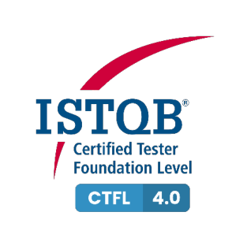
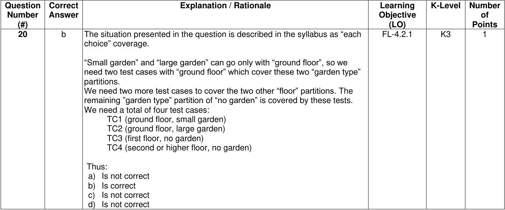

# ISTQB CTFL Sample Exam Set A - Answers

> Searchable Markdown conversion of the official ISTQB PDF, version 1.7, released April 1, 2025.
> The source PDF remains authoritative. Page anchors below correspond to physical PDF pages.

Source PDF: `resources/official/ISTQB-CTFL-Sample-A-Answers-v1.7.pdf`

<a id="pdf-page-1"></a>
<!-- Source PDF page 1 -->

### Sample Exam – Answers Sample Exam set A Version 1.7

### ISTQB® Certified Tester Syllabus Foundation Level

**Compatible with Syllabus version 4.0.1**

International Software Testing Qualifications Board



<a id="pdf-page-2"></a>
<!-- Source PDF page 2 -->

### Copyright Notice

Copyright Notice © International Software Testing Qualifications Board (hereinafter called ISTQB®).

ISTQB® is a registered trademark of the International Software Testing Qualifications Board.

All rights reserved.

The authors hereby transfer the copyright to the ISTQB®. The authors (as current copyright holders) and ISTQB® (as the future copyright holder) have agreed to the following conditions of use:

Extracts, for non-commercial use, from this document may be copied if the source is acknowledged.

Any Accredited Training Provider may use this sample exam in their training course if the authors and the ISTQB® are acknowledged as the source and copyright owners of the sample exam and provided that any advertisement of such a training course is done only after official Accreditation of the training materials has been received from an ISTQB®-recognized Member Board.

Any individual or group of individuals may use this sample exam in articles and books, if the authors and the ISTQB® are acknowledged as the source and copyright owners of the sample exam.

Any other use of this sample exam is prohibited without first obtaining the approval in writing of the ISTQB®.

Any ISTQB®-recognized Member Board may translate this sample exam provided they reproduce the abovementioned Copyright Notice in the translated version of the sample exam.

### Document Responsibility

The ISTQB® Examination Working Group is responsible for this document.

This document is maintained by a core team from ISTQB® consisting of the Syllabus Working Group and Exam Working Group.

### Acknowledgements

This document was produced by a core team from ISTQB® : Laura Albert, Wim de Coutere, Arnika Hryszko, Gary Mogyorodi, (technical rewiever), Meile Posthuma, Gandhinee Rajkomar, Stuart Reid, Jean-François Riverin, Adam Roman, Lucjan Stapp, Stephanie Ulrich, Yaron Tsubery and Eshraka Zakaria.

The core team thanks the reviewers: Amanda Alderman, Alexander Alexandrov, Jürgen Beniermann, Rex Black, Young jae.Choi, Nicola De Rosa, Klaudia Dussa-Zieger, Klaus Erlenbach. Joëlle Genois, Tamás Gergely, Dot Graham, Matthew Gregg, Gabriele Haller, Chinthaka Indikadahena, John Kurowski, Ine Lutterman, Isabelle Martin, Patricia McQuaid, Dénes Medzihradszky, Blair Mo, Gary Mogyorodi, Jörn Münzel, Markus Niehammer, Ingvar Nordström, Fran O'Hara, Raul Onisor, Dénes Orosz, Arnd Pehl, Horst Pohlmann, Nishan Portoyan, Ale Rebon Portillo, Stuart Reid, Ralf Reissing, Liang Ren, Jean-Francois Riverin, Lloyd Roden, Tomas Rosenqvist, Murian Song, Szilard Szell, Giancarlo Tomasig, Joanne Tremblay, François Vaillancourt, Daniel van der Zwan, André Verschelling and Paul Weymouth for their suggestions and input.

<a id="pdf-page-3"></a>
<!-- Source PDF page 3 -->

### Revision History

|Sam|ple Exam–Answers Layo|ut Template used:<br>Version 2.9<br>Date: August 10, 2022|
|---|---|---|
|**Version**|**Date**|**Remarks**|
|1.7|April 1, 2025|Correction of usage of Glossary terms|
|1.6|May 27, 2024|Correction of Answer: #5, #6, #12, #16, #A7, #A21|
|1.5|April 12, 2024|Correction of Answer: #2|
|1.4|December 19, 2023|Bump to match Question document version|
|1.3|November 21, 2023|Bump to match Question document version|
|1.2|November 6, 2023|Correction of Answer: #2, #5, #17|
|1.1|October 16, 2023|Bump to match Question document version<br>Layout tweaks|
|1.0|April 12, 2023|Release version|

<a id="pdf-page-4"></a>
<!-- Source PDF page 4 -->

## Table of Contents

```text
Copyright Notice ............................................................................................................................. 2
Document Responsibility ................................................................................................................. 2
Acknowledgements ......................................................................................................................... 2
Revision History .............................................................................................................................. 3
Table of Contents............................................................................................................................ 4
Introduction ..................................................................................................................................... 6
  Purpose of this document ............................................................................................................ 6
  Instructions .................................................................................................................................. 6
Answer Key ..................................................................................................................................... 7
Answers .......................................................................................................................................... 8
    1 ................................................................................................................................................................. 8
    2 ................................................................................................................................................................. 8
    3 ................................................................................................................................................................. 9
    4 ................................................................................................................................................................. 9
    5 ............................................................................................................................................................... 10
    6 ............................................................................................................................................................... 10
    7 ............................................................................................................................................................... 11
    8 ............................................................................................................................................................... 11
    9 ............................................................................................................................................................... 11
    10 ............................................................................................................................................................. 12
    11 ............................................................................................................................................................. 12
    12 ............................................................................................................................................................. 12
    13 ............................................................................................................................................................. 13
    14 ............................................................................................................................................................. 13
    15 ............................................................................................................................................................. 14
    16 ............................................................................................................................................................. 14
    17 ............................................................................................................................................................. 15
    18 ............................................................................................................................................................. 15
    19 ............................................................................................................................................................. 16
    20 ............................................................................................................................................................. 17
    21 ............................................................................................................................................................. 18
    22 ............................................................................................................................................................. 18
    23 ............................................................................................................................................................. 19
    26 ............................................................................................................................................................. 20
    27 ............................................................................................................................................................. 21
    28 ............................................................................................................................................................. 21
    29 ............................................................................................................................................................. 21
    30 ............................................................................................................................................................. 22
    31 ............................................................................................................................................................. 22
    32 ............................................................................................................................................................. 22
    33 ............................................................................................................................................................. 23
    34 ............................................................................................................................................................. 23
    35 ............................................................................................................................................................. 23
    36 ............................................................................................................................................................. 24
    37 ............................................................................................................................................................. 24
    38 ............................................................................................................................................................. 25
    39 ............................................................................................................................................................. 25
    40 ............................................................................................................................................................. 26
Appendix: Answer Key for Additional Sample Questions ............................................................... 27
Appendix: Answers to Additional Sample Questions ..................................................................... 28
    A1 ............................................................................................................................................................. 28
    A2 ............................................................................................................................................................. 29
    A3 ............................................................................................................................................................. 29
```

<a id="pdf-page-5"></a>
<!-- Source PDF page 5 -->

|A4 ............................................................................................................................................................. 29|
|---|
|A5 ............................................................................................................................................................. 30|
|A6 ............................................................................................................................................................. 30|
|A7 ............................................................................................................................................................. 31|
|A8 ............................................................................................................................................................. 31|
|A9 ............................................................................................................................................................. 32|
|A10 ........................................................................................................................................................... 32|
|A11 ........................................................................................................................................................... 33|
|A12 ........................................................................................................................................................... 33|
|A13 ........................................................................................................................................................... 33|
|A14 ........................................................................................................................................................... 34|
|A15 ........................................................................................................................................................... 34|
|A16 ........................................................................................................................................................... 34|
|A17 ........................................................................................................................................................... 35|
|A18 ........................................................................................................................................................... 35|
|A19 ........................................................................................................................................................... 35|
|A20 ........................................................................................................................................................... 36|
|A21 ........................................................................................................................................................... 36|
|A22 ........................................................................................................................................................... 36|
|A23 ........................................................................................................................................................... 37|
|A24 ........................................................................................................................................................... 37|
|A25 ........................................................................................................................................................... 38|
|A26 ........................................................................................................................................................... 38|

<a id="pdf-page-6"></a>
<!-- Source PDF page 6 -->

### Introduction

### Purpose of this document

The example questions and answers and associated justifications in this sample exam have been created by a team of subject matter experts and experienced question writers with the aim of:

- Assisting ISTQB® Member Boards and Exam Boards in their question writing activities

- Providing training providers and exam candidates with examples of exam questions

These questions cannot be used as-is in any official examination.

Note, that real exams may include a wide variety of questions, and this sample exam **_is not_** intended to include examples of all possible question types, styles, or lengths, also this sample exam may both be more difficult or less difficult than any official exam.

### Instructions

In this document you will find:

- Answer Key table, including for each correct answer:

   - K-level, Learning Objective, and Point value

- Answer Key table for additional questions, including for each correct answer:

   - K-level, Learning Objective, and Point value

- Answer sets, including for all questions:

   - Correct answer

   - Justification for each response (answer) option

   - K-level, Learning Objective, and Point value

- Additional answer sets, including for all questions [does not apply to all sample exams*]:

   - Correct answer

   - Justification for each response (answer) option

   - K-level, Learning Objective, and Point value

* The first 40 questions and their answers are arranged according to the exam structure and rules and therefore simulate a sample exam. The block “Answers to Additional Sample Questions” contains the answers to additional questions that are not part of the sample exam but may help the learner to gain a deeper knowledge in the related fields.

- _Questions are contained in a separate document_

<a id="pdf-page-7"></a>
<!-- Source PDF page 7 -->

### Answer Key

|**Question**<br>**Number (#)**|**Correct Answer**|**LO**|**K-Level**|**Points**|**Question**<br>**Number (#)**|**Correct Answer**|**LO**|**K-Level**|**Points**|
|---|---|---|---|---|---|---|---|---|---|
|1|c|FL-1.1.1|K1|1|21|a|FL-4.2.2|K3|1|
|2|a|FL-1.2.1|K2|1|22|d|FL-4.2.3|K3|1|
|3|a|FL-1.3.1|K2|1|23|d|FL-4.2.4|K3|1|
|4|b|FL-1.4.1|K2|1|24|a|FL-4.3.1|K2|1|
|5|b|FL-1.4.2|K2|1|25|d|FL-4.3.3|K2|1|
|6|a, e|FL-1.4.5|K2|1|26|a|FL-4.4.1|K2|1|
|7|b|FL-1.5.1|K2|1|27|c|FL-4.4.2|K2|1|
|8|d|FL-1.5.2|K1|1|28|b|FL-4.5.2|K2|1|
|9|d|FL-2.1.2|K1|1|29|a|FL-4.5.3|K3|1|
|10|c|FL-2.1.3|K1|1|30|c|FL-5.1.2|K1|1|
|11|d|FL-2.1.5|K2|1|31|c, e|FL-5.1.3|K2|1|
|12|c|FL-2.1.6|K2|1|32|d|FL-5.1.4|K3|1|
|13|a|FL-2.2.1|K2|1|33|a|FL-5.1.5|K3|1|
|14|b|FL-2.2.3|K2|1|34|a|FL-5.1.7|K2|1|
|15|a|FL-3.1.2|K2|1|35|c|FL-5.2.4|K2|1|
|16|d|FL-3.2.1|K1|1|36|d|FL-5.3.3|K2|1|
|17|b|FL-3.2.4|K2|1|37|c|FL-5.4.1|K2|1|
|18|d|FL-3.2.5|K1|1|38|c|FL-5.5.1|K3|1|
|19|c|FL-4.1.1|K2|1|39|c|FL-6.1.1|K2|1|
|20|b|FL-4.2.1|K3|1|40|b|FL-6.2.1|K1|1|

<a id="pdf-page-8"></a>
<!-- Source PDF page 8 -->

### Answers

|**Question**<br>**Number**<br>**(#)**|**Correct**<br>**Answer**|**Explanation / Rationale**|**Learning**<br>**Objective**<br>**(LO)**|**K-Level**|**Number**<br>**of**<br>**Points**|
|---|---|---|---|---|---|
|**1**|c|a) Is not correct. It is impossible to prove that there are no defects<br>anymore in the system under test. See testing principle 1<br>b) Is not correct. See testing principle 7<br>c) Is correct. Testing finds defects and failures which reduces the level of<br>risk and at the same time gives more confidence in the quality level of<br>the test object<br>d) Is not correct. It is impossible to test all combinations of inputs (see<br>testing principle 2)|FL-1.1.1|K1|1|
|**2**|a|a) Is correct. It is important that testers are involved from the beginning of<br>the software development lifecycle (SDLC). It will increase<br>understanding of design decisions and will detect defects early.<br>b) Is not correct. Both developers and testers will have more<br>understanding of each other's work products and how to test the code<br>c) Is not correct. End users will not help the testers in increasing the quality<br>of defect reports; also, users usually do not participate in low-level<br>testing levels like integration testing<br>d) Is not correct. Being certified does not automatically mean that the<br>tester will be better in test design|FL-1.2.1|K2|1|

<a id="pdf-page-9"></a>
<!-- Source PDF page 9 -->

|**Question**<br>**Number**<br>**(#)**|**Correct**<br>**Answer**|**Explanation / Rationale**|**Learning**<br>**Objective**<br>**(LO)**|**K-Level**|**Number**<br>**of**<br>**Points**|
|---|---|---|---|---|---|
|**3**|a|a) Is correct. This principle means that if the same tests are repeated over<br>and over again, eventually these tests no longer find any new defects.<br>This is probably why the tests all passed in this release as well<br>b) Is not correct. This principle says about the mistaken belief that just<br>finding and fixing a large number of defects will ensure the success of a<br>system<br>c) Is not correct. This principle says that a small number of components<br>usually contain most of the defects<br>d) Is not correct. This principle states that testing all combinations of<br>inputs and preconditions is not feasible|FL-1.3.1|K2|1|
|**4**|b|a) Is not correct. Estimating the test effort is part of test planning<br>b) Is correct. This is an example of defining test conditions which is a part<br>of test analysis<br>c) Is not correct. Using test techniques to derive coverage items is a part<br>of test design<br>d) Is not correct. Reporting defects found during dynamic testing is a part<br>of test execution|FL-1.4.1|K2|1|

<a id="pdf-page-10"></a>
<!-- Source PDF page 10 -->

|**Question**<br>**Number**<br>**(#)**|**Correct**<br>**Answer**|**Explanation / Rationale**|**Learning**<br>**Objective**<br>**(LO)**|**K-Level**|**Number**<br>**of**<br>**Points**|
|---|---|---|---|---|---|
|**5**|b|i. Is true. The SDLC has an influence on the test approach<br>ii. Is false. The number of defects detected in previous projects may<br>have some influence, but this is not as significant as i, iii and iv<br>iii. Is true. The identified product risks are one of the most important<br>factors influencing the test approach<br>iv. Is true. Regulatory requirements are important factors influencing the<br>test approach<br>v. Is false. The test environment has no significant influence on the test<br>approach|FL-1.4.2|K2|1|
|||Thus:<br>a) Is not correct<br>b) Is correct<br>c) Is not correct<br>d) Is not correct||||
|**6**|a, e|a) Is correct. This is done by the testers<br>b) Is not correct. The product backlog is built and maintained by the<br>product owner<br>c) Is not correct. This is done by the development team<br>d) Is not correct. This is a managerial role<br>e) Is correct. This is done by the testers since its technical task done as<br>part of a test analysis.|FL-1.4.5|K2|1|

<a id="pdf-page-11"></a>
<!-- Source PDF page 11 -->

|**Question**<br>**Number**<br>**(#)**|**Correct**<br>**Answer**|**Explanation / Rationale**|**Learning**<br>**Objective**<br>**(LO)**|**K-Level**|**Number**<br>**of**<br>**Points**|
|---|---|---|---|---|---|
|**7**|b|i. Is true. Having domain knowledge is an important tester skill<br>ii. Is false. This is a task of the business analyst together with the<br>business representative<br>iii. Is true. Being a good team player is an important skill<br>iv. Is false. Planning and organizing the work of the team is a task of the<br>test manager or, mostly in an Agile software development project,<br>the whole team and not just the tester<br>v. Is true. Critical thinking is one of the most important skills of testers<br>Thus:<br>a) Is not correct<br>b) Is correct<br>c) Is not correct<br>d) Is not correct|FL-1.5.1|K2|1|
|**8**|d|a) Is not correct. The test automation approach is defined by testers with<br>the help of developers and business representatives<br>b) Is not correct. The test strategy is decided in collaboration with the<br>developers<br>c) Is not correct. Testers, developers, and business representatives are<br>part of the whole team approach<br>d) Is correct. Testers will work closely with business representatives to<br>ensure that the desired quality levels are achieved. This includes<br>supporting and collaborating with them to help them create suitable<br>acceptance tests|FL-1.5.2|K1|1|
|**9**|d|a) Is not correct<br>b) Is not correct<br>c) Is not correct<br>d) Is correct. This rule holds for all SDLC models|FL-2.1.2|K1|1|

<a id="pdf-page-12"></a>
<!-- Source PDF page 12 -->

|**Question**<br>**Number**<br>**(#)**|**Correct**<br>**Answer**|**Explanation / Rationale**|**Learning**<br>**Objective**<br>**(LO)**|**K-Level**|**Number**<br>**of**<br>**Points**|
|---|---|---|---|---|---|
|**10**|c|a) Is not correct. It is more often used in behavior-driven development<br>(BDD)<br>b) Is not correct. It is the description of test-driven development (TDD)<br>c) Is correct. In acceptance test-driven development (ATDD) tests are<br>written from acceptance criteria as part of the design process<br>d) Is not correct. It is used in BDD|FL-2.1.3|K1|1|
|**11**|d|a) Is not correct. Early review is an example of the shift-left approach<br>b) Is not correct. TDD is an example of the shift-left approach<br>c) Is not correct. Early non-functional testing is an example of the shift-left<br>approach<br>d) Is correct. Test scripts should be subject to configuration management,<br>so it makes no sense to create the test scripts before this process is set<br>up|FL-2.1.5|K2|1|
|**12**|c|a) Is not correct. Retrospectives are more useful for identifying<br>improvement opportunities and have little importance for clients<br>b) Is not correct. Retrospectives are not aimed to collect feedback about<br>the product, but about the process. Additionally, retrospectives are<br>internal activity for the team and should not include end user<br>representatives<br>c) Is correct. Regularly conducted retrospectives, when appropriate follow<br>up activities occur, are critical to continual improvement of development<br>and testing<br>d) Is not correct. Courage and respect are values of Extreme<br>Programming and are not closely related to retrospectives|FL-2.1.6|K2|1|

<a id="pdf-page-13"></a>
<!-- Source PDF page 13 -->

|**Question**<br>**Number**<br>**(#)**|**Correct**<br>**Answer**|**Explanation / Rationale**|**Learning**<br>**Objective**<br>**(LO)**|**K-Level**|**Number**<br>**of**<br>**Points**|
|---|---|---|---|---|---|
|**13**|a|Considering:<br>•<br>The test basis for acceptance testing is the user’s business needs<br>(1D)<br>•<br>Communication between components is tested during component<br>integration testing (2B)<br>•<br>Failures in logic can be found during component testing (3A)<br>•<br>Business rules are the test basis for system testing (4C)<br>Thus:<br>a) Is correct<br>b) Is not correct<br>c) Is not correct<br>d) Is not correct|FL-2.2.1|K2|1|
|**14**|b|Because TC1 and TC3 failed in Execution 1 (i.e., test (1) and test (3)), test<br>(4) and test (6) are confirmation tests.<br>Because TC2 and TC3 failed in Execution 2 (i.e., tests (5) and (6)), test (8)<br>and test (9) are also confirmation tests.<br>TC2 passed in Execution 1 (i.e., test (2)), so test (5) is a regression test.<br>TC1 passed in the Execution 2 (i.e., test (4)), so test (7) is also a regression<br>test.<br>Thus:<br>a) Is not correct<br>b) Is correct<br>c) Is not correct<br>d) Is not correct|FL-2.2.3|K2|1|

<a id="pdf-page-14"></a>
<!-- Source PDF page 14 -->

|**Question**<br>**Number**<br>**(#)**|**Correct**<br>**Answer**|**Explanation / Rationale**|**Learning**<br>**Objective**<br>**(LO)**|**K-Level**|**Number**<br>**of**<br>**Points**|
|---|---|---|---|---|---|
|**15**|a|a) Is correct. Defect management is no less expensive. Finding and fixing<br>defects later in the SDLC is more costly<br>b) Is not correct. This is a benefit of static testing<br>c) Is not correct. This is a benefit of static testing<br>d)Is not correct. This is a benefit of static testing|FL-3.1.2|K2|1|
|**16**|d|a) Is not correct. Feedback can improve the test process, but if one only<br>wants to improve future projects, the feedback does not need to come<br>early or frequently<br>b) Is not correct. Feedback is not used to prioritize requirements<br>c) Is not correct. There is no one, recommended way to measure quality<br>of changes. Also, this is not one of the benefits of early feedback that<br>are mentioned in section 3.2.1<br>d) Is correct. Early and frequent feedback can prevent misunderstandings<br>about requirements|FL-3.2.1|K1|1|

<a id="pdf-page-15"></a>
<!-- Source PDF page 15 -->

|**Question**<br>**Number**<br>**(#)**|**Correct**<br>**Answer**|**Explanation / Rationale**|**Learning**<br>**Objective**<br>**(LO)**|**K-Level**|**Number**<br>**of**<br>**Points**|
|---|---|---|---|---|---|
|**17**|b|Considering the attributes:<br>•<br>Specified for walkthroughs, technical reviews, and inspections; thus,<br>the reviews being performed cannot be informal reviews<br>•<br>The purpose of evaluating quality is one of the most important<br>objectives of a walkthrough<br>•<br>This is not allowed for inspections and is typically not done in<br>technical reviews. A moderator is needed in walkthroughs and is<br>allowed for informal reviews<br>•<br>All types of reviews can include individual preparation (even informal<br>reviews)<br>•<br>All types of reviews can produce a review report, although informal<br>reviews do not require documentation<br>Thus:<br>a) Is not correct<br>b) Is correct<br>c) Is not correct<br>d) Is not correct|FL-3.2.4|K2|1|
|**18**|d|a) Is not correct. Adequate time for individuals is a success factor<br>b) Is not correct. Splitting work products into small adequate parts is a<br>success factor<br>c) Is not correct. Avoiding behaviors that might indicate boredom,<br>exasperation, etc. is a success factor<br>d) Is correct. During reviews one can find defects, not failures|FL-3.2.5|K1|1|

<a id="pdf-page-16"></a>
<!-- Source PDF page 16 -->

|**Question**<br>**Number**<br>**(#)**|**Correct**<br>**Answer**|**Explanation / Rationale**|**Learning**<br>**Objective**<br>**(LO)**|**K-Level**|**Number**<br>**of**<br>**Points**|
|---|---|---|---|---|---|
|**19**|c|a) Is not correct. This is a common characteristic of white-box test<br>techniques. Test conditions, test cases, and test data are derived from<br>a test basis that may include code, software architecture, detailed<br>design, or any other source of information regarding the structure of the<br>software.<br>b) Is not correct. This is a common characteristic of white-box test<br>techniques. Coverage is measured based on the items tested within a<br>selected structure and the test technique applied to the test basis<br>c) Is correct. This is a common characteristic of experience-based test<br>techniques. This knowledge and experience include expected use of<br>the software, its environment, likely defects, and the distribution of<br>those defects is used to define tests<br>d) Is not correct. This is a common characteristic of black-box test<br>techniques. Test cases may be used to detect gaps within requirements<br>and the implementation of the requirements, as well as deviations from<br>the requirements|FL-4.1.1|K2|1|

<a id="pdf-page-17"></a>
<!-- Source PDF page 17 -->



<!-- Start of picture text -->
Question  Correct  Explanation / Rationale  Learning  K-Level Number<br>Number  Answer  Objective  of<br>(#)  (LO)  Points<br>20  b  The situation presented in the question is described in the syllabus as “each  FL-4.2.1  K3  1<br>choice” coverage.<br>“Small garden” and “large garden” can go only with “ground floor”, so we<br>need two test cases with “ground floor” which cover these two “garden type”<br>partitions.<br>We need two more test cases to cover the two other “floor” partitions. The<br>remaining ”garden type” partition of “no garden” is covered by these tests.<br>We need a total of four test cases:<br>TC1 (ground floor, small garden)<br>TC2 (ground floor, large garden)<br>TC3 (first floor, no garden)<br>TC4 (second or higher floor, no garden)<br>Thus:<br>a) Is not correct<br>b) Is correct<br>c) Is not correct<br>d) Is not correct<br><!-- End of picture text -->

<a id="pdf-page-18"></a>
<!-- Source PDF page 18 -->

|**Question**<br>**Number**<br>**(#)**|**Correct**<br>**Answer**|**Explanation / Rationale**|**Learning**<br>**Objective**<br>**(LO)**|**K-Level**|**Number**<br>**of**<br>**Points**|
|---|---|---|---|---|---|
|**21**|a|There are 12 boundary values for the final result values: 0, 50, 51, 60, 61,<br>70, 71, 80, 81, 90, 91, and 100.<br>The test cases cover six of them (TC1–91, TC2–50, TC3–81, TC4–60,<br>TC5–70 and TC7–51).<br>Therefore, the test cases cover 6/12 = 50%.|FL-4.2.2|K3|1|
|||Thus:<br>a) Is correct<br>b) Is not correct<br>c) Is not correct<br>d) Is not correct||||
|**22**|d|a) Is not correct. A member without a missed deadline can get a discount<br>and a gift T-Shirt after 15 bicycle rentals<br>b) Is not correct. A member without a missed deadline can get a discount<br>but no gift T-Shirt until they rented a bicycle 15 times<br>c) Is not correct. Non-members cannot get a discount, even if they did not<br>miss a deadline yet<br>d) Is correct. No discount as a non-member that has also missed a<br>deadline, but only members can receive a gift T-Shirt. Hence, the action<br>is not correct|FL-4.2.3|K3|1|

<a id="pdf-page-19"></a>
<!-- Source PDF page 19 -->

|**Question**<br>**Number**<br>**(#)**|**Correct**<br>**Answer**|**Explanation / Rationale**|**Learning**<br>**Objective**<br>**(LO)**|**K-Level**|**Number**<br>**of**<br>**Points**|
|---|---|---|---|---|---|
|**23**|d|“test” and “error”transitions cannot occur in one test case.<br>Neither can both “done” transitions.<br>This means we need at least three test cases to achieve transition<br>coverage. For example:<br>TC1: test, done<br>TC2: run, error, done<br>TC3: run, pause, resume, pause, done<br>Thus:<br>a) Is not correct<br>b) Is not correct<br>c) Is not correct<br>d) Is correct|FL-4.2.4|K3|1|
|**24**|a|a) Is correct. Since 100% statement coverage is achieved, every<br>statement, including the ones with defects, must have been executed<br>and evaluated at least once<br>b) Is not correct. Coverage depends on what is tested, not on the number<br>of test cases. For example, for code “if (x==0) y=1”, one test case (x=0)<br>achieves 100% statement coverage, but two test cases (x=1) and (x=2)<br>together achieve only 50% statement coverage<br>c) Is not correct. If there is a loop in the code there may be an infinite<br>number of possible paths, so it is not possible to execute all the<br>possible paths in the code<br>d) Is not correct. Exhaustive testing is not possible (see the seven testing<br>principles section in the syllabus). For example, for code “input x; print<br>x” any single test with arbitrary x achieves 100% statement coverage,<br>but covers one input value|FL-4.3.1|K2|1|

<a id="pdf-page-20"></a>
<!-- Source PDF page 20 -->

|**Question**<br>**Number**<br>**(#)**|**Correct**<br>**Answer**|**Explanation / Rationale**|**Learning**<br>**Objective**<br>**(LO)**|**K-Level**|**Number**<br>**of**<br>**Points**|
|---|---|---|---|---|---|
|**25**|d|a) Is not correct. The fundamental strength of white-box test techniques is<br>that the entire software implementation is taken into account during<br>testing<br>b) Is not correct. White-box coverage measures provide an objective<br>measure of coverage and provide the necessary information to allow<br>additional tests to be generated to increase this coverage<br>c) Is not correct. White-box test techniques can be used to perform<br>reviews (static testing)<br>d) Is correct. This is the weakness of the white-box test techniques. They<br>are not able to identify the missing implementation, because they are<br>based solely on the test object structure, not on the requirements<br>specification|FL-4.3.3|K2|1|
|**26**|a|a) Is correct. The basic concept behind error guessing is that the tester<br>tries to guess what errors may have been made by the developer and<br>what defects may be in the test object based on past experience (and<br>sometimes checklists)<br>b) Is not correct. Although a tester who used to be a developer may use<br>their personal experience to help them when performing error guessing,<br>the test technique is not based on prior knowledge of development<br>c) Is not correct. Error guessing is not a usability technique for guessing<br>how users may fail to interact with the test object<br>d) Is not correct. Duplicating the development task has several flaws that<br>make it impractical, such as the tester having equivalent skills to the<br>developer and the time involved to perform the development. It is not<br>error guessing|FL-4.4.1|K2|1|

<a id="pdf-page-21"></a>
<!-- Source PDF page 21 -->

|**Question**<br>**Number**<br>**(#)**|**Correct**<br>**Answer**|**Explanation / Rationale**|**Learning**<br>**Objective**<br>**(LO)**|**K-Level**|**Number**<br>**of**<br>**Points**|
|---|---|---|---|---|---|
|**27**|c|a) Is not correct. This is a new product. You probably do not have a<br>checklist yet and test conditions might not be known due to missing<br>requirements<br>b) Is not correct. This is a new product. You probably do not have enough<br>information to make correct error guesses<br>c) Is correct. Exploratory testing is most useful when there are few known<br>specifications and/or there is a pressing timeline for testing<br>d) Is not correct. Branch testing is time-consuming, and your management<br>is asking about some test results now. Also, branch testing does not<br>involve domain knowledge|FL-4.4.2|K2|1|
|**28**|b|a) Is not correct. Retrospectives are used to capture lessons learned and<br>to improve the development and testing process, not to document the<br>acceptance criteria<br>b) Is correct. This is the standard way to document acceptance criteria<br>c) Is not correct. Verbal communication does not allow to physically<br>document the acceptance criteria as part of a user story (”card” aspect<br>in the 3C’s model)<br>d) Is not correct. Acceptance criteria are related to a user story, not a test<br>plan. Also, acceptance criteria are the conditions that have to be fulfilled<br>to decide if the user story is complete. Risks are not such conditions|FL-4.5.2|K2|1|
|**29**|a|a) Is correct. This test covers two acceptance criteria: one about editing<br>the document and one about saving changes<br>b) Is not correct. Acceptance criteria cover the editor activities, not the<br>content owner activities<br>c) Is not correct. Scheduling the edited content for publication may be a<br>nice feature, but it is not covered by the acceptance criteria<br>d) Is not correct. Acceptance criteria state about reassigning from an<br>editor to the content owner, not to another editor|FL-4.5.3|K3|1|

<a id="pdf-page-22"></a>
<!-- Source PDF page 22 -->

|**Question**<br>**Number**<br>**(#)**|**Correct**<br>**Answer**|**Explanation / Rationale**|**Learning**<br>**Objective**<br>**(LO)**|**K-Level**|**Number**<br>**of**<br>**Points**|
|---|---|---|---|---|---|
|**30**|c|a) Is not correct. Priorities for user stories are determined by the business<br>representative together with the development team<br>b) Is not correct. Testers focus on both functional and non-functional<br>aspects of the system to be tested<br>c) Is correct. According to the syllabus, this is one of the ways testers add<br>value to iteration and release planning<br>d) Is not correct. Early test design is not part of release planning. Early<br>test design does not automatically guarantee the release of quality<br>software|FL-5.1.2|K1|1|
|**31**|c, e|a) Is not correct. Test environment readiness is a resource availability<br>criterion; hence it belongs to the entry criteria<br>b) Is not correct. This is a resource availability criterion; hence it belongs<br>to the entry criteria<br>c) Is correct. Estimated defect density is a measure of diligence; hence it<br>belongs to the exit criteria.<br>d) Is not correct. Requirements translated into a given format result in<br>testable requirements; hence it belongs to the entry criteria<br>e) Is correct. Automation of regression tests is a completion criterion;<br>hence it belongs to the exit criteria|FL-5.1.3|K2|1|
|**32**|d|In the three-point estimation technique:<br>E = (optimistic + 4*most likely + pessimistic)/6<br>E = (2+(4*11)+14)/6 = 10|FL-5.1.4|K3|1|
|||Thus:<br>a) Is not correct<br>b) Is not correct<br>c) Is not correct<br>d) Is correct||||

<a id="pdf-page-23"></a>
<!-- Source PDF page 23 -->

|**Question**<br>**Number**<br>**(#)**|**Correct**<br>**Answer**|**Explanation / Rationale**|**Learning**<br>**Objective**<br>**(LO)**|**K-Level**|**Number**<br>**of**<br>**Points**|
|---|---|---|---|---|---|
|**33**|a|Test TC 001 must come first, followed by TC 002, to satisfy dependencies.<br>Afterwards, TC 003 to satisfy priority and then TC 004, followed by TC 005.<br>Thus:<br>a) Is correct<br>b) Is not correct<br>c) Is not correct<br>d) Is not correct|FL-5.1.5|K3|1|
|**34**|a|Considering:<br>•<br>Usability testing is in Q3 (1–C)<br>•<br>Component testing is in Q1 (2–A)<br>•<br>Functional testing is in Q2 (3–B)<br>•<br>Reliability testing is in Q4 (4–D)<br>Thus:<br>a) Is correct<br>b) Is not correct<br>c) Is not correct<br>d) Is not correct|FL-5.1.7|K2|1|
|**35**|**c**|a) Is not correct. We do not accept the risk; concrete actions are proposed<br>b) Is not correct. No contingency plans are proposed<br>c) Is correct. The proposed actions are related to testing, which is a form<br>of risk mitigation<br>d) Is not correct. Risk is not transferred but mitigated|FL-5.2.4|K2|1|

<a id="pdf-page-24"></a>
<!-- Source PDF page 24 -->

|**Question**<br>**Number**<br>**(#)**|**Correct**<br>**Answer**|**Explanation / Rationale**|**Learning**<br>**Objective**<br>**(LO)**|**K-Level**|**Number**<br>**of**<br>**Points**|
|---|---|---|---|---|---|
|**36**|d|a) Is not correct. Acceptance criteria are the conditions used to decide<br>whether the user story is ready. They cannot show work progress<br>b) Is not correct. Defect reports inform about the defects. They do not<br>show work progress<br>c) Is not correct. Test completion report can be created after the iteration<br>is finished, so it will not show the progress continuously within an<br>iteration<br>d) Is correct. Burndown charts are a graphical representation of work left<br>to do versus time remaining. They are updated daily, so they can<br>continuously show the work progress|FL-5.3.3|K2|1|
|**37**|c|a) Is not correct. Traceability is the relationship between two or more work<br>products, not between different versions of the same work product<br>b) Is not correct. Maintenance testing is about testing changes; it is not<br>related closely to versioning<br>c) Is correct. To support testing, configuration management may involve<br>the version control of all test items<br>d) Is not correct. Requirements engineering is the elicitation,<br>documentation, and management of requirements; it is not closely<br>related to test script versioning|FL-5.4.1|K2|1|

<a id="pdf-page-25"></a>
<!-- Source PDF page 25 -->

|**Question**<br>**Number**<br>**(#)**|**Correct**<br>**Answer**|**Explanation / Rationale**|**Learning**<br>**Objective**<br>**(LO)**|**K-Level**|**Number**<br>**of**<br>**Points**|
|---|---|---|---|---|---|
|**38**|c|a) Is not correct. The expected result is “the application should accept the<br>provided input and create the user”. The actual result is “The<br>application hangs up after entering “Test input: $””.<br>b) Is not correct. There is a reference to the test case and to the related<br>requirement and it states that the defect is rejected. Also, the defect<br>status would not be very helpful for the developers<br>c) Is correct. We do not know in which test environment the anomaly was<br>detected, and we also do not know which application (and its version) is<br>affected<br>d) Is not correct. The defect report states that the anomaly is urgent, that it<br>is a global issue (i.e., many, if not all, test administration accounts are<br>affected) and states the impact is high for business stakeholders|FL-5.5.1|K3|1|
|**39**|c|a) Is not correct. Test monitoring involves the ongoing checking of all<br>activities and comparison of actual progress against the test plan. Test<br>control involves taking the actions necessary to meet the test objectives<br>of the test plan. No test data are prepared during these activities.<br>b) Is not correct. Test analysis includes analysis of the test basis to<br>identify test conditions and prioritize them. Test data are not prepared<br>during this activity.<br>c) Is correct. Test design and implementation can both include the<br>identification, creation or acquisition of the testware necessary for test<br>execution (e.g., test data).<br>d) Is not correct. Test completion activities occur at project milestones<br>(e.g., release, end of iteration, test level completion), so it is too late for<br>preparing test data.|FL-6.1.1|K2|1|

<a id="pdf-page-26"></a>
<!-- Source PDF page 26 -->

|**Question**<br>**Number**<br>**(#)**|**Correct**<br>**Answer**|**Explanation / Rationale**|**Learning**<br>**Objective**<br>**(LO)**|**K-Level**|**Number**<br>**of**<br>**Points**|
|---|---|---|---|---|---|
|**40**|b|a) Is not correct. Test automation does not introduce unknown regressions<br>in production<br>b) Is correct. Wrong allocation of effort to maintain testware is a risk<br>c) Is not correct. Test tools must be selected so that they and their<br>testware can be relied upon<br>d) Is not correct. The primary goal of test automation is to reduce manual<br>testing. So, this is a benefit, not a risk|FL-6.2.1|K1|1|

<a id="pdf-page-27"></a>
<!-- Source PDF page 27 -->

### Appendix: Answer Key for Additional Sample Questions

|**Question**<br>**Number (#)**|**Correct Answer**|**LO**|**K-Level**|**Points**|**Question**<br>**Number (#)**|**Correct Answer**|**LO**|**K-Level**|**Points**|
|---|---|---|---|---|---|---|---|---|---|
|A1|a|FL-1.1.2|K2|1|A14|b|FL-3.2.3|K1|1|
|A2|d|FL-1.2.2|K1|1|A15|c|FL-4.2.2|K3|1|
|A3|d|FL-1.2.3|K2|1|A16|d|FL-4.3.2|K2|1|
|A4|d|FL-1.4.3|K2|1|A17|c|FL-4.4.3|K2|1|
|A5|c|FL-1.4.4|K2|1|A18|b|FL-4.5.1|K2|1|
|A6|d|FL-1.5.3|K2|1|A19|d|FL-5.1.1|K2|1|
|A7|b, c|FL-2.1.1|K2|1|A20|b|FL-5.1.4|K3|1|
|A8|c|FL-2.1.4|K2|1|A21|a|FL-5.1.6|K1|1|
|A9|b|FL-2.2.2|K2|1|A22|c|FL-5.2.1|K1|1|
|A10|a|FL-2.3.1|K2|1|A23|a|FL-5.2.2|K2|1|
|A11|c|FL-3.1.1|K1|1|A24|d|FL-5.2.3|K2|1|
|A12|d|FL-3.1.3|K2|1|A25|a, d|FL-5.3.1|K1|1|
|A13|b|FL-3.2.2|K2|1|A26|b|FL-5.3.2|K2|1|

<a id="pdf-page-28"></a>
<!-- Source PDF page 28 -->

### Appendix: Answers to Additional Sample Questions

|**Question**<br>**Number**<br>**(#)**|**Correct**<br>**Answer**|**Explanation / Rationale**|**Learning**<br>**Objective**<br>**(LO)**|**K-Level**|**Number**<br>**of**<br>**Points**|
|---|---|---|---|---|---|
|**A1**|a|a) Is correct. Debugging is the process of finding, analyzing, and removing<br>the causes of failures in a component or system<br>b) Is not correct. Testing is the process concerned with planning,<br>preparation and evaluation of a component or system and related work<br>products to determine that they satisfy specified requirements, to<br>demonstrate that they are fit for purpose and to detect defects. It is not<br>related to fixing causes of failures<br>c) Is not correct. Requirement elicitation is the process of gathering,<br>capturing, and consolidating requirements from available sources. It is<br>not related to fixing causes of failures<br>d) Is not correct. Defect management is the process of recognizing,<br>recording, classifying, investigating, resolving, and disposing of defects.<br>It is not related to fixing causes of failures|FL-1.1.2|K2|1|

<a id="pdf-page-29"></a>
<!-- Source PDF page 29 -->

|**Question**<br>**Number**<br>**(#)**|**Correct**<br>**Answer**|**Explanation / Rationale**|**Learning**<br>**Objective**<br>**(LO)**|**K-Level**|**Number**<br>**of**<br>**Points**|
|---|---|---|---|---|---|
|**A2**|d|Considering:<br>Testing and quality assurance are not the same. Testing is the<br>process consisting of all software development lifecycle (SDLC)<br>activities, both static and dynamic, concerned with planning,<br>preparation and evaluation of a component or system and related<br>work products to determine that they satisfy specified requirements, to<br>demonstrate that they are fit for purpose and to detect defects. Quality<br>assurance is focused on establishing, introducing, monitoring,<br>improving, and adhering to the quality-related processes.|FL-1.2.2|K1|1|
|||Thus:<br>a) Is not correct<br>b) Is not correct<br>c) Is not correct<br>d) Is correct||||
|**A3**|d|a) Is not correct. The root cause is the distraction that the programmer<br>experienced while programming<br>b) Is not correct. Accepting invalid inputs is a failure<br>c) Is not correct. The error in thinking that put the defect in the code<br>d) Is correct. The problem in the code is a defect|FL-1.2.3|K2|1|
|**A4**|d|The testware under consideration is a test charter<br>Test charters are the output from test design|FL-1.4.3|K2|1|
|||Thus:<br>a) Is not correct<br>b) Is not correct<br>c) Is not correct<br>d) Is correct||||

<a id="pdf-page-30"></a>
<!-- Source PDF page 30 -->

|**Question**<br>**Number**<br>**(#)**|**Correct**<br>**Answer**|**Explanation / Rationale**|**Learning**<br>**Objective**<br>**(LO)**|**K-Level**|**Number**<br>**of**<br>**Points**|
|---|---|---|---|---|---|
|**A5**|c|a) Is not correct. Performing the impact analysis will not give information<br>about completeness of tests. Analyzing the impact analysis of changes<br>will help to select the right test cases for execution<br>b) Is not correct. Traceability does not give information about the<br>estimated level of residual risk if the test cases are not traced back to<br>risks<br>c) Is correct. Performing the impact analysis of the changes helps in<br>selecting the test cases for the regression test<br>d) Is not correct. Analyzing the traceability between the test basis, test<br>objects and test cases does not help in selecting test data to achieve<br>the assumed coverage of the test object. Selecting test data is more<br>related to test analysis and test implementation, not traceability|FL-1.4.4|K2|1|
|**A6**|d|a) Is not correct. Quality should be the responsibility of everyone working<br>on the project and not the sole responsibility of the test team<br>b) Is not correct. First, it is not a benefit if an external test team does not<br>meet delivery deadlines, and second, there is no reason to believe that<br>external test teams will feel they do not have to meet strict delivery<br>deadlines<br>c) Is not correct. It is bad practice for the test team to work in complete<br>isolation, and we would expect an external test team to be concerned<br>with changing project requirements and communicating well with<br>developers<br>d) Is correct. Specifications are never perfect, meaning that assumptions<br>will have to be made by the developer. An independent tester is useful<br>in that they can challenge and verify the assumptions and subsequent<br>interpretation made by the developer|FL-1.5.3|K2|1|

<a id="pdf-page-31"></a>
<!-- Source PDF page 31 -->

|**Question**<br>**Number**<br>**(#)**|**Correct**<br>**Answer**|**Explanation / Rationale**|**Learning**<br>**Objective**<br>**(LO)**|**K-Level**|**Number**<br>**of**<br>**Points**|
|---|---|---|---|---|---|
|**A7**|b, c|a) Is not correct.  The executable code is usually created in the later<br>phases, so dynamic test execution cannot be performed early in the<br>SDLC<br>b) Is correct. In sequential development models, in the initial phases,<br>testers participate in requirement reviews, which is a form of static<br>testing.<br>c) Is correct. Test planning could be performed early in the SDLC before<br>the test project begins together with test analysis and test design.<br>d) Is not correct. Acceptance test execution can be performed when there<br>is a working product. In sequential SDLC models the working product is<br>usually delivered later in the SDLC<br>e)  Is not correct. Maintenance testing when there is a working and<br>deployed product, which is not done in the early phases of any SDLC.|FL-2.1.1|K2|1|
|**A8**|c|Consider:<br>i. Is true. Faster product release and faster time to market is an<br>advantage of DevOps<br>ii. Is false. Typically, we need less effort for manual tests because of<br>the use of test automation<br>iii. Is true. Constant availability of executable software is an advantage<br>iv. Is false. More regression tests are needed<br>v. Is false. Not everything is automated and setting up a test<br>automation framework is expensive<br>Thus:<br>a) Is not correct<br>b) Is not correct<br>c) It is correct<br>d) Is not correct|FL-2.1.4|K2|1|

<a id="pdf-page-32"></a>
<!-- Source PDF page 32 -->

|**Question**<br>**Number**<br>**(#)**|**Correct**<br>**Answer**|**Explanation / Rationale**|**Learning**<br>**Objective**<br>**(LO)**|**K-Level**|**Number**<br>**of**<br>**Points**|
|---|---|---|---|---|---|
|**A9**|b|a) Is not correct. The fact that the requirement about the system’s<br>performance comes directly from the client and that the performance is<br>important from the business point of view (i.e., high priority) does not<br>make these tests functional, because they do not check “what” the<br>system does, but “how” (i.e., how fast the orders are processed)<br>b) Is correct. This is an example of testing for performance efficiency, a<br>type of non-functional testing<br>c) Is not correct. From the scenario, we do not know if interacting with the<br>user interface is a part of the test conditions. But even if we did, the<br>main test objective of these tests is to check the performance, not the<br>usability<br>d) Is not correct. We do not need to know the internal structure of the code<br>to perform the performance efficiency testing. One can execute<br>performance efficiency tests without structural knowledge|FL-2.2.2|K2|1|
|**A10**|a|a) Is correct. When a system is retired, this can require testing of data<br>migration, which is a form of maintenance testing<br>b) Is not correct. Regression testing verifies whether a fix accidentally<br>affected the behavior of other parts of the code, but now we are talking<br>about data migration to a new system<br>c) Is not correct. Portability testing focuses on transferring the system to<br>another environment<br>d) Is not correct. Integration testing focuses on interactions between<br>components and/or systems, not on data migration. Also, it is not a test<br>type, but a test level.|FL-2.3.1|K2|1|

<a id="pdf-page-33"></a>
<!-- Source PDF page 33 -->

|**Question**<br>**Number**<br>**(#)**|**Correct**<br>**Answer**|**Explanation / Rationale**|**Learning**<br>**Objective**<br>**(LO)**|**K-Level**|**Number**<br>**of**<br>**Points**|
|---|---|---|---|---|---|
|**A11**|c|Only third-party executable code cannot be reviewed.<br>Thus:<br>a) Is not correct<br>b) Is not correct<br>c) It is correct<br>d) Is not correct|FL-3.1.1|K1|1|
|**A12**|d|Consider:<br>i. These behaviors are easily detectable while the software is running.<br>Hence, dynamic testing shall be used to identify them<br>ii. This is an example of deviations from standards, which is a typical<br>defect that is easier found with static testing<br>iii. If the software is executed during the test, it is dynamic testing<br>iv. Identifying defects as early as possible is the test objective of both<br>static testing and dynamic testing<br>v. This is an example of gaps in the test basis traceability or coverage,<br>which is a typical defect that is easier found with static testing<br>Thus:<br>a) Is not correct<br>b) Is not correct<br>c) Is not correct<br>d) Is correct|FL-3.1.3|K2|1|
|**A13**|b|a) Is not correct. In all types of reviews there is more than one role, even<br>in informal ones<br>b) Is correct. There are several activities during the formal review process<br>c) Is not correct. Documentation to be reviewed should be distributed as<br>early as possible<br>d) Is not correct. Defects found during the review should be reported|FL-3.2.2|K2|1|

<a id="pdf-page-34"></a>
<!-- Source PDF page 34 -->

|**Question**<br>**Number**<br>**(#)**|**Correct**<br>**Answer**|**Explanation / Rationale**|**Learning**<br>**Objective**<br>**(LO)**|**K-Level**|**Number**<br>**of**<br>**Points**|
|---|---|---|---|---|---|
|**A14**|b|a) Is not correct. This is the task of the review leader<br>b) Is correct. This is the task of the management in a formal review<br>c) Is not correct. This is the task of the moderator<br>d) Is not correct. This is the task of the scribe|FL-3.2.3|K1|1|
|**A15**|c|There are three equivalence partitions: {..., 10, 11}, {12}, and {13, 14, ...}.<br>The boundary values are 11, 12 and 13. In the three-point boundary value<br>analysis for each boundary, we need to test the boundary and both its<br>neighbors, so:<br>•<br>for 11 we test 10, 11, 12<br>•<br>for 12 we test 11, 12, 13<br>•<br>for 13 we test 12, 13, 14<br>Altogether we need to test 10, 11, 12, 13, and 14<br>Thus:<br>a) Is not correct<br>b) Is not correct<br>c) Is correct<br>d) Is not correct|FL-4.2.2|K3|1|
|**A16**|d|a) Is not correct. In this case one test case is still needed since there is at<br>least one (unconditional) branch to be covered<br>b) Is not correct. Covering only unconditional branches does not imply<br>covering all conditional branches<br>c) Is not correct. 100% branch coverage implies 100% statement<br>coverage, not otherwise. For example, for an IF decision without the<br>ELSE, one test is enough to achieve 100% statement coverage, but it<br>only achieves 50% branch coverage<br>d) Is correct. Each decision outcome corresponds to a conditional branch,<br>so 100% branch coverage implies 100% coverage of the decision<br>outcomes|FL-4.3.2|K2|1|

<a id="pdf-page-35"></a>
<!-- Source PDF page 35 -->

|**Question**<br>**Number**<br>**(#)**|**Correct**<br>**Answer**|**Explanation / Rationale**|**Learning**<br>**Objective**<br>**(LO)**|**K-Level**|**Number**<br>**of**<br>**Points**|
|---|---|---|---|---|---|
|**A17**|c|a) Is not correct. The book provides general guidance, and is not a formal<br>requirements document, a specification, or a set of use cases, user<br>stories, or business processes<br>b) Is not correct. While you could consider the list as a set of test charters,<br>it more closely resembles the list of test conditions to be checked<br>c) Is correct. The list of user interface best practices is the list of test<br>conditions to be systematically checked<br>d) Is not correct. The tests are not focused on failures that could occur, but<br>rather on knowledge about what is important for the user, in terms of<br>usability|FL-4.4.3|K2|1|
|**A18**|b|a) Is not correct. Collaborative user story writing means that all<br>stakeholders create the user stories collaboratively, to obtain the<br>shared vision<br>b) Is correct. Collaborative user story writing means that all stakeholders<br>create the user stories collaboratively, to obtain the shared vision<br>c) Is not correct. Collaborative user story writing means that all<br>stakeholders create the user stories collaboratively, to obtain the<br>shared vision<br>d) Is not correct. This is the list of properties that each user story should<br>have, not the description of the collaboration-based approach|FL-4.5.1|K2|1|
|**A19**|d|a) Is not correct. The paragraph contains information on test levels and<br>exit criteria, which are part of the test approach<br>b) Is not correct. The paragraph contains information on test levels and<br>exit criteria, which are part of the test approach<br>c) Is not correct. The paragraph contains information on test levels and<br>exit criteria, which are part of the test approach<br>d) Is correct. The paragraph contains information on test levels and exit<br>criteria, which are part of the test approach|FL-5.1.1|K2|1|

<a id="pdf-page-36"></a>
<!-- Source PDF page 36 -->

|**Question**<br>**Number**<br>**(#)**|**Correct**<br>**Answer**|**Explanation / Rationale**|**Learning**<br>**Objective**<br>**(LO)**|**K-Level**|**Number**<br>**of**<br>**Points**|
|---|---|---|---|---|---|
|**A20**|b|a) Is not correct. This should be a team activity and not overruled by one<br>team member<br>b) Is correct. If test estimates are not the same, but the variation in the<br>results is small, applying rules like “accept the number with the most<br>votes” can be applied<br>c) Is not correct. There is no consensus yet as some say 13, others say 8<br>d) Is not correct. A feature should not be removed only because the team<br>cannot agree on the test estimates|FL-5.1.4|K3|1|
|**A21**|a|a) Is correct. The test pyramid emphasizes having a larger number of tests<br>at the lower test levels<br>b) Is not correct. It is not true that a test on a lower level tests a larger<br>piece of functionality. Tests are more atomic and oriented on a specific<br>logic, so it is the opposite<br>c) Is not correct. Test pyramid shows how the number of tests is<br>distributed across test levels<br>d) Is not correct. The test pyramid model supports the team in test<br>automation|FL-5.1.6|K1|1|
|**A22**|c|a) Is not correct. Risk impact and risk likelihood are independent<br>b) Is not correct. Risk impact and risk likelihood are independent<br>c) Is correct. Risk impact and risk likelihood are independent<br>d) Is not correct. We need both factors to calculate risk level|FL-5.2.1|K1|1|

<a id="pdf-page-37"></a>
<!-- Source PDF page 37 -->

|**Question**<br>**Number**<br>**(#)**|**Correct**<br>**Answer**|**Explanation / Rationale**|**Learning**<br>**Objective**<br>**(LO)**|**K-Level**|**Number**<br>**of**<br>**Points**|
|---|---|---|---|---|---|
|**A23**|a|Consider:<br>i. It is a Project risk<br>ii. It is a Product risk<br>iii. It is a Product risk<br>iv. It is a Project risk<br>v. It is a Product risk|FL-5.2.2|K2|1|
|||Thus:<br>a) Is correct<br>b) Is not correct<br>c) Is not correct<br>d) Is not correct||||
|**A24**|d|a) Is not correct. This is an example of a risk monitoring activity, not risk<br>analysis<br>b) Is not correct. This is an example of an architectural decision, not<br>related with testing<br>c) Is not correct. This is an example of performing a quantitative risk<br>analysis and is not related to thoroughness or scope of testing<br>d) Is correct. This shows how risk analysis impacts the thoroughness of<br>testing (i.e., the level of detail)|FL-5.2.3|K2|1|

<a id="pdf-page-38"></a>
<!-- Source PDF page 38 -->

|**Question**<br>**Number**<br>**(#)**|**Correct**<br>**Answer**|**Explanation / Rationale**|**Learning**<br>**Objective**<br>**(LO)**|**K-Level**|**Number**<br>**of**<br>**Points**|
|---|---|---|---|---|---|
|**A25**|a, d|a) Is correct. The number of defects found is related to the test object<br>quality<br>b) Is not correct. This is the measure of the test efficiency not the test<br>object quality<br>c) Is not correct. The number of test cases executed does not tell us<br>anything about the quality; test results might do<br>d) Is correct. defect density is related to the test object quality<br>e) Is not correct. Time to repair is a process metric. It does not tell us<br>anything about the product quality|FL-5.3.1|K1|1|
|**A26**|b|a) Is not correct. Impediments to testing can be high-level and business-<br>related, so this is an important piece of information for business<br>stakeholders<br>b) Is correct. Branch testing is a technical metric used by developers and<br>technical test analysts. This information is of no interest to business<br>representatives<br>c) Is not correct. Test progress is project related, so it may be useful for<br>business representatives<br>d) Is not correct. Risks impact product quality, so it may be useful for<br>business representatives|FL-5.3.2|K2|1|
