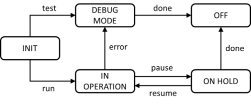

# ISTQB CTFL Sample Exam Set A - Questions

> Searchable Markdown conversion of the official ISTQB PDF, version 1.7, released April 1, 2025.
> The source PDF remains authoritative. Page anchors below correspond to physical PDF pages.

Source PDF: `resources/official/ISTQB-CTFL-Sample-A-Questions-v1.7.pdf`

<a id="pdf-page-1"></a>
<!-- Source PDF page 1 -->

### Sample Exam – Questions Sample Exam set A Version 1.7

### ISTQB® Certified Tester Syllabus Foundation Level Compatible with Syllabus version 4.0.1

International Software Testing Qualifications Board


<a id="pdf-page-2"></a>
<!-- Source PDF page 2 -->

### Copyright Notice

Copyright Notice © International Software Testing Qualifications Board (hereinafter called ISTQB®).

ISTQB® is a registered trademark of the International Software Testing Qualifications Board.

All rights reserved.

The authors hereby transfer the copyright to the ISTQB®. The authors (as current copyright holders) and ISTQB® (as the future copyright holder) have agreed to the following conditions of use:

Extracts, for non-commercial use, from this document may be copied if the source is acknowledged.

Any Accredited Training Provider may use this sample exam in their training course if the authors and the ISTQB® are acknowledged as the source and copyright owners of the sample exam and provided that any advertisement of such a training course is done only after official Accreditation of the training materials has been received from an ISTQB®-recognized Member Board.

Any individual or group of individuals may use this sample exam in articles and books, if the authors and the ISTQB® are acknowledged as the source and copyright owners of the sample exam.

Any other use of this sample exam is prohibited without first obtaining the approval in writing of the ISTQB®.

Any ISTQB®-recognized Member Board may translate this sample exam provided they reproduce the abovementioned Copyright Notice in the translated version of the sample exam.

### Document Responsibility

The ISTQB® Examination Working Group is responsible for this document.

This document is maintained by a core team from ISTQB® consisting of the Syllabus Working Group and Exam Working Group.

<a id="pdf-page-3"></a>
<!-- Source PDF page 3 -->

### Acknowledgements

This document was produced by a core team from ISTQB® : Laura Albert, Wim de Coutere, Arnika Hryszko, Gary Mogyorodi, (technical rewiever), Meile Posthuma, Gandhinee Rajkomar, Stuart Reid, Jean-François Riverin, Adam Roman, Lucjan Stapp, Stephanie Ulrich, Yaron Tsubery and Eshraka Zakaria.

The core team thanks the reviewers: Amanda Alderman, Alexander Alexandrov, Jürgen Beniermann, Rex Black, Young jae Choi, Nicola De Rosa, Klaudia Dussa-Zieger, Klaus Erlenbach, Joëlle Genois, Tamás Gergely, Dot Graham, Matthew Gregg, Gabriele Haller, Chinthaka Indikadahena, John Kurowski, Ine Lutterman, Isabelle Martin, Patricia McQuaid, Dénes Medzihradszky, Blair Mo, Gary Mogyorodi, Jörn Münzel, Markus Niehammer, Ingvar Nordström, Fran O'Hara, Raul Onisor, Dénes Orosz, Arnd Pehl, Horst Pohlmann, Nishan Portoyan, Ale Rebon Portillo, Stuart Reid, Ralf Reissing, Liang Ren, Jean-Francois Riverin, Lloyd Roden, Tomas Rosenqvist, Murian Song, Szilard Szell, Giancarlo Tomasig, Joanne Tremblay, François Vaillancourt, Daniel van der Zwan, André Verschelling and Paul Weymouth for their suggestions and input.

<a id="pdf-page-4"></a>
<!-- Source PDF page 4 -->

### Revision History

|Sample E|xam–Questions Layout|Template used:<br>Version 2.9<br>Date: August 10, 2022|
|---|---|---|
|**Version**|**Date**|**Remarks**|
|1.7|April 1, 2025|Correction of Question: #3, #20; Correction of usage of<br>Glossary terms|
|1.6|May 27, 2024|Correction of Question: #5, #6, #16, #A7, #A21|
|1.5|April 12, 2024|Minor correction of Question: #36|
|1.4|December 19, 2023|Minor correction of Question: #29|
|1.3|November 21, 2023|No chances, just saved to PDF with transparent background on<br>pictures|
|1.2|November 6, 2023|Correction of Question: #12, #A7<br>Minor correction of Question: #5, #A8, #A11, #A12, #A23<br>Correction of Roman type questions to match Roman type rules|
|1.1|October 16, 2023|Correction of Question: #5, #20, #A7|
|1.0|April 12, 2023|Release version|

<a id="pdf-page-5"></a>
<!-- Source PDF page 5 -->

## Table of Contents

```text
Copyright Notice ............................................................................................................................. 2
Document Responsibility ................................................................................................................. 2
Acknowledgements ......................................................................................................................... 3
Revision History .............................................................................................................................. 4
Table of Contents............................................................................................................................ 5
Introduction ..................................................................................................................................... 7
  Purpose of this document ............................................................................................................ 7
  Instructions .................................................................................................................................. 7
Questions ....................................................................................................................................... 8
    Question #1 (1 Point) ................................................................................................................................. 8
    Question #2 (1 Point) ................................................................................................................................. 8
    Question #3 (1 Point) ................................................................................................................................. 8
    Question #4 (1 Point) ................................................................................................................................. 9
    Question #5 (1 Point) ................................................................................................................................. 9
    Question #6 (1 Point) ................................................................................................................................. 9
    Question #7 (1 Point) ............................................................................................................................... 10
    Question #8 (1 Point) ............................................................................................................................... 10
    Question #9 (1 Point) ............................................................................................................................... 10
    Question #10 (1 Point) ............................................................................................................................. 11
    Question #11 (1 Point) ............................................................................................................................. 11
    Question #12 (1 Point) ............................................................................................................................. 11
    Question #13 (1 Point) ............................................................................................................................. 12
    Question #14 (1 Point) ............................................................................................................................. 12
    Question #15 (1 Point) ............................................................................................................................. 13
    Question #16 (1 Point) ............................................................................................................................. 13
    Question #17 (1 Point) ............................................................................................................................. 13
    Question #18 (1 Point) ............................................................................................................................. 13
    Question #19 (1 Point) ............................................................................................................................. 14
    Question #20 (1 Point) ............................................................................................................................. 14
    Question #21 (1 Point) ............................................................................................................................. 15
    Question #22 (1 Point) ............................................................................................................................. 16
    Question #23 (1 Point) ............................................................................................................................. 16
    Question #24 (1 Point) ............................................................................................................................. 17
    Question #25 (1 Point) ............................................................................................................................. 17
    Question #26 (1 Point) ............................................................................................................................. 17
    Question #27 (1 Point) ............................................................................................................................. 17
    Question #28 (1 Point) ............................................................................................................................. 18
    Question #29 (1 Point) ............................................................................................................................. 18
    Question #30 (1 Point) ............................................................................................................................. 18
    Question #31 (1 Point) ............................................................................................................................. 19
    Question #32 (1 Point) ............................................................................................................................. 19
    Question #33 (1 Point) ............................................................................................................................. 19
    Question #34 (1 Point) ............................................................................................................................. 20
    Question #35 (1 Point) ............................................................................................................................. 20
    Question #36 (1 Point) ............................................................................................................................. 21
    Question #37 (1 Point) ............................................................................................................................. 21
    Question #38 (1 Point) ............................................................................................................................. 21
    Question #39 (1 Point) ............................................................................................................................. 22
    Question #40 (1 Point) ............................................................................................................................. 22
Appendix: Additional Questions .................................................................................................... 23
    Question #A1 (1 Point) ............................................................................................................................ 23
    Question #A2 (1 Point) ............................................................................................................................ 23
```

<a id="pdf-page-6"></a>
<!-- Source PDF page 6 -->

|Question #A3 (1 Point) ............................................................................................................................ 23|
|---|
|Question #A4 (1 Point) ............................................................................................................................ 24|
|Question #A5 (1 Point) ............................................................................................................................ 24|
|Question #A6 (1 Point) ............................................................................................................................ 24|
|Question #A7 (1 Point) ............................................................................................................................ 25|
|Question #A8 (1 Point) ............................................................................................................................ 25|
|Question #A9 (1 Point) ............................................................................................................................ 25|
|Question #A10 (1 Point) .......................................................................................................................... 26|
|Question #A11 (1 Point) .......................................................................................................................... 26|
|Question #A12 (1 Point) .......................................................................................................................... 26|
|Question #A13 (1 Point) .......................................................................................................................... 27|
|Question #A14 (1 Point) .......................................................................................................................... 27|
|Question #A15 (1 Point) .......................................................................................................................... 27|
|Question #A16 (1 Point) .......................................................................................................................... 28|
|Question #A17 (1 Point) .......................................................................................................................... 28|
|Question #A18 (1 Point) .......................................................................................................................... 28|
|Question #A19 (1 Point) .......................................................................................................................... 29|
|Question #A20 (1 Point) .......................................................................................................................... 29|
|Question #A21 (1 Point) .......................................................................................................................... 30|
|Question #A22 (1 Point) .......................................................................................................................... 30|
|<br>Question #A23 (1 Point) .......................................................................................................................... 30|
|<br>Question #A24 (1 Point) .......................................................................................................................... 31|
|Question #A25 (1 Point) .......................................................................................................................... 31|
|Question #A26 (1 Point) .......................................................................................................................... 31|

<a id="pdf-page-7"></a>
<!-- Source PDF page 7 -->

### Introduction

### Purpose of this document

The example questions and answers and associated justifications in this sample exam have been created by a team of subject matter experts and experienced question writers with the aim of:

- Assisting ISTQB® Member Boards and Exam Boards in their question writing activities

- Providing training providers and exam candidates with examples of exam questions

### These questions cannot be used as-is in any official examination.

Note that real exams may include a wide variety of questions, and this sample exam **_is not_** intended to include examples of all possible question types, styles, or lengths; also, this sample exam may both be more difficult or less difficult than any official exam.

### Instructions

In this document you will find:

- Questions<sup>1</sup> , including for each question:

   - Any scenario needed by the question stem

   - Point value

   - Response (answer) option set

- Additional questions, including for each question [does not apply to all sample exams*]: `-` Any scenario needed by the question stem

   - Point value

   - Response (answer) option set

* The first 40 questions (and their answers) are arranged according to the exam structure and rules and therefore simulate a sample exam. The block “Additional Questions” (and answers) contains additional questions (and answers) that are not part of the sample exam but may help the learner to gain deeper knowledge in the related fields.

_Answers, including justification, are contained in a separate document._

> 1 In this sample exam the questions are sorted by the LO they target; this cannot be expected of a live exam.

<a id="pdf-page-8"></a>
<!-- Source PDF page 8 -->

### <u>Questions</u>

## Question #1 (1 Point)

Which of the following statements describe a valid test objective?

- a) To prove that there are no unfixed defects in the system under test

- b) To prove that there will be no failures after the implementation of the system into production

- c) To reduce the risk level of the test object and to build confidence in the quality level

- d) To verify that there are no untested combinations of inputs

Select ONE option.

## Question #2 (1 Point)

Which of the following options shows an example of test activities that contribute to success?

- a) Having testers involved during various software development lifecycle (SDLC) activities will help to detect defects in work products

- b) Testers try not to disturb the developers while coding, so that the developers write better code

- c) Testers collaborating with end users help to improve the quality of defect reports during component integration and system testing

- d) Certified testers will design much better test cases than non-certified testers

Select ONE option.

## Question #3 (1 Point)

You have been assigned as a tester to a team producing a new system incrementally. You have noticed that no changes have been made to the existing regression test cases for several iterations and no new regression defects were identified. Your manager is happy, but you are not. Which testing principle explains your skepticism?

- a) Tests wear out

- b) Absence-of-defects fallacy

- c) Defects cluster together

- d) Exhaustive testing is impossible

Select ONE option.

<a id="pdf-page-9"></a>
<!-- Source PDF page 9 -->

## Question #4 (1 Point)

You work in a team that develops a mobile application for food ordering. In the current iteration the team decided to implement the payment functionality.

Which of the following activities is a part of test analysis?

- a) Estimating that testing the integration with the payment service will take 8 person-days

- b) Deciding that the team should test if it is possible to properly share payment between many users

- c) Using boundary value analysis (BVA) to derive the test data for the test cases that check the correct payment processing for the minimum allowed amount to be paid

- d) Analyzing the discrepancy between the actual result and expected result after executing a test case that checks the process of payment with a credit card, and reporting a defect

Select ONE option.

## Question #5 (1 Point)

Which of the following factors have a SIGNIFICANT influence on the test approach?

   - i. The SDLC

   - ii. The number of defects detected in previous projects

   - iii. The identified product risks

   - iv. New regulatory requirements forcing formal white-box testing

   - v. The test environment setup

- a) i, ii have significant influence

- b) i, iii, iv have significant influence

- c) ii, iv, v have significant influence

- d) iii, v have significant influence

Select ONE option.

## Question #6 (1 Point)

Which TWO of the following tasks belong MAINLY to a testing role?

- a) Configure test environments

- b) Maintain the product backlog

- c) Design solutions to new requirements

- d) Create the test plan

- e) Analyze the test basis

Select TWO options.

<a id="pdf-page-10"></a>
<!-- Source PDF page 10 -->

## Question #7 (1 Point)

Which of the following skills (i-v) are the MOST important skills of a tester?

   - i. Having domain knowledge

   - ii. Creating a product vision

   - iii. Being a good team player

   - iv. Planning and organizing the work of the team

   - v. Critical thinking

- a) ii and iv are important

- b) i, iii and v are important

- c) i, ii and v are important

- d) iii and iv are important

Select ONE option.

## Question #8 (1 Point)

How is the whole team approach present in the interactions between testers and business representatives?

- a) Business representatives decide on test automation approaches

- b) Testers help business representatives to define a test strategy

- c) Business representatives are not part of the whole team approach

- d) Testers help business representatives to create suitable acceptance tests

Select ONE option.

## Question #9 (1 Point)

Consider the following rule: “for every SDLC activity there is a corresponding test activity”. In which SDLC models does this rule hold?

- a) Only in sequential development models

- b) Only in iterative development models

- c) Only in iterative and incremental development models

- d) In sequential, incremental, and iterative development models

Select ONE option.

<a id="pdf-page-11"></a>
<!-- Source PDF page 11 -->

## Question #10 (1 Point)

Which of the following statements BEST describes the acceptance test-driven development (ATDD) approach?

- a) In ATDD, acceptance criteria are typically created based on the given/when/then format

- b) In ATDD, test cases are mainly created at component testing and are code-oriented

- c) In ATDD , tests are created, based on acceptance criteria to drive the development of the related software

- d) in ATDD, tests are based on the desired behavior of the software, which makes it easier for team members to understand them

Select ONE option.

## Question #11 (1 Point)

Which of the following is NOT an example of the shift-left approach?

- a) Reviewing the user requirements before they are formally accepted by the stakeholders

- b) Writing a component test before the corresponding code is written

- c) Executing a performance efficiency test for a component during component testing

- d) Writing a test script before setting up the configuration management process

Select ONE option.

## Question #12 (1 Point)

Which of the arguments below would you use to convince your manager to organize retrospectives at the end of each release cycle?

- a) Retrospectives are very popular these days and clients would appreciate it if we added them to our processes

- b) Organizing retrospectives will save the organization money because without them end user representatives do not provide immediate feedback about the product

- c) Process weaknesses identified during the retrospective can be analyzed and serve as a to do list for the organization’s continuous process improvement program

- d) Retrospectives embrace five values including courage and respect, which are crucial to maintain continuous improvement in the organization

Select ONE option.

<a id="pdf-page-12"></a>
<!-- Source PDF page 12 -->

## Question #13 (1 Point)

Which types of failures (1-4) fit which test levels (A-D) BEST?

1. Failures in system behavior as it deviates from the user’s business needs

2. Failures in communication between components

3. Failures in logic in the code

4. Failures in not correctly implemented business rules

- A. Component testing

- B. Component integration testing

- C. System testing

- D. Acceptance testing

- a) 1D, 2B, 3A, 4C

- b) 1D, 2B, 3C, 4A
- c) 1B, 2A, 3D, 4C

- d) 1C, 2B, 3A, 4D

Select ONE option.

## Question #14 (1 Point)

You are testing a user story with three acceptance criteria: AC1, AC2 and AC3. AC1 is covered by test case TC1, AC2 by TC2, and AC3 by TC3. The test execution history had three test runs on three consecutive versions of the software as follows:

||**Execution 1**|**Execution 2**|**Execution 3**|
|---|---|---|---|
|**TC1**|(1) Failed|(4) Passed|(7) Passed|
|**TC2**|(2) Passed|(5) Failed|(8) Passed|
|**TC3**|(3) Failed|(6) Failed|(9) Passed|

Tests are repeated once you are informed that all defects found in the test run are corrected and a new version of the software is available.

Which of the above tests are executed as regression tests?

- a) Only 4, 7, 8, 9

- b) Only 5, 7

- c) Only 4, 6, 8, 9

- d) Only 5, 6

Select ONE option.

<a id="pdf-page-13"></a>
<!-- Source PDF page 13 -->

## Question #15 (1 Point)

Which of the following is NOT a benefit of static testing?

- a) Having less expensive defect management due to the ease of detecting defects later in the SDLC

- b) Fixing defects found during static testing is generally much less expensive than fixing defects found during dynamic testing

- c) Finding coding defects that might not have been found by only performing dynamic testing

- d) Detecting gaps and inconsistencies in requirements

Select ONE option.

## Question #16 (1 Point)

Which of the following is a benefit of early and frequent feedback?

- a) It improves the test process for future projects

- b) It forces customers to prioritize their requirements based on agreed risks

- c) It  provides a measure for the quality of changes

- d) It helps avoid requirements misunderstandings

Select ONE option.

## Question #17 (1 Point)

The reviews being used in your organization have the following attributes:

- There is the role of a scribe

- The main purpose is to evaluate quality

- The meeting is led by the author of the work product

- There is individual preparation

- A review report is produced

Which of the following review types is MOST likely being used?

- a) Informal review

- b) Walkthrough

- c) Technical review

- d) Inspection

Select ONE option.

## Question #18 (1 Point)

Which of these statements is NOT a factor that contributes to successful reviews?

- a) Participants should dedicate adequate time for the review

- b) Splitting large work products into small parts to make the required effort less intense

- c) Participants should avoid behaviors that might indicate boredom, exasperation, or hostility to other participants

- d) Failures found should be acknowledged, appreciated, and handled objectively

Select ONE option.

<a id="pdf-page-14"></a>
<!-- Source PDF page 14 -->

## Question #19 (1 Point)

Which of the following is a characteristic of experience-based test techniques?

- a) Test cases are created based on detailed design information

- b) Items tested within the interface code section are used to measure coverage
- c) The test techniques heavily rely on the tester’s knowledge of the software and the business domain

- d) The test cases are used to identify deviations from the requirements

Select ONE option.

## Question #20 (1 Point)

You are testing a simplified apartment search form which has only two search criteria:

- floor (with three possible options: ground floor; first floor; second or higher floor)

- garden type (with three possible options: no garden; small garden; large garden)

Each of the apartment on the ground floor has a garden, apartments on higher floors don’t. The form has a built-in validation mechanism that will not allow you to use the search criteria which violate this rule.

Each test has two input values: floor and garden type. You want to apply equivalence partitioning (EP) to cover each floor and each garden type in your tests.

What is the **minimal** number of test cases to achieve 100% EP coverage for valid partitions?

- a) 3
- b) 4
- c) 5
- d) 6

Select ONE option

<a id="pdf-page-15"></a>
<!-- Source PDF page 15 -->

## Question #21 (1 Point)

You are testing a system that calculates the final course grade for a given student.

The final grade is assigned based on the final result, according to the following rules:

- 0 – 50 points: failed

- 51 – 60 points: fair

- 61 – 70 points: satisfactory

- 71 – 80 points: good

- 81 – 90 points: very good

- 91 – 100 points: excellent

You have prepared the following set of test cases:

||**Final**<br>**result**|**Final**<br>**grade**|
|---|---|---|
|**TC1**|91|excellent|
|**TC2**|50|failed|
|**TC3**|81|very good|
|**TC4**|60|fair|
|**TC5**|70|satisfactory|
|**TC6**|80|good|

What is the 2-value boundary value analysis (BVA) coverage for the final result that is achieved with the existing test cases?

- a) 50%
- b) 60%
- c) 33.3%
- d) 100%

Select ONE option.

<a id="pdf-page-16"></a>
<!-- Source PDF page 16 -->

## Question #22 (1 Point)

Your favorite bicycle daily rental store has just introduced a new Customer Relationship Management system and asked you, one of their most loyal members, to test it.

The implemented features are as follows:

- Anyone can rent a bicycle, but members receive a 20% discount

- However, if the return deadline is missed, the discount is no longer available

- After 15 rentals, members get a gift: a T-Shirt

Decision table describing the implemented features looks as follows:

|**Conditions**|**R1**|**R2**|**R3**|**R4**|**R5**|**R6**|**R7**|**R8**|
|---|---|---|---|---|---|---|---|---|
|Being a member|T|T|T|T|F|F|F|F|
|Missed deadline|T|F|T|F|T|F|F|T|
|15th rental|F|F|T|T|F|F|T|T|
|**Actions**|||||||||
|20% discount||X||X|||||
|Gift T-Shirt|||X|X||||X|

Based ONLY on the feature description of the Customer Relationship Management system, which of the above rules describes an impossible situation?

- a) R4

- b) R2
- c) R6
- d) R8

Select ONE option.

## Question #23 (1 Point)

You test a system whose lifecycle is modeled by the state transition diagram shown below. The system starts in the INIT state and ends its operation in the OFF state.



What is the MINIMAL number of test cases to achieve valid transitions coverage?

- a) 4
- b) 2
- c) 7
- d) 3

Select ONE option.

<a id="pdf-page-17"></a>
<!-- Source PDF page 17 -->

## Question #24 (1 Point)

Your test suite achieved 100% statement coverage. What is the consequence of this fact?

- a) Each instruction in the code that contains a defect has been executed at least once
- b) Any test suite containing more test cases than your test suite will also achieve 100% statement coverage

- c) Each path in the code has been executed at least once
- d) Every combination of input values has been tested at least once

Select ONE option.

## Question #25 (1 Point)

Which of the following is NOT true for white-box testing?

- a) During white-box testing the entire software implementation is considered

- b) White-box coverage metrics can help identify additional tests to increase code coverage

- c) White-box test techniques can be used in static testing
- d) White-box testing can help identify gaps in requirements implementation

Select ONE option.

## Question #26 (1 Point)

Which of the following BEST describes the concept behind error guessing?

- a) Error guessing involves using your knowledge and experience of defects found in the past and typical errors made by developers

- b) Error guessing involves using your personal experience of development and the errors you made as a developer

- c) Error guessing requires you to imagine that you are the user of the test object and to guess errors the user could make interacting with it

- d) Error guessing requires you to rapidly duplicate the development task to identify the sort of errors a developer might make

Select ONE option.

## Question #27 (1 Point)

In your project there has been a delay in the release of a brand-new application and test execution started late, but you have very detailed domain knowledge and good analytical skills. The full list of requirements has not yet been shared with the team, but management is asking for some test results to be presented.

Which test technique fits BEST in this situation?

- a) Checklist-based testing

- b) Error guessing

- c) Exploratory testing

- d) Branch testing

Select ONE option.

<a id="pdf-page-18"></a>
<!-- Source PDF page 18 -->

## Question #28 (1 Point)

Which of the following BEST describes the way acceptance criteria can be documented?

- a) Performing retrospectives to determine the actual needs of the stakeholders regarding a given user story

- b) Using the given/when/then format to describe an example test condition related to a given user story

- c) Using verbal communication to reduce the risk of misunderstanding the acceptance criteria by others

- d) Documenting risks related to a given user story in a test plan to facilitate the risk-based testing of a given user story

Select ONE option.

## Question #29 (1 Point)

Consider the following user story:

_As an Editor_

_I want to review content before it is published so that I can ensure the grammar is correct_

and its acceptance criteria:

- The user can log in to the content management system with "Editor" role

- The editor can view existing content pages

- The editor can edit the page content

- The editor can add markup comments

- The editor can save changes

- The editor can reassign to the "content owner" role to make updates

Which of the following is the BEST example of an ATDD test for this user story?

- a) Test if the editor can save the document after edit the page content

- b) Test if the content owner can log in and make updates to the content

- c) Test if the editor can schedule the edited content for publication

- d) Test if the editor can reassign to another editor to make updates

Select ONE option.

## Question #30 (1 Point)

How do testers add value to iteration and release planning?

- a) Testers determine the priority of the user stories to be developed

- b) Testers focus only on the functional aspects of the system to be tested

- c) Testers participate in the detailed risk identification and risk assessment of user stories

- d) Testers guarantee the release of high-quality software through early test design during the release planning

Select ONE option.

<a id="pdf-page-19"></a>
<!-- Source PDF page 19 -->

## Question #31 (1 Point)

Which TWO of the following options are the exit criteria for testing a system?

- a) Test environment readiness

- b) The ability to log in to the test object by the tester

- c) Estimated defect density is reached

- d) Requirements are translated into given/when/then format

- e) Regression tests are automated

Select TWO options.

## Question #32 (1 Point)

Your team uses the three-point estimation technique to estimate the test effort for a new high-risk feature. The following estimates were made:

- Most optimistic estimation: 2 person-hours

- Most likely estimation: 11 person-hours

- Most pessimistic estimation: 14 person-hours

What is the final estimate?

- a) 9 person-hours

- b) 14 person-hours

- c) 11 person-hours

- d) 10 person-hours

Select ONE option.

## Question #33 (1 Point)

You are testing a mobile application that allows users to find a nearby restaurant based on the type of food they want to eat. Consider the following list of test cases, priorities (i.e., a smaller number means a higher priority), and dependencies:

|**Test case**<br>**number**|**Test condition covered**|**Priority**|**Logical**<br>**dependency**|
|---|---|---|---|
|TC 001|Select type of food|3|none|
|TC 002|Select restaurant|2|TC 001|
|TC 003|Get direction|1|TC 002|
|TC 004|Call restaurant|2|TC 002|
|TC 005|Make reservation|3|TC 002|

Which of the following test cases should be executed as the third one?

- a) TC 003
- b) TC 005
- c) TC 002
- d) TC 001

Select ONE option.

<a id="pdf-page-20"></a>
<!-- Source PDF page 20 -->

## Question #34 (1 Point)

Consider the following test categories (1-4) and agile testing quadrants (A-D):

1. Usability testing

2. Component testing

3. Functional testing

4. Reliability testing

- A. Agile testing quadrant Q1: technology facing, supporting the development team B. Agile testing quadrant Q2: business facing, supporting the development team C. Agile testing quadrant Q3: business facing, critique the product

- D. Agile testing quadrant Q4: technology facing, critique the product

How do the following test categories map onto the agile testing quadrants?

- a) 1C, 2A, 3B, 4D
- b) 1D, 2A, 3C, 4B
- c) 1C, 2B, 3D, 4A

- d) 1D, 2B, 3C, 4A

Select ONE option.

## Question #35 (1 Point)

During a risk analysis the following risk was identified and assessed:

- Risk: Response time is too long to generate a report

- Risk likelihood: medium; risk impact: high

- Response to risk:

   - An independent test team performs performance efficiency testing during system testing

   - A selected sample of end users performs alpha testing and beta testing before the release

What measure is proposed to be taken in response to this analyzed risk?

- a) Risk acceptance

- b) Contingency plan
- c) Risk mitigation

- d) Risk transfer

Select ONE option.

<a id="pdf-page-21"></a>
<!-- Source PDF page 21 -->

## Question #36 (1 Point)

Which work product can be used by an agile team to show the amount of work that has been completed and the amount of total work remaining for a given iteration?

- a) Acceptance criteria

- b) Defect report

- c) Test completion report

- d) Burndown chart

Select ONE option.

## Question #37 (1 Point)

You need to update one of the automated test scripts to be in line with a new requirement. Which process indicates that you create a new version of the test script in the test repository?

- a) Traceability management

- b) Maintenance testing

- c) Configuration management

- d) Requirements engineering

Select ONE option.

## Question #38 (1 Point)

You received the following defect report from the developers stating that the anomaly described in this test report is not reproducible.

_Application hangs up_

_2022-May-03 – John Doe – Rejected_

_The application hangs up after entering “Test input: $” in the Name field on the new user creation screen. Tried to log off, log in with test_admin01 account, same issue. Tried with other test admin accounts, same issue. No error message received; log (see attached) contains fatal error notification. Based on the test case TC-1305, the application should accept the provided input and create the user. Please fix with high priority, this feature is related to REQ-0012, which is a critical new business requirement._

What critical information is MISSING from this test report that would have been useful for the developers?

- a) Expected result and actual result

- b) References and defect status

- c) Test environment and test item

- d) Priority and severity

Select ONE option.

<a id="pdf-page-22"></a>
<!-- Source PDF page 22 -->

## Question #39 (1 Point)

Which test activity does a data preparation tool support?

- a) Test monitoring and test control

- b) Test analysis

- c) Test design and test implementation

- d) Test completion

Select ONE option.

## Question #40 (1 Point)

Which item correctly identifies a potential risk of performing test automation?

- a) It may introduce unknown regressions in production

- b) Sufficient efforts to maintain testware may not be properly allocated

- c) Testing tools and associated testware may not be sufficiently relied upon

- d) It may reduce the time allocated for manual testing

Select ONE option.

<a id="pdf-page-23"></a>
<!-- Source PDF page 23 -->

### Appendix: Additional Questions

## Question #A1 (1 Point)

You were given a task to analyze and fix causes of failures in a new system to be released.

Which activity are you performing?

- a) Debugging

- b) Software testing

- c) Requirement elicitation

- d) Defect management

Select ONE option.

## Question #A2 (1 Point)

In many software organizations the test department is called the Quality Assurance (QA) department. Is this sentence correct or not and why?

- a) It is correct. Testing and QA mean exactly the same thing

- b) It is correct. These names can be used interchangeably because both testing and QA focus their activities on the same quality issues

- c) It is not correct. Testing is something more; testing includes all activities with regard to quality. QA focuses on quality-related processes

- d) It is not correct. QA is focused on quality-related processes while testing concentrates on demonstrating that a component or system is fit for purpose and to detect defects

Select ONE option.

## Question #A3 (1 Point)

A phone ringing in a neighboring cubicle distracts a programmer causing him to improperly program the logic that checks the upper boundary of an input variable. Later, during system testing, a tester notices that this input field accepts invalid input values.

Which of the following correctly describes an incorrectly coded upper bound?

- a) The root cause

- b) A failure

- c) An error

- d) A defect

Select ONE option.

<a id="pdf-page-24"></a>
<!-- Source PDF page 24 -->

## Question #A4 (1 Point)

Consider the following testware.

|Test Charter #|04.018<br>Session time: 1h|
|---|---|
|Explore:|Registration page|
|With:|Different sets of incorrect input data|
|To discover:|Defects related to accepting the registration process with the<br>incorrect input|

Which test activity produces this testware as an output?

- a) Test planning

- b) Test monitoring and test control

- c) Test analysis

- d) Test design

Select ONE option.

## Question #A5 (1 Point)

Which of the following is the BEST example of how traceability supports testing?

- a) Performing the impact analysis of a change will give information about the completion of the tests

- b) Analyzing the traceability between test cases and test results will give information about the estimated level of residual risk

- c) Performing the impact analysis of a change will help selecting the right test cases for regression testing

- d) Analyzing the traceability between the test basis, the test objects and the test cases will help in selecting test data to achieve the assumed coverage of the test object

Select ONE option.

## Question #A6 (1 Point)

Which of the following BEST explains a benefit of independence of testing?

- a) The use of an independent test team allows project management to assign responsibility for the quality of the final deliverable to the test team

- b) If a test team external to the organization can be afforded, then there are distinct benefits in terms of this external team not being so easily swayed by the delivery concerns of project management and the need to meet strict delivery deadlines

- c) An independent test team can work separately from the developers, need not be distracted with project requirement changes, and can restrict communication with the developers to defect reporting through the defect management system

- d) When specifications contain ambiguities and inconsistencies, assumptions are made on their interpretation, and an independent tester can be useful in questioning those assumptions and the interpretation made by the developer

Select ONE option.

<a id="pdf-page-25"></a>
<!-- Source PDF page 25 -->

## Question #A7 (1 Point)

You are working as a tester in the team that follows the V-model. Which of the following activities CAN be performed in the initial phases of the SDLC?

- a) Dynamic test execution

- b) Static testing

- c) Test planning

- d) Acceptance test execution

- e) Maintenance testing

Select TWO options.

## Question #A8 (1 Point)

Which of the following are advantages of DevOps?

   - i. Faster product release and faster time to market

   - ii. Increases the need for repetitive manual testing

   - iii. Constant availability of executable software

   - iv. Reduction in the number of regression tests associated with code refactoring

   - v. Setting up the test automation framework is inexpensive since everything is automated

- a) i, ii, iv are advantages

- b) iii, v are advantages

- c) i, iii are advantages

- d) ii, iv, v are advantages

Select ONE option.

## Question #A9 (1 Point)

You work as a tester on a project on a mobile application for food ordering for one of your clients. The client sent you a list of requirements. One of them, with high priority, says

- _“The order must be processed in less than 10 seconds in 95% of the cases”._

You created a set of test cases in which a number of random orders were made, the processing time measured, and the test results were checked against the requirements.

What test type did you perform?

- a) Functional, because the test cases cover the user’s business requirement for the system

- b) Non-functional, because they measure the system’s performance

- c) Functional, because the test cases interact with the user interface

- d) White-box, because we need to know the internal structure of the program to measure the order processing time

Select ONE option.

<a id="pdf-page-26"></a>
<!-- Source PDF page 26 -->

## Question #A10 (1 Point)

Your organization’s test strategy suggests that once a system is going to be retired, data migration shall be tested. As part of what test type is this testing MOST likely to be performed?

- a) Maintenance testing

- b) Regression testing

- c) Reliability testing

- d) Integration testing

Select ONE option.

## Question #A11 (1 Point)

The following is a list of the work products produced in the SDLC.

- i. Business requirements

- ii. Schedule

- iii. Test budget

- iv. Third-party executable code v. User stories and their acceptance criteria

Which of them can be reviewed?

- a) i and iv can be reviewed

- b) i, ii, iii and iv can be reviewed

- c) i, ii, iii, and v can be reviewed
- d) iii, iv, v can be reviewed

Select ONE option.

## Question #A12 (1 Point)

Decide which of the following statements (i-v) are true for static testing.

   - i. Abnormal external behaviors are easier to identify with this testing

   - ii. Discrepancies from a coding standard are easier to find with this testing

   - iii. It identifies failures caused by defects when the software is run

- iv. Its test objective is to identify defects as early as possible v. Missing coverage for critical security requirements is easier to find and fix

- a) i, iv, v are true for static testing

- b) i, iii, iv are true for static testing

- c) ii, iii are true for static testing

- d) ii, iv, v are true for static testing

Select ONE option.

<a id="pdf-page-27"></a>
<!-- Source PDF page 27 -->

## Question #A13 (1 Point)

Which of the following statements about formal reviews is TRUE?

- a) Some reviews do not require more than one role

- b) The review process has several activities

- c) Documentation to be reviewed is not distributed before the review meeting, with the exception of the work product for specific review types

- d) Defects found during the review are not reported since they are not found by dynamic testing

Select ONE option.

## Question #A14 (1 Point)

What task may management take on during a formal review?

- a) Taking overall responsibility for the review

- b) Deciding what is to be reviewed

- c) Ensuring the effective running of review meetings, and moderating, if necessary

- d) Recording review information such as review decisions

Select ONE option.

## Question #A15 (1 Point)

A wine storage system uses a control device that measures the wine cell temperature T (measured in °C, rounded to the nearest degree) and alarms the user if it deviates from the optimal value of 12, according to the following rules:

- if T = 12, the system says, “optimal temperature”

- if T < 12, the system says, “temperature is too low!”

- if T > 12, the system says, “temperature is too high!”

You want to use the 3-point boundary value analysis (BVA) to verify the behavior of the control device. A test input is a temperature in °C provided by the device.

What is the MINIMAL set of test inputs that achieves 100% of the desired coverage?

- a) 11, 12, 13
- b) 10, 12, 14
- c) 10, 11, 12, 13, 14
- d) 10, 11, 13, 14

Select ONE option.

<a id="pdf-page-28"></a>
<!-- Source PDF page 28 -->

## Question #A16 (1 Point)

Which of the following statements about branch testing is CORRECT?

- a) If a program includes only unconditional branches, then 100% branch coverage can be achieved without executing any test cases

- b) If the test cases exercise all unconditional branches in the code, then 100% branch coverage is achieved

- c) If 100% statement coverage is achieved, then 100% branch coverage is also achieved

- d) If 100% branch coverage is achieved, then all decision outcomes in each decision statement in the code are exercised

Select ONE option.

## Question #A17 (1 Point)

You are testing a mobile application that allows customers to access and manage their bank accounts. You are running a test suite that involves evaluating each screen, and each field on each screen, against a general list of user interface best practices derived from a popular book on the topic that maximizes usability for such applications. Which of the following options BEST categorizes the test technique you are using?

- a) Black-box

- b) Exploratory

- c) Checklist-based

- d) Error guessing

Select ONE option.

## Question #A18 (1 Point)

Which of the following BEST describe the collaborative approach to user story writing?

- a) User stories are created by testers and developers and then accepted by business representatives

- b) User stories are created by business representatives, developers, and testers together
- c) User stories are created by business representatives and verified by developers and testers
- d) User stories are created in a way that they are independent, negotiable, valuable, estimable, small, and testable

Select ONE option.

<a id="pdf-page-29"></a>
<!-- Source PDF page 29 -->

## Question #A19 (1 Point)

Consider the following part of a test plan.

_Testing will be performed using component testing and component integration testing. The regulations require to demonstrate that 100% branch coverage is achieved for each component classified as critical._

Which part of the test plan does this part belong to?

- a) Communication

- b) Risk register

- c) Context of testing

- d) Test approach

Select ONE option.

## Question #A20 (1 Point)

Your team uses planning poker to estimate the test effort for a newly required feature. There is a rule in your team that if there is no time to reach full agreement and the variation in the results is small, rules like “accept the number with the most votes” can be applied.

After two rounds, the consensus was not reached, so the third round was initiated. You can see the test estimation results in the table below.

|||Team|mem|bers'|estima|tions||
|---|---|---|---|---|---|---|---|
|Round 1|21|2|5|34|13|8|2|
|Round 2|13|8|8|34|13|8|5|
|Round 3|13|8|13|13|13|13|8|

Which of the following is the BEST example of the next step?

- a) The product owner has to step in and make a final decision

- b) Accept 13 as the final test estimate as this has most of the votes

- c) No further action is needed. Consensus has been reached

- d) Remove the new feature from the current release because consensus has not been reached

Select ONE option.

<a id="pdf-page-30"></a>
<!-- Source PDF page 30 -->

## Question #A21 (1 Point)

Which of the following is TRUE regarding the test pyramid?

- a) It emphasizes having far more tests at the lower test levels

- b) It suggests that each low-level test checks a large part of the functionality

- c) It describes distribution of test types across the SDLC

- d) It has no impact on the construction of automated tests

Select ONE option.

## Question #A22 (1 Point)

During risk analysis the team considered the following risk: “ _The system allows too high a discount for a customer_ ”. The team estimated the risk impact to be very high.

What can one say about the risk likelihood?

- a) It is also very high. High risk impact always implies high risk likelihood

- b) It is very low. High risk impact always implies low risk likelihood

- c) One cannot say anything about risk likelihood. Risk impact and risk likelihood are independent.

- d) Risk likelihood is not important with such a high-risk impact. One does not need to define it.

Select ONE option.

## Question #A23 (1 Point)

The following list contains risks that have been identified for a new software product to be developed:

- i. Management moves two experienced testers to another project

- ii. The system does not comply with security standards

- iii. System response time exceeds user requirements

- iv. Stakeholders have inaccurate expectations

- v. Disabled people have problems when using the system

Which of them are project risks?

- a) i, iv are project risks

- b) iv, v are project risks
- c) i, iii are project risks

- d) ii, v are project risks

Select ONE option.

<a id="pdf-page-31"></a>
<!-- Source PDF page 31 -->

## Question #A24 (1 Point)

Which of the following is an example of how product risk analysis influences thoroughness and scope of testing?

- a) The test manager monitors and reports the level of all known risks on a daily basis so the stakeholders can make an informed decision on the release date

- b) One of the identified risks was " _Lack of support of open-source databases_ ", so the team decided to integrate the system with an open-source database

- c) During the quantitative risk analysis, the team estimated the total level of all identified risks and reported it as the total residual risk before testing

- d) Risk assessment revealed a very high level of performance risks, so it was decided to perform detailed performance efficiency testing early in the SDLC

Select ONE option.

## Question #A25 (1 Point)

Which TWO of the following options are common metrics used for reporting on the quality level of the test object?

- a) Number of defects found during system testing

- b) Total effort on test design divided by the number of designed test cases

- c) Number of executed test procedures

- d) Number of defects found divided by the size of a work product

- e) Time needed to repair a defect

Select TWO options.

## Question #A26 (1 Point)

Which of the following pieces of information contained in a test progress report is the LEAST useful for business representatives?

- a) Impediments to testing

- b) Branch coverage achieved

- c) Test progress

- d) New risks within the test cycle

Select ONE option.
