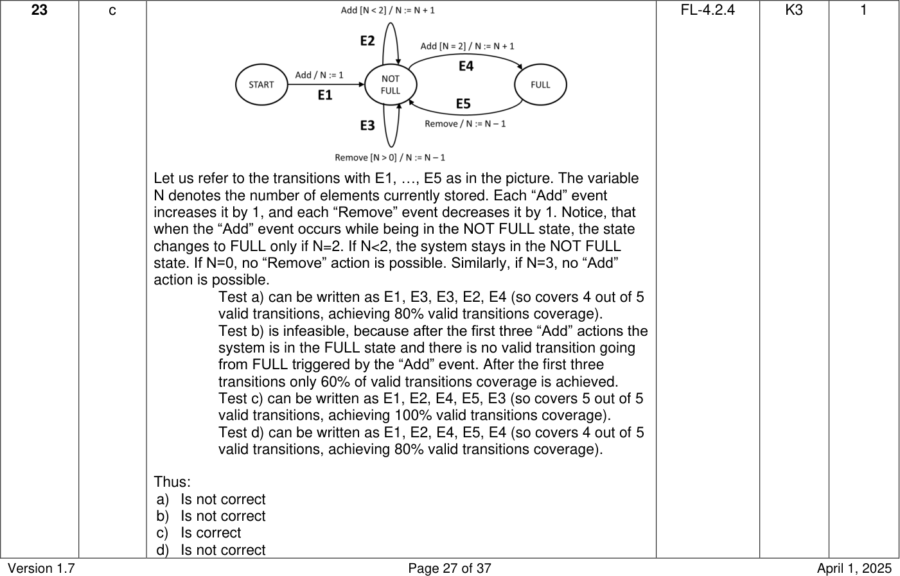

# ISTQB CTFL Sample Exam Set B - Answers

> Searchable Markdown conversion of the official ISTQB PDF, version 1.7, released April 1, 2025.
> The source PDF remains authoritative. Page anchors below correspond to physical PDF pages.

Source PDF: `resources/official/ISTQB-CTFL-Sample-B-Answers-v1.7.pdf`

<a id="pdf-page-1"></a>
<!-- Source PDF page 1 -->

### Sample Exam – Answers Sample Exam set B Version 1.7

### ISTQB® Certified Tester Syllabus Foundation Level

**Compatible with Syllabus version 4.0.1**

International Software Testing Qualifications Board


<a id="pdf-page-2"></a>
<!-- Source PDF page 2 -->

### Copyright Notice

Copyright Notice © International Software Testing Qualifications Board (hereinafter called ISTQB®).

ISTQB® is a registered trademark of the International Software Testing Qualifications Board.

All rights reserved.

The authors hereby transfer the copyright to the ISTQB®. The authors (as current copyright holders) and ISTQB® (as the future copyright holder) have agreed to the following conditions of use:

Extracts, for non-commercial use, from this document may be copied if the source is acknowledged.

Any Accredited Training Provider may use this sample exam in their training course if the authors and the ISTQB® are acknowledged as the source and copyright owners of the sample exam and provided that any advertisement of such a training course is done only after official Accreditation of the training materials has been received from an ISTQB®-recognized Member Board.

Any individual or group of individuals may use this sample exam in articles and books, if the authors and the ISTQB® are acknowledged as the source and copyright owners of the sample exam.

Any other use of this sample exam is prohibited without first obtaining the approval in writing of the ISTQB®.

Any ISTQB®-recognized Member Board may translate this sample exam provided they reproduce the abovementioned Copyright Notice in the translated version of the sample exam.

### Document Responsibility

The ISTQB® Examination Working Group is responsible for this document.

This document is maintained by a core team from ISTQB® consisting of the Syllabus Working Group and Exam Working Group.

### Acknowledgements

This document was produced by a core team from the ISTQB® : Stuart Reid and Adam Roman

The core team thanks the Exam Working Group review team, the Syllabus Working Group and Member Boards for their suggestions and input.

<a id="pdf-page-3"></a>
<!-- Source PDF page 3 -->

### Revision History

|Sample E|xam–Answers Layout T|emplate used:<br>Version 2.11<br>Date: October 16, 2023|
|---|---|---|
|**Version**|**Date**|**Remarks**|
|1.7|April 1, 2025|Correction of usage of Glossary terms|
|1.6|July 8, 2024|Correction of Question #32|
|1.5|May 29, 2024|Minor correction of Answer: #28|
|1.4|April 12, 2024|Cleanup of Answer: #2|
|1.3|January 8, 2024|Bump to match Question document|
|1.2|December 5, 2023|Correction of LO for Question: #15|
|1.1|November 15, 2023|Bump to match Question document|
|1.0|October 16 2023|First version|

<a id="pdf-page-4"></a>
<!-- Source PDF page 4 -->

## Table of Contents

```text
Copyright Notice ............................................................................................................................. 2
Document Responsibility ................................................................................................................. 2
Acknowledgements ......................................................................................................................... 2
Revision History .............................................................................................................................. 3
Table of Contents............................................................................................................................ 4
Introduction ..................................................................................................................................... 5
  Purpose of this document ............................................................................................................ 5
  Instructions .................................................................................................................................. 5
Answer Key ..................................................................................................................................... 6
Answers .......................................................................................................................................... 7
    1 ................................................................................................................................................................. 7
    2 ................................................................................................................................................................. 8
    3 ................................................................................................................................................................. 9
    4 ............................................................................................................................................................... 10
    5 ............................................................................................................................................................... 11
    6 ............................................................................................................................................................... 12
    7 ............................................................................................................................................................... 13
    8 ............................................................................................................................................................... 14
    9 ............................................................................................................................................................... 15
    10 ............................................................................................................................................................. 16
    11 ............................................................................................................................................................. 16
    12 ............................................................................................................................................................. 17
    13 ............................................................................................................................................................. 18
    14 ............................................................................................................................................................. 18
    15 ............................................................................................................................................................. 19
    16 ............................................................................................................................................................. 20
    17 ............................................................................................................................................................. 21
    18 ............................................................................................................................................................. 22
    19 ............................................................................................................................................................. 23
    20 ............................................................................................................................................................. 24
    21 ............................................................................................................................................................. 25
    22 ............................................................................................................................................................. 26
    23 ............................................................................................................................................................. 27
    24 ............................................................................................................................................................. 28
    25 ............................................................................................................................................................. 29
    26 ............................................................................................................................................................. 30
    27 ............................................................................................................................................................. 31
    28 ............................................................................................................................................................. 31
    29 ............................................................................................................................................................. 31
    30 ............................................................................................................................................................. 32
    31 ............................................................................................................................................................. 32
    32 ............................................................................................................................................................. 33
    33 ............................................................................................................................................................. 33
    34 ............................................................................................................................................................. 34
    35 ............................................................................................................................................................. 34
    36 ............................................................................................................................................................. 35
    37 ............................................................................................................................................................. 35
    38 ............................................................................................................................................................. 36
    39 ............................................................................................................................................................. 36
    40 ............................................................................................................................................................. 37
```

<a id="pdf-page-5"></a>
<!-- Source PDF page 5 -->

### Introduction

### Purpose of this document

The example questions and answers and associated justifications in this sample exam have been created by a team of subject matter experts and experienced question writers with the aim of:

- Assisting ISTQB® Member Boards and Exam Boards in their question writing activities

- Providing training providers and exam candidates with examples of exam questions

These questions cannot be used as-is in any official examination.

**Note** , that real exams may include a wide variety of questions, and this sample exam **_is not_** intended to include examples of all possible question types, styles or lengths, also this sample exam may both be more difficult or less difficult than any official exam.

### Instructions

In this document you may find:

- Answer Key table, including for each correct answer:

   - K-level, Learning Objective, and Point value

- Answer sets, including for all questions:

   - Correct answer

   - Justification for each response (answer) option

   - K-level, Learning Objective, and Point value

- Additional answer sets, including for all questions [does not apply to all sample exams]: `-` Correct answer

   - Justification for each response (answer) option

   - K-level, Learning Objective, and Point value

- _Questions are contained in a separate document_

<a id="pdf-page-6"></a>
<!-- Source PDF page 6 -->

### Answer Key

|**Question**<br>**Number (#)**|**Correct Answer**|**LO**|**K-Level**|**Points**|**Question**<br>**Number (#)**|**Correct Answer**|**LO**|**K-Level**|**Points**|
|---|---|---|---|---|---|---|---|---|---|
|1|d|FL-1.2.1|K2|1|21|d|FL-4.2.2|K3|1|
|2|b|FL-1.2.2|K1|1|22|b|FL-4.2.3|K3|1|
|3|d|FL-1.3.1|K2|1|23|c|FL-4.2.4|K3|1|
|4|a|FL-1.4.1|K2|1|24|b|FL-4.3.1|K2|1|
|5|c|FL-1.4.2|K2|1|25|c|FL-4.3.2|K2|1|
|6|b|FL-1.4.4|K2|1|26|a, e|FL-4.4.2|K2|1|
|7|b|FL-1.5.1|K2|1|27|d|FL-4.4.3|K2|1|
|8|d|FL-1.5.2|K1|1|28|b|FL-4.5.2|K2|1|
|9|b|FL-2.1.1|K2|1|29|d|FL-4.5.3|K3|1|
|10|b|FL-2.1.2|K1|1|30|a|FL-5.1.3|K2|1|
|11|a|FL-2.1.3|K1|1|31|b|FL-5.1.4|K3|1|
|12|b|FL-2.1.4|K2|1|32|b|FL-5.1.5|K3|1|
|13|a|FL-2.2.1|K2|1|33|d|FL-5.1.7|K2|1|
|14|d|FL-2.2.3|K2|1|34|c|FL-5.2.4|K2|1|
|15|b|FL-3.1.3|K2|1|35|a|FL-5.3.1|K1|1|
|16|c|FL-3.2.1|K1|1|36|a|FL-5.3.3|K2|1|
|17|d|FL-3.2.2|K2|1|37|a|FL-5.4.1|K2|1|
|18|c|FL-3.2.3|K1|1|38|b|FL-5.5.1|K3|1|
|19|d|FL-4.1.1|K2|1|39|c|FL-6.1.1|K2|1|
|20|a|FL-4.2.1|K3|1|40|a|FL-6.2.1|K1|1|

<a id="pdf-page-7"></a>
<!-- Source PDF page 7 -->

### Answers

|**Question**<br>**Number**<br>**(#)**|**Correct**<br>**Answer**|**Explanation / Rationale**|**Learning**<br>**Objective**<br>**(LO)**|**K-Level**|**Number**<br>**of**<br>**Points**|
|---|---|---|---|---|---|
|**1**|d|a) Is not correct. It is often possible to use dynamic testing to cause a test<br>object to fail in ways that could never be achieved by the users, such as<br>by using fault injection. However, if the failure can never occur with real<br>end users, then identifying it is not especially valuable as testing is<br>ultimately aimed at improving the work product for the end users.<br>Spending time testing for failures that cannot occur with real users is not<br>an efficient use of a tester’s time<br>b) Is not correct. Static testing in the form of static analysis is used by<br>developers to identify defects in their code earlier than can be achieved<br>through dynamic testing. Note, however, that static testing (and static<br>analysis) is used to detect defects, not failures, which are found by<br>dynamic testing.Thus it is the use of the term ‘failures’ that makes this<br>an incorrect option<br>c) Is not correct. Static analysis directly detects defects in code, and this is<br>normally information for the developer, not the customer.<br>d) Is correct. Reviews are a form of static testing that can be applied from<br>the very start of the software development lifecycle and are used to find<br>defects that can be removed before subsequent development activities<br>waste effort on faulty requirements. If the defects are not detected and<br>removed early on, then when the defect is found in derived work<br>products, such as the design and code, the requirements will need to be<br>changed.|FL-1.2.1|K2|1|

<a id="pdf-page-8"></a>
<!-- Source PDF page 8 -->

|**Question**<br>**Number**<br>**(#)**|**Correct**<br>**Answer**|**Explanation / Rationale**|**Learning**<br>**Objective**<br>**(LO)**|**K-Level**|**Number**<br>**of**<br>**Points**|
|---|---|---|---|---|---|
|**2**|b|a) Is not correct. QA concentrates on process improvement and<br>implementation, using a preventive approach to avoid errors and<br>defects, while testing is a form of QC that is used to detect defects<br>b) Is correct. QC aims to achieve appropriate levels of quality by focusing<br>on identifying and correcting product defects. Testing is a significant<br>part of QC and helps to uncover these defects<br>c) Is not correct. Although testing is a significant part of QC and helps to<br>uncover defects, other (non-testing) techniques utilized in QC include<br>formal methods like model checking and proof of correctness, as well as<br>simulation and prototyping<br>d) Is not correct. QA concentrates on process improvement and<br>implementation, using a preventive approach to avoid errors and<br>defects, while testing is a form of QC that is used to detect defects|FL-1.2.2|K1|1|

<a id="pdf-page-9"></a>
<!-- Source PDF page 9 -->

|**3**|d<br>The ‘exhaustive testing is impossible’ principle is concerned with the fact<br>that it is not feasible to test every possible variation of inputs in all different<br>circumstances, except in trivial cases. Instead, testing utilizes test<br>techniques, test case prioritization, and risk-based testing to sample from<br>the set of possibilities and focus test efforts.|FL-1.3.1|K2|1|
|---|---|---|---|---|
||a) Is not correct. The principle states that it is not feasible to test everything<br>except in trivial cases. Testing everything would require testing every<br>possible variation of inputs in all different circumstances, which is<br>generally infeasible as there will be a practically infinite number of<br>possibilities. Testing every possible expected result will not address this<br>problem as the relationship between inputs and expected results can be<br>different for each test object. Sometimes there may be a practically<br>infinite number of possible expected results (e.g., when there are<br>several variables representing real numbers), whereas at other times<br>there may be just two expected results, such as with a single variable<br>that can be either true or false<br>b) Is not correct. The principle states that it is not feasible to test every<br>possible variation of inputs in all different circumstances. This is<br>because for non-trivial systems there is a practically infinite number.<br>Therefore, in practice, documenting all possible input variations would<br>be impractical as it would take an infinite length of time<br>c) Is not correct. Starting testing as early as possible with reviews and<br>other static testing approaches will not address the problem of there<br>being too many possible test cases. The ‘early testing saves time and<br>money’ principle is concerned with fixing defects early on to prevent the<br>occurrence of subsequent defects in derived work products, thereby<br>reducing costs and the likelihood of failures<br>d) Is correct. The use of equivalence partitioning and boundary value<br>analysis to generate test cases is one way to address the principle as<br>these test techniques provide a systematic way to derive a finite subset<br>of all possible test cases||||

<a id="pdf-page-10"></a>
<!-- Source PDF page 10 -->

|**Question**<br>**Number**<br>**(#)**|**Correct**<br>**Answer**|**Explanation / Rationale**|**Learning**<br>**Objective**<br>**(LO)**|**K-Level**|**Number**<br>**of**<br>**Points**|
|---|---|---|---|---|---|
|**4**|a|a) Is correct. Test design involves using test conditions to create test<br>cases and other necessary testware, such as test data requirements<br>and test charters for exploratory testing.Test environment requirements<br>are also specified, including the necessary infrastructure and tools<br>b) Is not correct. Test execution involves executing test cases (as part of<br>test procedures), however it does not directly cover the other testware<br>mentioned in the question, such as test data requirements, test<br>environment requirements and test conditions<br>c) Is not correct. Test analysis is used to identify the features that require<br>testing. The test basis is analyzed and defined as test conditions, which<br>are then prioritized along with related risks. While this activity involves<br>working with test conditions, it does not cover the other testware<br>mentioned in the question, such as test data requirements, test<br>environment requirements and test cases<br>d) Is not correct. Test implementation includes the generation of test<br>procedures, such as manual and automated test scripts, which are<br>created from test cases and may be assembled into test suites. Test<br>procedures are prioritized and arranged in a test execution schedule.<br>Test data is created, and the test environment built, and its set up<br>verified. While this activity involves explicitly working with test cases,<br>and may use test data requirements and test environment requirements<br>to create test data and the test environment, it does not cover test<br>conditions|FL-1.4.1|K2|1|

<a id="pdf-page-11"></a>
<!-- Source PDF page 11 -->

|**Question**<br>**Number**<br>**(#)**|**Correct**<br>**Answer**|**Explanation / Rationale**|**Learning**<br>**Objective**<br>**(LO)**|**K-Level**|**Number**<br>**of**<br>**Points**|
|---|---|---|---|---|---|
|**5**|c|a) Isnot correct. The organization’s marketing team is unlikely to perform<br>much testing (although in some organizations they may be involved with<br>acceptance testing), so their average level of experience (most of which<br>would be in marketing) is not likely to impact how testing is performed<br>for a given test object<br>b) Is not correct. The level of knowledge of users that a new system is<br>being built for them is unlikely to affect how testing is performed. Any<br>user involvement that could affect how testing is performed is more<br>likely to be as a result of decisions made by the testers, customer and<br>project manager<br>c)Is correct. The number of years’ experience of the members of the<br>performance efficiency testing team will help to determine the<br>capabilities and knowledge (e.g., of different tools and defect types) that<br>the team members will apply when they are testing<br>d) Is not correct. The organizational structure of the different end users<br>(who may be varied) will change between users. So, it may not even be<br>known when the application is being tested, and the end user’s<br>organizational structure can thus have little effect on how the testing is<br>performed|FL-1.4.2|K2|1|

<a id="pdf-page-12"></a>
<!-- Source PDF page 12 -->

|**Question**<br>**Number**<br>**(#)**|**Correct**<br>**Answer**|**Explanation / Rationale**|**Learning**<br>**Objective**<br>**(LO)**|**K-Level**|**Number**<br>**of**<br>**Points**|
|---|---|---|---|---|---|
|**6**|b|a) Is not correct. Traceability between the mitigated risks and test cases<br>that passed provides little information, because to be mitigated (by<br>testing) the risks would need to have a corresponding test case that<br>passed. To be able to assess residual risk, traceability between all risks<br>and test results needs to be available, so that the risks that do not have<br>a corresponding passing test can be identified as the residual risks<br>b) Is correct. Traceability between user requirements and test results<br>provides an indication of which user requirements have been tested and<br>so provides a means of measuring project progress (in the context of<br>testing) against business goals<br>c) Is not correct. It is not clear that test cases that failed provide an<br>indication of tester’s skills any more than test cases that passed. It<br>would partly depend on the test objective (e.g., building confidence or<br>causing failures). Also, such measurement of testers based on test<br>cases that passed and failed can be counter-productive as it could<br>cause the testers to optimize their testing based on that metric rather<br>than the test objective<br>d) Is not correct. Traceability between the identified risks and written test<br>conditions provides a means of determining which further test conditions<br>need to be written. Determining which risks are worth testing is part of<br>risk management, and risk mitigation in particular|FL-1.4.4|K2|1|

<a id="pdf-page-13"></a>
<!-- Source PDF page 13 -->

|**Question**<br>**Number**<br>**(#)**|**Correct**<br>**Answer**|**Explanation / Rationale**|**Learning**<br>**Objective**<br>**(LO)**|**K-Level**|**Number**<br>**of**<br>**Points**|
|---|---|---|---|---|---|
|**7**|b|a) Is not correct. Strong communication skills, active listening, and<br>teamwork abilities enable a tester to interact effectively with all<br>stakeholders, however a deep knowledge of a variety of computer<br>games that allowed them to get on well with one developer is not an<br>example of a generic skill useful to testers<br>b) Is correct. Domain knowledge that can be used to understand and<br>communicate with end-users and business representatives is one of the<br>generic skills required by testers. A tester with experience as a pilot<br>would make them better able to appreciate the acceptance criteria for<br>the helicopter control system<br>c) Is not correct. Although programming skills could be considered as<br>technical knowledge which can increase efficiency when utilizing some<br>test tools, it is unlikely that these skills would improve their<br>communication with business analysts<br>d) Is not correct. Although thoroughness, attention to detail, curiosity, and<br>a methodical approach to identifying hard-to-find defects are all useful<br>generic skills for testers, it is doubtful they would be generating test<br>cases prior to starting exploratory testing. This is because one of the<br>main tenets of exploratory testing is that the test cases are generated<br>during the testing, not scripted in advance|FL-1.5.1|K2|1|

<a id="pdf-page-14"></a>
<!-- Source PDF page 14 -->

|**Question**<br>**Number**<br>**(#)**|**Correct**<br>**Answer**|**Explanation / Rationale**|**Learning**<br>**Objective**<br>**(LO)**|**K-Level**|**Number**<br>**of**<br>**Points**|
|---|---|---|---|---|---|
|**8**|d|a) Is not correct. The whole-team approach allows any team member with<br>the requisite skills and knowledge to undertake any task, however that<br>does not mean that team members can take on any role at any time.<br>Typically, they only take on roles in which they are competent, and there<br>is no suggestion that every team member can do every role<br>b) Is not correct. The whole-team approach applies to how a single team<br>(typically in Agile software development) works; it does not cover how<br>multiple teams are supposed to work on larger projects, and it does not<br>suggest that only one ‘whole’ team is needed for a complete project<br>c) Is not correct. The whole-team approach does not expect every team<br>member to be involved in every important decision. For instance, there<br>is no need for the business representative (i.e., the Product Owner) to<br>be involved in every technical decision that does not affect the business<br>outcome and implementing such an approach would unnecessarily slow<br>down the team’s progress<br>d) Is correct. By leveraging the diverse skill sets of each team member<br>most effectively, the whole-team approach fosters superior team<br>dynamics, promotes robust communication and collaboration, and<br>generates a team synergy that benefits the entire project|FL-1.5.2|K1|1|

<a id="pdf-page-15"></a>
<!-- Source PDF page 15 -->

|**Question**<br>**Number**<br>**(#)**|**Correct**<br>**Answer**|**Explanation / Rationale**|**Learning**<br>**Objective**<br>**(LO)**|**K-Level**|**Number**<br>**of**<br>**Points**|
|---|---|---|---|---|---|
|**9**|b|a) Is not correct. In agile software development, deliverables are produced<br>in each iteration, and the frequent delivery of increments necessitates<br>extensive regression testing. Although some (or all) of this regression<br>testing may be automated, the regression testing (automated or not)<br>cannot be replaced by automation of system tests<br>b) Is correct. If a sequential development model is used, then early in the<br>software development lifecycle no code is available for execution, and<br>so during this time static testing (e.g., reviews) is performed. Later in the<br>lifecycle, when code is available for execution, dynamic testing is<br>possible. Note, however, that preparation for dynamic testing will often<br>occur early in any software development lifecycle<br>c) Is not correct. If an iterative development model, like agile software<br>development, is used, then component tests may well be used for<br>regression testing for each iteration. In which case, there is a strong<br>argument for automating these component tests, which will have to be<br>run frequently, and there is unlikely to be a strong argument for<br>developers performing these component tests manually<br>d) Is not correct. In most incremental development models, deliverables<br>are produced in each increment, requiring both static testing and<br>dynamic testing at all test levels for each increment delivered|FL-2.1.1|K2|1|

<a id="pdf-page-16"></a>
<!-- Source PDF page 16 -->

|**Question**<br>**Number**<br>**(#)**|**Correct**<br>**Answer**|**Explanation / Rationale**|**Learning**<br>**Objective**<br>**(LO)**|**K-Level**|**Number**<br>**of**<br>**Points**|
|---|---|---|---|---|---|
|**10**|b|a) Is not correct. Testers should review work products as soon as drafts<br>are available to enable early testing as part of a shift-left approach. If<br>they waited until the next development phase, then unnecessary<br>development (and test) work could be started on unreviewed, flawed<br>work products<br>b) Is correct. Testers should review work products as soon as drafts are<br>available to enable early testing as part of a shift-left approach<br>c) Is not correct. Testers typically review work products that form the test<br>basis as part of test analysis, not before test analysis and test design<br>d) Is not correct. Testers should review work products as soon as drafts<br>are available to enable early testing as part of the shift-left approach.<br>Waiting until they are published means that any defects that could be<br>found by tester’s review will be in the published document|FL-2.1.2|K1|1|
|**11**|a|a) Is correct. Test-Driven Development (TDD) is a well-known example of<br>a test-first approach to development<br>b) Is not correct. Coverage-Driven Development is not a correct example<br>of a test-first approach to development<br>c) Is not correct. Quality-Driven Development is not a correct example of a<br>test-first approach to development<br>d) Is not correct. Feature-Driven Development is not an example of a test-<br>first approach to development, but is, instead, an agile software<br>development methodology based around delivering features (as<br>opposed to user stories in Scrum)|FL-2.1.3|K1|1|

<a id="pdf-page-17"></a>
<!-- Source PDF page 17 -->

|**Question**<br>**Number**<br>**(#)**|**Correct**<br>**Answer**|**Explanation / Rationale**|**Learning**<br>**Objective**<br>**(LO)**|**K-Level**|**Number**<br>**of**<br>**Points**|
|---|---|---|---|---|---|
|**12**|b|a) Is not correct. DevOps enhances testing in several ways, such as by<br>providing fast feedback on code quality, automated regression testing<br>that minimizes regression risk, and promoting a shift-left approach with<br>high-quality code submission and component tests. This is largely<br>provided through continuous integration, where the developers submit<br>component (unit) tests with their new code, which must pass for the<br>code to be admitted to the build. Therefore, developers do need to<br>complete component testing<br>b) Is correct. DevOps enhances testing in several ways, such as by<br>providing fast feedback on code quality, automated regression testing<br>that minimizes regression risk, and promoting a shift-left approach with<br>high-quality code submission and component tests<br>c) Is not correct. DevOps enhances testing in several ways, such as by<br>providing fast feedback on code quality, automated regression testing<br>that minimizes regression risk, and promoting a shift-left approach with<br>high-quality code submission and component tests. Testers do not<br>attempt to treat developers and operations equally by spending more<br>time on release testing, although a shift-right approach to testing<br>(testing in production) may well be used<br>d) Is not correct. Automated processes like continuous<br>integration/continuous delivery (CI/CD) in DevOps facilitate stable test<br>environments and reduce the need for manual testing, however, there is<br>a risk of overlooking the importance of manual testing, especially from a<br>user's perspective|FL-2.1.4|K2|1|

<a id="pdf-page-18"></a>
<!-- Source PDF page 18 -->

|**Question**<br>**Number**<br>**(#)**|**Correct**<br>**Answer**|**Explanation / Rationale**|**Learning**<br>**Objective**<br>**(LO)**|**K-Level**|**Number**<br>**of**<br>**Points**|
|---|---|---|---|---|---|
|**13**|a|a) Is correct. System testing examines the behavior and capabilities of the<br>complete system and covers non-functional testing of quality<br>characteristics, which includes security testing. This type of testing is<br>often performed by an independent test team based on system<br>specifications<br>b) Is not correct. System integration testing examines the interfaces with<br>other systems and external services<br>c) Is not correct. Beta testing is a type of acceptance testing performed at<br>an external site by roles outside the development organization<br>d) Is not correct. Component integration testing involves testing the<br>(interfaces and) interactions between components of a system, such as<br>the user interface and database|FL-2.2.1|K2|1|
|**14**|d|a) Is not correct. Regression tests increase in number as the project<br>progresses, as new regression tests are typically required as changes<br>are made to the system. Similarly, the number of confirmation tests also<br>typically increases as the project progresses as new confirmation tests<br>are needed for each fix made to a system<br>b) Is not correct. It is the other way round. Confirmation tests are created<br>and run when the test object is fixed, and regression tests are (ideally)<br>run whenever the test object is enhanced (changed)<br>c) Is not correct. Confirmation testing verifies that a defect has been fixed<br>correctly and so is concerned with testing changes to the test object.<br>However, regression testing ensures that changes (including changes to<br>the operational environment) do not have negative effects on<br>unchanged software and so does not check that the operational<br>environment remains unchanged<br>d) Is correct. Regression testing ensures that changes do not have<br>negative effects on unchanged software. Confirmation testing verifies<br>that a defect has been fixed–and so is concerned with changed code|FL-2.2.3|K2|1|

<a id="pdf-page-19"></a>
<!-- Source PDF page 19 -->

|**Question**<br>**Number**<br>**(#)**|**Correct**<br>**Answer**|**Explanation / Rationale**|**Learning**<br>**Objective**<br>**(LO)**|**K-Level**|**Number**<br>**of**<br>**Points**|
|---|---|---|---|---|---|
|**15**|b|a) Is not correct. A lack of usability provided through the user interface can<br>be detected through a review using a suitable checklist, but the lack of<br>usability can also be identified by getting several typical users to<br>dynamically test the user interface and provide feedback on its usability<br>b) Is correct. A code review can detect code that cannot be reached by<br>any path, however dynamic tests can only exercise reachable code and<br>cannot determine that code cannot be reached without running every<br>possible combination of inputs and input states, which is impractical for<br>real code<br>c) Is not correct. Poor response times for most of the expected users are<br>difficult to determine without executing the code (i.e., by static testing),<br>so in this situation dynamic testing could find a defect, but static testing<br>is unlikely to find it<br>d) Is not correct. A review of the code by someone who is aware of the<br>required features could detect that the required features had not been<br>implemented in the code, and dynamic testing could also be used to<br>determine that these required features had not been implemented|FL-3.1.3|K2|1|

<a id="pdf-page-20"></a>
<!-- Source PDF page 20 -->

|**Question**<br>**Number**<br>**(#)**|**Correct**<br>**Answer**|**Explanation / Rationale**|**Learning**<br>**Objective**<br>**(LO)**|**K-Level**|**Number**<br>**of**<br>**Points**|
|---|---|---|---|---|---|
|**16**|c|a) Is not correct. The feedback is from stakeholders (e.g., business<br>representatives and end users), not from developers, so this feedback is<br>not likely to inform managers which developers are more or less<br>productive<br>b) Is not correct. Early and frequent feedback from stakeholders is not<br>used by project managers to prioritize how they interact with the<br>different stakeholders<br>c) Is correct. Obtaining feedback from stakeholders early and often in the<br>software development process can be highly beneficial as it facilitates<br>early communication of potential quality issues, can prevent<br>misunderstandings about requirements, and ensures that any changes<br>in stakeholder requirements are understood and implemented sooner<br>d) Is not correct. Early and frequent feedback can prevent the<br>development of a product that does not meet stakeholder needs, and<br>results in costly rework and missed deadlines, so, ideally there should<br>be no delay. Also, the feedback is from stakeholders (not to them),<br>which includes the end users, so the end users providing feedback will<br>not aid the end users’understanding|FL-3.2.1|K1|1|

<a id="pdf-page-21"></a>
<!-- Source PDF page 21 -->

|**Question**<br>**Number**<br>**(#)**|**Correct**<br>**Answer**|**Explanation / Rationale**|**Learning**<br>**Objective**<br>**(LO)**|**K-Level**|**Number**<br>**of**<br>**Points**|
|---|---|---|---|---|---|
|**17**|d|Considering each of the listed task descriptions:<br>1. The quality characteristics to be evaluated and the exit criteria are<br>selected - (Planning (C): Defining the review scope, purpose,<br>work product to be reviewed, quality characteristics to be<br>evaluated, areas of focus, exit criteria, supporting information<br>such as standards, effort, and timeframes.)<br>2. Everyone has access to the work product - (Review initiation (B):<br>Ensuring all participants have access to the work product and<br>necessary resources, and clarifying their roles and<br>responsibilities.)<br>3. Anomalies are identified in the work product - (Individual review<br>(A): Evaluating the work product's quality, identifying and logging<br>anomalies, recommendations, and questions using review<br>techniques like checklist-based reviewing and scenario-based<br>reviewing.)<br>4. Anomalies are analyzed and discussed - (Communication and<br>analysis (D): Analyzing and discussing each anomaly,<br>determining its status, ownership, and required actions, and<br>making review decisions, normally in a meeting. This could<br>include determining the need for a follow-up review.)|FL-3.2.2|K2|1|
|||Thus:<br>a) Is not correct<br>b) Is not correct<br>c) Is not correct<br>d) Is correct. The correct match is: 1C, 2B, 3A, 4D||||

<a id="pdf-page-22"></a>
<!-- Source PDF page 22 -->

|**Question**<br>**Number**<br>**(#)**|**Correct**<br>**Answer**|**Explanation / Rationale**|**Learning**<br>**Objective**<br>**(LO)**|**K-Level**|**Number**<br>**of**<br>**Points**|
|---|---|---|---|---|---|
|**18**|c|Considering each of the listed roles:<br>1. Scribe (or Recorder) - responsible for gathering feedback from<br>reviewers and documenting review information, such as decisions<br>made, and any new anomalies identified during the review<br>meeting. (Records review information, such as decisions and new<br>anomalies found during the review meeting - B)<br>2. Review Leader - responsible for overseeing the review process,<br>such as selecting the review team members, scheduling review<br>meetings, and ensuring that the review is completed successfully.<br>(Takes overall responsibility for the review such as organizing<br>when and where the review will take place - D)<br>3. Facilitator (or Moderator) - responsible for ensuring that the<br>review meetings run effectively, including managing time,<br>mediating discussions, and creating a safe environment where<br>everyone can voice their opinions freely. (Ensures the effective<br>running of review meetings and the setting up of a safe review<br>environment - A)<br>4. Manager - responsible for deciding what needs to be reviewed<br>and allocating resources, such as staff and time, for the review.<br>(Decides what is to be reviewed and provides resources, such as<br>staff and time for the review - C)|FL-3.2.3|K1|1|
|||Thus:<br>a) Is not correct<br>b) Is not correct<br>c) Is correct. The correct match is: 1B, 2D, 3A, 4C<br>d) Is not correct||||

<a id="pdf-page-23"></a>
<!-- Source PDF page 23 -->

|**Question**<br>**Number**<br>**(#)**|**Correct**<br>**Answer**|**Explanation / Rationale**|**Learning**<br>**Objective**<br>**(LO)**|**K-Level**|**Number**<br>**of**<br>**Points**|
|---|---|---|---|---|---|
|**19**|d|a) Is not correct. Decision table testing is a black-box test technique, not a<br>white-box test technique–the test cases are not based on the decisions<br>in the source code. In branch testing, the test cases are derived from<br>knowledge of the control flow of the test object<br>b) Is not correct. Anticipation of potential defects is used in error guessing<br>(an experience-based test technique), not in branch testing (a white-box<br>test technique). In decision table testing, the test cases are derived from<br>the specification that describes the business logic<br>c) Is not correct. If a test case is based on the knowledge of the control<br>flow of the test object, it is a white-box test technique. Decision table<br>testing is typically based on an analysis of business logic, so it is a<br>black-box test technique. In branch testing, test cases are not derived<br>from the specification–this would make it a black-box test technique.<br>Branch testing is a white-box test technique, where test cases are<br>derived based on the source code structure<br>d) Is correct. Decision table testing is a black-box test technique, so it is<br>based on an analysis of the specified behavior of the test object without<br>reference to its internal structure. Therefore, the test cases are<br>independent of how the software is implemented. Branch testing is a<br>white-box test technique, so test cases are based on an analysis of the<br>test object’s internal structure and processing.As the test cases are<br>dependent on how the software is designed and coded, they can only<br>be created after the design or implementation of the test object|FL-4.1.1|K2|1|

<a id="pdf-page-24"></a>
<!-- Source PDF page 24 -->

|**Question**<br>**Number**<br>**(#)**|**Correct**<br>**Answer**|**Explanation / Rationale**|**Learning**<br>**Objective**<br>**(LO)**|**K-Level**|**Number**<br>**of**<br>**Points**|
|---|---|---|---|---|---|
|**20**|a|a) Is correct. 19 covers the“no discount”partition, 20 covers the“50%<br>discount”partition, and 30 covers the“10% discount”partition. These<br>three values cover all three of the valid equivalence partitions<br>b) Is not correct. 11 and 12 cover the“no discount”partition, while 20<br>covers the“50% discount”partition, so covering two of the three valid<br>equivalence partitions<br>c) Is not correct. 1 covers the“no discount”partition, while 10 and 50 cover<br>the“10% discount”partition. The“50% discount”partition is not<br>covered, so overall two of the three valid equivalence partitions are<br>covered<br>d) Is not correct. 29 and 31 cover the“no discount”partition, while 10 and<br>30 cover the“10% discount”partition. The“50% discount”partition is<br>not covered, so overall two of the three valid equivalence partitions are<br>covered|FL-4.2.1|K3|1|

<a id="pdf-page-25"></a>
<!-- Source PDF page 25 -->

|**Question**<br>**Number**<br>**(#)**|**Correct**<br>**Answer**|**Explanation / Rationale**|**Learning**<br>**Objective**<br>**(LO)**|**K-Level**|**Number**<br>**of**<br>**Points**|
|---|---|---|---|---|---|
|**21**|d|The domain for the password length has three equivalence partitions:<br>•<br>passwords too short {0, 1, …, 4, 5}<br>•<br>passwords OK {6, 7, …, 11, 12}<br>•<br>passwords too long {13, 14, …}<br>To achieve full coverage for 3-value BVA we need to test the following<br>values:<br>0, 1, 4, 5, 6, 7, 11, 12, 13, 14.<br>Since 2-value BVA is already covered, this means that we have already<br>tested the passwords of length:<br>0, 5, 6, 12 and 13.<br>This means that the additional lengths that need to be covered to move<br>from 2-value to 3-value are:<br>1, 4, 7, 11 and 14.<br>Thus:<br>a) Is not correct<br>b) Is not correct<br>c) Is not correct<br>d) Is correct|FL-4.2.2|K3|1|

<a id="pdf-page-26"></a>
<!-- Source PDF page 26 -->

|**Question**<br>**Number**<br>**(#)**|**Correct**<br>**Answer**|**Explanation / Rationale**|**Learning**<br>**Objective**<br>**(LO)**|**K-Level**|**Number**<br>**of**<br>**Points**|
|---|---|---|---|---|---|
|**22**|b|There are five columns in the decision table. Each test case covers one of<br>them.<br>TC1 and TC2 both cover Rule 4<br>TC3 and TC4 both cover Rule 2<br>TC5 covers Rule 5<br>So, these five test cases cover three out of five columns, achieving a<br>coverage of (3/5)*100% = 60%. Therefore, option b) is the CORRECT<br>option.|FL-4.2.3|K3|1|
|||Thus:<br>a) Is not correct<br>b) Is correct<br>c) Is not correct<br>d) Is not correct||||

<a id="pdf-page-27"></a>
<!-- Source PDF page 27 -->



<!-- Start of picture text -->
23  c  FL-4.2.4  K3  1<br>Let us refer to the transitions with E1, …, E5 as in the picture. The variable<br>N denotes the number of elements currently stored. Each “Add” event<br>increases it by 1, and each “Remove” event decreases it by 1. Notice, that<br>when the “Add” event occurs while being in the NOT FULL state, the state<br>changes to FULL only if N=2. If N<2, the system stays in the NOT FULL<br>state. If N=0, no “Remove” action is possible. Similarly, if N=3, no “Add”<br>action is possible.<br>Test a) can be written as E1, E3, E3, E2, E4 (so covers 4 out of 5<br>valid transitions, achieving 80% valid transitions coverage).<br>Test b) is infeasible, because after the first three “Add” actions the<br>system is in the FULL state and there is no valid transition going<br>from FULL triggered by the “Add” event. After the first three<br>transitions only 60% of valid transitions coverage is achieved.<br>Test c) can be written as E1, E2, E4, E5, E3 (so covers 5 out of 5<br>valid transitions, achieving 100% valid transitions coverage).<br>Test d) can be written as E1, E2, E4, E5, E4 (so covers 4 out of 5<br>valid transitions, achieving 80% valid transitions coverage).<br>Thus:<br>a) Is not correct<br>b) Is not correct<br>c) Is correct<br>d) Is not correct<br><!-- End of picture text -->

<a id="pdf-page-28"></a>
<!-- Source PDF page 28 -->

|**Question**<br>**Number**<br>**(#)**|**Correct**<br>**Answer**|**Explanation / Rationale**|**Learning**<br>**Objective**<br>**(LO)**|**K-Level**|**Number**<br>**of**<br>**Points**|
|---|---|---|---|---|---|
|**24**|b|a) Is not correct. Coverage is always defined as the percentage of the<br>covered elements. Therefore, it cannot exceed 100%<br>b) Is correct. If the statements executed by T1 and T2 were disjoint, the<br>coverage of the test suite {T1, T2} would be 105%, which is impossible<br>(see answer a). Therefore, at least 5% of executable statements must<br>have been executed by both T1 and T2<br>c) Is not correct. Statement coverage does not tell us anything about the<br>number of non-executable statements in the code<br>d) Is not correct. Even if a test suite achieves full statement coverage, this<br>does not imply achieving full branch coverage|FL-4.3.1|K2|1|

<a id="pdf-page-29"></a>
<!-- Source PDF page 29 -->

|**Question**<br>**Number**<br>**(#)**|**Correct**<br>**Answer**|**Explanation / Rationale**|**Learning**<br>**Objective**<br>**(LO)**|**K-Level**|**Number**<br>**of**<br>**Points**|
|---|---|---|---|---|---|
|**25**|c|Branch testing is a white-box test technique in which the coverage items are<br>branches. A branch is a transfer of control between two nodes in the control<br>flow graph, which shows the possible sequences in which source code<br>statements are executed in the test object. Each transfer of control can be<br>either unconditional (i.e., straight-line code) or conditional (i.e., a decision<br>outcome). Coverage is measured as the number of branches exercised by<br>the test cases divided by the total number of branches, and is expressed as<br>a percentage.<br>Thus:<br>a) Is not correct. A decision outcome is a conditional branch. For branch<br>testing, X counts not only conditional, but also unconditional branches<br>b) Is not correct. Branch coverage counts not only conditional, but also<br>unconditional branches<br>c) Is correct. Branch coverage is measured as the number of branches<br>exercised by the test cases divided by the total number of branches,<br>and is expressed as a percentage<br>d) Is not correct. Both X and Y count only conditional branches and do not<br>take into account the unconditional branches|FL-4.3.2|K2|1|

<a id="pdf-page-30"></a>
<!-- Source PDF page 30 -->

|**Question**<br>**Number**<br>**(#)**|**Correct**<br>**Answer**|**Explanation / Rationale**|**Learning**<br>**Objective**<br>**(LO)**|**K-Level**|**Number**<br>**of**<br>**Points**|
|---|---|---|---|---|---|
|**26**|a, e|Exploratory testing is useful when there are few or inadequate<br>specifications or there is significant time pressure on the testing.<br>Exploratory testing is also useful to complement other more formal test<br>techniques. Exploratory testing will be more effective if the tester is<br>experienced, has domain knowledge and has a high degree of essential<br>skills, like analytical skills, curiosity and creativeness.|FL-4.4.2|K2|1|
|||Thus:<br>a) Is correct. Exploratory testing is useful when there are few or<br>inadequate specifications or there is significant time pressure on the<br>testing<br>b) Is not correct. Exploratory testing is not a black-box test technique<br>c) Is not correct. Exploratory testing is useful when the specifications are<br>poorly written<br>d) Is not correct. Programming skills have nothing to do with exploratory<br>testing in principle<br>e) Is correct. Exploratory testing will be more effective if the tester is<br>experienced, has domain knowledge and has a high degree of essential<br>skills,like analytical skills,curiosity and creativeness||||

<a id="pdf-page-31"></a>
<!-- Source PDF page 31 -->

|**Question**<br>**Number**<br>**(#)**|**Correct**<br>**Answer**|**Explanation / Rationale**|**Learning**<br>**Objective**<br>**(LO)**|**K-Level**|**Number**<br>**of**<br>**Points**|
|---|---|---|---|---|---|
|**27**|d|a) Is not correct. Checklists should contain test conditions to be verified.<br>This is an example of an error, not a test condition; even if the tester<br>was able to deduce some potential test conditions from the examples of<br>errors, this error description is too general<br>b) Is not correct. Checklists should not contain items that are better suited<br>as exit criteria. This is an example of an exit criterion<br>c) Is not correct. Checklists should not contain items that are too general.<br>This is a very general item, which practically describes a test objective<br>d) Is correct. This is an example of a test condition that can be checked by<br>a human|FL-4.4.3|K2|1|
|**28**|b|a) Is not correct. The rule-oriented format includes formats like bullet point<br>verification lists or tabulated forms of input-output mappings, explicitly<br>showing the rules to be followed. Given/When/Then is a scenario-<br>oriented format because it describes a scenario to be verified<br>b) Is correct. This is a Given/When/Then format, which is scenario-oriented<br>c) Is not correct. There is no "product-oriented" format of acceptance<br>criteria<br>d) Is not correct. There is no "process-oriented" format of acceptance<br>criteria|FL-4.5.2|K2|1|
|**29**|d|a) Is not correct. The test case is related to viewing previous orders in the<br>order history<br>b) Is not correct. The test case is related to viewing previous orders<br>c) Is not correct. The test case is related to viewing previous orders in the<br>order history<br>d) Is correct. The test case is related to the registration process, which is<br>not discussed in the user story. The user story is about viewing previous<br>orders|FL-4.5.3|K3|1|

<a id="pdf-page-32"></a>
<!-- Source PDF page 32 -->

|**Question**<br>**Number**<br>**(#)**|**Correct**<br>**Answer**|**Explanation / Rationale**|**Learning**<br>**Objective**<br>**(LO)**|**K-Level**|**Number**<br>**of**<br>**Points**|
|---|---|---|---|---|---|
|**30**|a|a) Is correct. This is something that can (and should) be checked_before_<br>the code is submitted to version control<br>b) Is not correct. This is something that can be checked_after_step (2) is<br>performed, because merge conflict reporting can be done_after_the code<br>is submitted and merged<br>c) Is not correct. This fits better as the entry criterion for step (3)<br>d)Is not correct. This fits better as the exit criterion for step (3)|FL-5.1.3|K2|1|
|**31**|b|The average development effort is $900,000 and the average test effort is<br>$90,000 (calculated from the four projects).<br>The average test-to-development effort ratio is 1:10 ($90,000 : $900,000),<br>which means that historically, on average, the test effort is 10% of the<br>development effort.<br>So if the development effort is estimated to be $800,000, the estimated test<br>effort is estimated as:<br>10% * $800,000 = 0.1 * $800,000 = $80,000.|FL-5.1.4|K3|1|
|||Thus:<br>a) Is not correct<br>b) Is correct<br>c) Is not correct<br>d) Is not correct||||

<a id="pdf-page-33"></a>
<!-- Source PDF page 33 -->

|**Question**<br>**Number**<br>**(#)**|**Correct**<br>**Answer**|**Explanation / Rationale**|**Learning**<br>**Objective**<br>**(LO)**|**K-Level**|**Number**<br>**of**<br>**Points**|
|---|---|---|---|---|---|
|**32**|b|The logical dependencies mean that for each product you have to run<br>SEARCH→VIEW→ADD before running ORDER. You can add more<br>products (using the same flow), before you run ORDER.<br>Based on this, TC1 or TC2 must be executed first, otherwise no progress<br>can be made.<br>The first priority should be given to VIEW and ADD product B, as its test<br>cases (TC6, TC4) are assigned with higher priority.<br>So, the first 3 tests to execute are TC2 -> TC4 -> TC6<br>Now we need to consider whether to run TC7 and then the entire flow for<br>product A or run the TCs for product A first. If TC7 has lower priority than<br>the other tests, they should be tested first.<br>Therefore, the entire flow should be:<br>TC2 -> TC4 -> TC6 -> TC1 -> TC3 -> TC5 -> TC7<br>a) Is not correct. TC1 must be executed before TC3<br>b) Is correct<br>c) Is not correct. As shown above, TC7 is the last to be executed.<br>d) Is not correct. Product B must be executed before product A|FL-5.1.5|K3|1|
|**33**|d|a) Is not correct. Usability testing is business facing testing that critiques<br>the product (Q3)<br>b) Is not correct. Functional testing is business facing testing (Q2)<br>c) Is not correct. User acceptance testing is business facing testing that<br>critiques the product (Q3)<br>d) Is correct. Component integration testing is technology facing testing<br>that supports the team(guides the development) (Q1)|FL-5.1.7|K2|1|

<a id="pdf-page-34"></a>
<!-- Source PDF page 34 -->

|**Question**<br>**Number**<br>**(#)**|**Correct**<br>**Answer**|**Explanation / Rationale**|**Learning**<br>**Objective**<br>**(LO)**|**K-Level**|**Number**<br>**of**<br>**Points**|
|---|---|---|---|---|---|
|**34**|c|Considering each of the listed risks and their mitigations:<br>1. Long system responses (1) can be tested in performance testing<br>(B)<br>2. Changes in consumers’ preferences (2) are usually out of our<br>control, so usually we accept this risk (A)<br>3. Flooding of the server room (3) can cause significant loss, so we<br>should transfer the risk, e.g., by buying an insurance policy (D)<br>4. That patients above a certain age receive inaccurate reports (4)<br>suggests a potential boundary problem, which can be effectively<br>detected with test techniques like BVA (C)|FL-5.2.4|K2|1|
|||Thus:<br>a) Is not correct<br>b) Is not correct<br>c) Is correct. The correct combinations of risk and mitigation are: 1B, 2A,<br>3D and 4C<br>d) Is not correct||||
|**35**|a|a) Is correct. Product quality metrics measure quality characteristics. Mean<br>time to failure measures maturity, so it is a product quality metric<br>b) Is not correct. This is an example of a defect metric, not a product<br>quality metric<br>c) Is not correct. This is an example of a coverage metric, not a product<br>quality metric<br>d) Is not correct. This is an example of a defect metric, not a product<br>quality metric|FL-5.3.1|K1|1|

<a id="pdf-page-35"></a>
<!-- Source PDF page 35 -->

|**Question**<br>**Number**<br>**(#)**|**Correct**<br>**Answer**|**Explanation / Rationale**|**Learning**<br>**Objective**<br>**(LO)**|**K-Level**|**Number**<br>**of**<br>**Points**|
|---|---|---|---|---|---|
|**36**|a|a) Is correct. The client is in a different location and time zone, so it may<br>be difficult to communicate face-to-face<br>b) Is not correct. Dashboards are usually available to any user at any time,<br>so the difference in time zones will not be as much of a hindrance to<br>communication as verbal, face-to-face communication<br>c) Is not correct. Although the time difference between Europe and<br>America is several hours, and this may cause some inconvenience, it's<br>certainly not as great as with communicating face-to-face<br>d) Is not correct. Video conferencing tools are a convenient means of<br>communication. Although communication between Europe and America<br>during working hours usually requires one party to connect in the very<br>early or very late hours, this is not as much of an inconvenience as<br>verbal,face-to-face communication|FL-5.3.3|K2|1|
|**37**|a|a) Is correct. For a complex configuration item (e.g., a test environment),<br>configuration management (CM) records the items it consists of, their<br>relationships, and versions<br>b) Is not correct. CM tools do not execute test cases and do not calculate<br>coverage<br>c) Is not correct. A CM tool is not a licensed management tool<br>d)Is not correct. CM tools do not generate test data|FL-5.4.1|K2|1|

<a id="pdf-page-36"></a>
<!-- Source PDF page 36 -->

|**Question**<br>**Number**<br>**(#)**|**Correct**<br>**Answer**|**Explanation / Rationale**|**Learning**<br>**Objective**<br>**(LO)**|**K-Level**|**Number**<br>**of**<br>**Points**|
|---|---|---|---|---|---|
|**38**|b|a) Is not correct. While the sentence is true, it does not provide much value<br>for the developer<br>b) Is correct. From the test results it seems that the system ignores<br>duplicates and sorts the list disregarding the repetitions. This is probably<br>the cause of failures in TC3, TC4, TC5. Such information may help the<br>developer to find the defect and fix it more efficiently<br>c) Is not correct. The system does not fail in sorting negative numbers.<br>The problem is rather in disregarding duplicates<br>d) Is not correct. The test cases TC3, TC4 and TC5 fail, butwe aren’t<br>aware that the test cases have any defects|FL-5.5.1|K3|1|
|**39**|c|Considering each of the listed tool categories and their descriptions:<br>A. Static testing tools–support the tester in performing reviews and<br>static analysis (4)<br>B. Tools supporting scalability and deployment standardization–For<br>example, virtual machines, containerization tools (3)<br>C. DevOps tools–support the DevOps delivery pipeline, workflow<br>tracking, automated build process(es), continuous<br>integration/continuous delivery (CI/CD) (1)<br>D. Collaboration tools–facilitate communication (2)<br>Thus:<br>a) Is not correct<br>b) Is not correct<br>c) Is correct. The correct match is: 1C, 2D, 3B, 4A<br>d) Is not correct|FL-6.1.1|K2|1|

<a id="pdf-page-37"></a>
<!-- Source PDF page 37 -->

|**Question**<br>**Number**<br>**(#)**|**Correct**<br>**Answer**|**Explanation / Rationale**|**Learning**<br>**Objective**<br>**(LO)**|**K-Level**|**Number**<br>**of**<br>**Points**|
|---|---|---|---|---|---|
|**40**|a|a) Is correct. Test automation can provide measures that are too<br>complicated for humans to derive, such as white-box testing coverage<br>measures for all but the most trivial code<br>b) Is not correct. By using test tools, the responsibility for the testing is<br>NOT shared with the tool vendor as the vendor is not involved in the<br>testing, and it isthe tester’s responsibility. The only possible<br>responsibility that could be assigned to the tool vendor is if the tool fails<br>to work as expected and provides incorrect test results<br>c) Is not correct. Testers still need to apply critical thinking when analyzing<br>anomalies in the test results to determine their likely cause<br>d) Is not correct. Neither testers nor tools can generate test cases simply<br>from an analysis of the program code as the code is the implementation<br>and provides no information on the expected results, which will need to<br>come from another part of the test basis, such as the design<br>specification|FL-6.2.1|K1|1|
