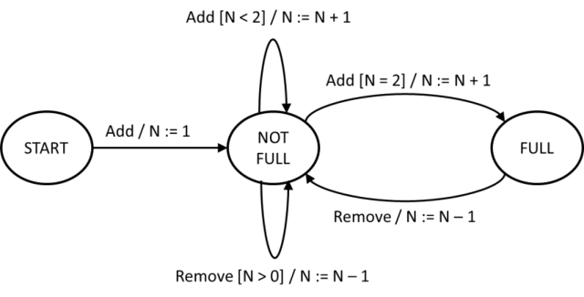

# ISTQB CTFL Sample Exam Set B - Questions

> Searchable Markdown conversion of the official ISTQB PDF, version 1.7, released April 1, 2025.
> The source PDF remains authoritative. Page anchors below correspond to physical PDF pages.

Source PDF: `resources/official/ISTQB-CTFL-Sample-B-Questions-v1.7.pdf`

<a id="pdf-page-1"></a>
<!-- Source PDF page 1 -->

### Sample Exam – Questions Sample Exam set B Version 1.7

### ISTQB® Certified Tester Syllabus Foundation Level Compatible with Syllabus version 4.0.1

International Software Testing Qualifications Board


<a id="pdf-page-2"></a>
<!-- Source PDF page 2 -->

### Copyright Notice

Copyright Notice © International Software Testing Qualifications Board (hereinafter called ISTQB®).

ISTQB® is a registered trademark of the International Software Testing Qualifications Board.

All rights reserved.

The authors hereby transfer the copyright to the ISTQB®. The authors (as current copyright holders) and ISTQB® (as the future copyright holder) have agreed to the following conditions of use:

Extracts, for non-commercial use, from this document may be copied if the source is acknowledged.

Any Accredited Training Provider may use this sample exam in their training course if the authors and the ISTQB® are acknowledged as the source and copyright owners of the sample exam and provided that any advertisement of such a training course is done only after official Accreditation of the training materials has been received from an ISTQB®-recognized Member Board.

Any individual or group of individuals may use this sample exam in articles and books, if the authors and the ISTQB® are acknowledged as the source and copyright owners of the sample exam.

Any other use of this sample exam is prohibited without first obtaining the approval in writing of the ISTQB®.

Any ISTQB®-recognized Member Board may translate this sample exam provided they reproduce the abovementioned Copyright Notice in the translated version of the sample exam.

### Document Responsibility

The ISTQB® Examination Working Group is responsible for this document.

This document is maintained by a core team from ISTQB® consisting of the Syllabus Working Group and Exam Working Group.

### Acknowledgements

This document was produced by a core team from ISTQB® : Stuart Reid and Adam Roman

The core team thanks the Exam Working Group review team, the Syllabus Working Group and Member Boards for their suggestions and input.

<a id="pdf-page-3"></a>
<!-- Source PDF page 3 -->

### Revision History

<u>Sample Exam – Questions Layout Template used: Version 2.11 Date: October 16, 2023</u>

|**Version**|**Date**|**Remarks**|
|---|---|---|
|1.7|April 1, 2025|Correction of usage of Glossary terms|
|1.6|July 8, 2024|Correction of question: #32|
|1.5|May 29, 2024|Bump to match Answer version|
|1.4|April 12, 2024|Correction of Question: #2, #35|
|1.3|January 8, 2024|Correction of Question: #26, #39|
|1.2|December 5, 2023|Correction of Question: #8, #13|
|1.1|November 15, 2023|Correction of Question: #35|
|1.0|October 16, 2023|First version|

<a id="pdf-page-4"></a>
<!-- Source PDF page 4 -->

## Table of Contents

```text
Copyright Notice ............................................................................................................................. 2
Document Responsibility ................................................................................................................. 2
Acknowledgements ......................................................................................................................... 2
Revision History .............................................................................................................................. 3
Table of Contents............................................................................................................................ 4
Introduction ..................................................................................................................................... 5
  Purpose of this document ............................................................................................................ 5
  Instructions .................................................................................................................................. 5
Questions ....................................................................................................................................... 6
    Question #1 (1 Point) ................................................................................................................................. 6
    Question #2 (1 Point) ................................................................................................................................. 6
    Question #3 (1 Point) ................................................................................................................................. 6
    Question #4 (1 Point) ................................................................................................................................. 6
    Question #5 (1 Point) ................................................................................................................................. 7
    Question #6 (1 Point) ................................................................................................................................. 7
    Question #7 (1 Point) ................................................................................................................................. 7
    Question #8 (1 Point) ................................................................................................................................. 7
    Question #9 (1 Point) ................................................................................................................................. 8
    Question #10 (1 Point) ............................................................................................................................... 8
    Question #11 (1 Point) ............................................................................................................................... 8
    Question #12 (1 Point) ............................................................................................................................... 8
    Question #13 (1 Point) ............................................................................................................................... 9
    Question #14 (1 Point) ............................................................................................................................... 9
    Question #15 (1 Point) ............................................................................................................................... 9
    Question #16 (1 Point) ............................................................................................................................... 9
    Question #17 (1 Point) ............................................................................................................................. 10
    Question #18 (1 Point) ............................................................................................................................. 10
    Question #19 (1 Point) ............................................................................................................................. 11
    Question #20 (1 Point) ............................................................................................................................. 11
    Question #21 (1 Point) ............................................................................................................................. 12
    Question #22 (1 Point) ............................................................................................................................. 13
    Question #23 (1 Point) ............................................................................................................................. 14
    Question #24 (1 Point) ............................................................................................................................. 14
    Question #25 (1 Point) ............................................................................................................................. 15
    Question #26 (1 Point) ............................................................................................................................. 15
    Question #27 (1 Point) ............................................................................................................................. 15
    Question #28 (1 Point) ............................................................................................................................. 16
    Question #29 (1 Point) ............................................................................................................................. 16
    Question #30 (1 Point) ............................................................................................................................. 17
    Question #31 (1 Point) ............................................................................................................................. 17
    Question #32 (1 Point) ............................................................................................................................. 18
    Question #33 (1 Point) ............................................................................................................................. 18
    Question #34 (1 Point) ............................................................................................................................. 19
    Question #35 (1 Point) ............................................................................................................................. 19
    Question #36 (1 Point) ............................................................................................................................. 19
    Question #37 (1 Point) ............................................................................................................................. 20
    Question #38 (1 Point) ............................................................................................................................. 20
    Question #39 (1 Point) ............................................................................................................................. 21
    Question #40 (1 Point) ............................................................................................................................. 21
```

<a id="pdf-page-5"></a>
<!-- Source PDF page 5 -->

### Introduction

### Purpose of this document

The example questions and answers and associated justifications in this sample exam have been created by a team of subject matter experts and experienced question writers with the aim of:

- Assisting ISTQB® Member Boards and Exam Boards in their question writing activities

- Providing training providers and exam candidates with examples of exam questions

These questions cannot be used as-is in any official examination.

**Note** , that real exams may include a wide variety of questions, and this sample exam **_is not_** intended to include examples of all possible question types, styles or lengths, also this sample exam may both be more difficult or less difficult than any official exam.

### Instructions

In this document you may find:

- Questions<sup>1</sup> , including for each question:

   - Any scenario needed by the question stem

   - Point value

   - Response (answer) option set

- Additional questions, including for each question [does not apply to all sample exams]: `-` Any scenario needed by the question stem

   - Point value

   - Response (answer) option set

- _Answers, including justification are contained in a separate document_

> 1 In this sample exam the questions are sorted by the LO they target; this cannot be expected of a live exam.

<a id="pdf-page-6"></a>
<!-- Source PDF page 6 -->

### <u>Questions</u>

## Question #1 (1 Point)

Which of the following is an example of why testing is necessary?

- a) Dynamic testing increases quality by causing test objects to fail in ways that could never be achieved by the users

- b) Static testing is used by developers to identify failures in their code earlier than can be achieved through dynamic testing

- c) Static analysis provides evidence to customers that the elements of the system that provide no outputs are fit for release

- d) Reviews increase the quality of requirements specifications and lead to fewer changes being needed in derived work products

Select ONE option.

## Question #2 (1 Point)

Which of the following statements about quality assurance (QA) and/or quality control (QC) is correct?

- a) QA is performed as part of testing

- b) Testing is performed as part of QC

- c) Testing is another term for QC

- d) Testing is performed as part of QA

Select ONE option.

## Question #3 (1 Point)

One of the ‘principles of testing’ states that exhaustive testing is impossible. Which of the following is an example of addressing this principle in practice?

- a) Creating test cases that cover every possible specified output

- b) Documenting all possible test input variations and prioritizing these based on importance

- c) Starting testing as early as possible with reviews and other static testing approaches

- d) Using equivalence partitioning and boundary value analysis to generate test cases

Select ONE option.

## Question #4 (1 Point)

Which test activity involves working with test data requirements, test conditions, test environment requirements and test cases?

- a) Test design

- b) Test execution

- c) Test analysis

- d) Test implementation

Select ONE option.

<a id="pdf-page-7"></a>
<!-- Source PDF page 7 -->

## Question #5 (1 Point)

Which of the following is MOST likely to impact how testing is performed for a given test object?

- a) The average level of experience of the organization’s marketing team

- b) The knowledge of users that a new system is being developed for them

- c) The number of years’ experience of the members of the test team

- d) The end user’s organizational structure for a commercial music streaming application

Select ONE option.

## Question #6 (1 Point)

Which of the following statements is a CORRECT example of the value of traceability?

- a) Traceability between the mitigated risks and test cases that passed provides a means of determining the level of residual risk

- b) Traceability between user requirements and test results provides a means of measuring project progress against business goals

- c) Traceability between testers and test cases that failed provides a means of determining the skill level of the testers

- d) Traceability between the identified risks and written test conditions provides a means of determining which risks are worth testing

Select ONE option.

## Question #7 (1 Point)

Which of the following is MOST likely to be an example of a tester using a generic skill when testing?

- a) The tester’s deep knowledge of a variety of computer games meant that they got on well with one of the developers who was also into gaming

- b) The tester was a former pilot and was better able to understand the acceptance criteria for the helicopter control system

- c) The tester previously worked as a programmer and used their skills in this area to better communicate with the business analysts

- d) The tester was very careful not to make mistakes when they methodically generated test cases prior to starting their exploratory testing session

Select ONE option.

## Question #8 (1 Point)

Which of the following is an advantage of the whole-team approach?

- a) It allows team members to take on any role at any time

- b) It only needs a single team to support the complete development project

- c) It embeds business representatives alongside developers in the same team
- d) It generates a team synergy that benefits the entire project

Select ONE option.

<a id="pdf-page-8"></a>
<!-- Source PDF page 8 -->

## Question #9 (1 Point)

Which of the following statements about the chosen software development lifecycle is CORRECT?

- a) If agile software development is used, automation of system tests replaces the need for regression testing

- b) If a sequential development model is used, then the dynamic testing is typically restricted to later in the lifecycle

- c) If an iterative development model is used, then component testing is typically performed manually by developers

- d) If an incremental development model is used, then static testing is done in early increments and dynamic testing in later increments

Select ONE option.

## Question #10 (1 Point)

Which of the following is a good testing practice that applies to all software development lifecycles?

- a) Testers should review work products as part of the next development phase

- b) Testers should review work products as soon as drafts are available

- c) Testers should review work products before test analysis and test design begin

- d) Testers should review work products immediately after they are published

Select ONE option.

## Question #11 (1 Point)

Which of the following is an example of a test-first approach to development?

- a) Test-Driven Development

- b) Coverage-Driven Development

- c) Quality-Driven Development

- d) Feature-Driven Development

Select ONE option.

## Question #12 (1 Point)

Which of the following statements about DevOps is CORRECT?

- a) To speed up releases, continuous integration is used to encourage developers to submit code quickly without the need to complete component testing

- b) To be able to update and release systems on a more frequent basis, many automated regression tests are required to reduce the risk of regression

- c) To treat both developers and operations equally, the testers will allocate more effort to release testing by operations using a shift-right approach

- d) To create increased synergy between testers, developers and operations, the testing must become fully automated with no manual testing

Select ONE option.

<a id="pdf-page-9"></a>
<!-- Source PDF page 9 -->

## Question #13 (1 Point)

Which of the following is MOST likely to be performed as part of system testing?

- a) Security testing of a credit management system by an independent test team

- b) Testing the interface of a currency exchange system with an external banking system

- c) Beta testing of a remote learning system by courseware developers

- d) Testing interactions between the user interface and database of a human resources system

Select ONE option.

## Question #14 (1 Point)

Which of the following statements is CORRECT?

- a) Regression tests increase in number as the project progresses, whereas the number of confirmation tests decreases as the project progresses

- b) Regression tests are created and run when the test object is fixed, whereas confirmation tests are run whenever the test object is enhanced

- c) Regression testing is concerned with checking that the operational environment remains unchanged, whereas confirmation testing is concerned with testing changes to the test object

- d) Regression testing is concerned with adverse effects in unchanged code, whereas confirmation testing is concerned with testing changed code

Select ONE option.

## Question #15 (1 Point)

Which of the following is an example of a defect that can be found by static testing but NOT by dynamic testing?

- a) Lack of usability provided through the user interface

- b) Code with no path that reaches it

- c) Poor response times for most of the expected users

- d) Required features that are not implemented in the code

Select ONE option.

## Question #16 (1 Point)

Which of the following is a benefit of early and frequent stakeholder feedback?

- a) Managers are aware of which developers are less productive

- b) It allows project managers to prioritize their stakeholder interactions

- c) It facilitates early communication of potential quality issues

- d) End users better understand why the delivery of the work product is delayed

Select ONE option.

<a id="pdf-page-10"></a>
<!-- Source PDF page 10 -->

## Question #17 (1 Point)

Given the following task descriptions:

1. The quality characteristics to be evaluated and the exit criteria are selected

2. Everyone has access to the work product

3. Anomalies are identified in the work product

4. Anomalies are discussed

And the following review activities

- A. Individual review

- B. Review initiation

- C. Planning

- D. Communication and analysis

Which of the following BEST matches the task descriptions and activities?

- a) 1B, 2C, 3D, 4A
- b) 1B, 2D, 3C, 4A
- c) 1C, 2A, 3B, 4D
- d) 1C, 2B, 3A, 4D

Select ONE option.

## Question #18 (1 Point)

Given the following roles in reviews:

1. Scribe

2. Review leader

3. Facilitator

4. Manager

And the following responsibilities in reviews:

- A. Ensures the effective running of review meetings and the setting up a safe review environment

- B. Records review information, such as decisions and new anomalies found during the review meeting

- C. Decides what is to be reviewed and provides resources, such as staff and time for the review

- D. Takes overall responsibility for the review such as organizing when and where the review will take place

Which of the following BEST matches the roles and responsibilities?

- a) 1A, 2B, 3D, 4C
- b) 1A, 2C, 3B, 4D
- c) 1B, 2D, 3A, 4C
- d) 1B, 2D, 3C, 4A

Select ONE option.

<a id="pdf-page-11"></a>
<!-- Source PDF page 11 -->

## Question #19 (1 Point)

Which of the following statements BEST describes the difference between decision table testing and branch testing?

- a) In decision table testing, the test cases are derived from the decision statements in the code. In branch testing, the test cases are derived from knowledge of the control flow of the test object.

- b) In decision table testing, the test cases are derived from the specification that describes the business logic. In branch testing the test cases are based on anticipation of potential defects in the source code.

- c) In decision table testing, the test cases are derived from knowledge of the control flow of the test object. In branch testing, test cases are derived from the specification that describes the business logic.

- d) In decision table testing, the test cases are independent of how the software is implemented. In branch testing, test cases can be created only after the design or implementation of the code.

Select ONE option.

## Question #20 (1 Point)

Customers of the TestWash car wash chain have cards with a record of the number of washes they have bought so far. The initial value is 0. After entering the car wash, the system increases the number on the card by one. This value represents the number of the current wash. Based on this number the system decides what discount the customer is entitled to.

For every tenth wash the system gives a 10% discount, and for every twentieth wash, the system gives a further 40% discount (i.e., a 50% discount in total).

Which of the following sets of input data (understood as the numbers of the current wash) achieves the highest equivalence partition coverage?

- a) 19, 20, 30
- b) 11, 12, 20
- c) 1, 10, 50
- d) 10, 29, 30, 31

Select ONE option.

<a id="pdf-page-12"></a>
<!-- Source PDF page 12 -->

## Question #21 (1 Point)

You are testing a form that verifies the correctness of the length of the password given as input. The form accepts a password with the correct length and rejects a password that is too short or too long. The password length is correct if it has between 6 and 12 characters inclusive. Otherwise, it is considered incorrect.

At first, the form is empty (password length = 0). You apply boundary value analysis to the “password length” variable.

Your set of test cases achieves 100% 2-value boundary value coverage. The team decided that due to the high risk of this component, test cases should be added to ensure 100% 3-value boundary value coverage.

Which additional password lengths should be tested to achieve this?

- a) 4, 5, 13, 14
- b) 7, 11
- c) 1, 5, 13
- d) 1, 4, 7, 11, 14

Select ONE option.

<a id="pdf-page-13"></a>
<!-- Source PDF page 13 -->

## Question #22 (1 Point)

The following decision table contains the rules for determining the risk of atherosclerosis.

||Rule 1|Rule 2|Rule 3|Rule 4|Rule 5|
|---|---|---|---|---|---|
|Conditions||||||
|Cholesterol (mg/dl)|≤124|≤ 124|125–<br>200|125–<br>200|≥ 201|
|Blood pressure (mm<br>Hg)|≤ 140|> 140|≤ 140|> 140|–|
|Action||||||
|Risk level|very low|low|medium|high|very high|

You designed the test cases with the following input data:

|TC1:|Cholesterol = 125 mg/dl|Blood pressure = 141 mm Hg|
|---|---|---|
|TC2:|Cholesterol = 200 mg/dl|Blood pressure = 201 mm Hg|
|TC3:|Cholesterol = 124 mg/dl|Blood pressure = 201 mm Hg|
|TC4:|Cholesterol = 109 mg/dl|Blood pressure = 200 mm Hg|
|TC5:|Cholesterol = 201 mg/dl|Blood pressure = 140 mm Hg|

What is the decision table coverage achieved by these test cases?

- a) 40%
- b) 60%
- c) 80%
- d) 100%

Select ONE option.

<a id="pdf-page-14"></a>
<!-- Source PDF page 14 -->

## Question #23 (1 Point)

A storage system can store up to three elements and is modeled by the following state transition diagram. The variable N represents the number of currently stored elements.



Which of the following test cases, represented as sequences of events, achieves the highest level of valid transitions coverage?

- a) Add, Remove, Add, Add, Add

- b) Add, Add, Add, Add, Remove, Remove

- c) Add, Add, Add, Remove, Remove

- d) Add, Add, Add, Remove, Add

Select ONE option.

## Question #24 (1 Point)

You run two test cases, T1 and T2, on the same code. Test T1 achieved 40% statement coverage and test T2 achieved 65% statement coverage.

Which of the following sentences must be necessarily true?

- a) The test suite composed of tests T1 and T2 achieves 105% statement coverage

- b) There exists at least one statement that must have been executed by both T1 and T2

- c) At least 5% of the statements in the code that was tested are non-executable

- d) The test suite composed of tests T1 and T2 achieves full branch coverage

Select ONE option.

<a id="pdf-page-15"></a>
<!-- Source PDF page 15 -->

## Question #25 (1 Point)

Let the branch coverage metric be defined as BCov = (X / Y) * 100%.

What do X and Y represent in this formula?

- a) X = number of decision outcomes exercised by the test cases

   - Y = total number of decision outcomes in the code

- b) X = number of conditional branches exercised by the test cases

   - Y = total number of branches in the code

- c) X = number of branches exercised by the test cases

   - Y = total number of branches in the code

- d) X = number of conditional branches exercised by the test cases

   - Y = total number of decision outcomes in the code

Select ONE option.

## Question #26 (1 Point)

Which TWO of the following statements provide the BEST rationale for using exploratory testing?

- a) Testers have not been allocated enough time for test design and test execution

- b) The existing test strategy requires that testers use formal, black-box test techniques

- c) The specification is written in a formal language that can be processed by a tool

- d) Testers are the members of an agile team and have good programming skills

- e) Testers are experienced in the business domain and have good analytical skills

Select TWO options.

## Question #27 (1 Point)

Which of the following BEST fits as an element of the checklist used in checklist-based testing?

- a) “The developer made an error when implementing the code”

- b) “The achieved statement coverage exceeds 85%”

- c) “The program works correctly regarding functional and non-functional requirements”

- d) “The error messages are written in language that the user can understand”

Select ONE option.

<a id="pdf-page-16"></a>
<!-- Source PDF page 16 -->

## Question #28 (1 Point)

Consider the following acceptance criteria for a user story written from the perspective of an online store owner.

_Given that the user is logged in and on the homepage,_

_When the user clicks on the "Add Item" button,_

_Then the "Create Item" form should appear,_

_And the user should be able to input a name and price for the new item._

In what format is this acceptance criteria written?

- a) Rule-oriented

- b) Scenario-oriented

- c) Product-oriented

- d) Process-oriented

Select ONE option.

## Question #29 (1 Point)

Your team analyzes the following user story in order to define the acceptance criteria:

_As a registered customer, I want to be able to view my previous orders on the company's website, so that I can keep track of my purchases._

Which of the following test cases will NOT be relevant for this user story?

- a) Input: the customer logs into their account on the website and clicks the “see order history” button

   - Expected result: the system shows a list of all the customer’s previous orders, including the date, order number, and total cost

- b) Input: the customer clicks on an order from the order list Expected result: the system displays the individual items purchased, along with their prices and quantities

- c) Input: the customer clicks “Sort ascending” button on the order history screen Expected result: the system shows the order history sorted by order number in ascending order

- d) Input: an unregistered customer registers as a new customer with a valid e-mail address that does not already exist in the customer database Expected result: the system accepts the registration and creates the account

Select ONE option.

<a id="pdf-page-17"></a>
<!-- Source PDF page 17 -->

## Question #30 (1 Point)

Your team follows the process that uses the DevOps delivery pipeline. The first three steps of this process are:

- (1) Code development

- (2) Submit code into a version control system and merge it into the “test” branch

- (3) Perform component testing for the submitted code

Which of the following is BEST suited to be the entry criterion for step (2) of this pipeline?

- a) Static analysis returns no high severity warnings for the submitted code

- b) System version control reports no conflicts when merging code into the “test” branch

- c) Component tests are compiled and ready to be executed

- d) Statement coverage is at least 80%

Select ONE option.

## Question #31 (1 Point)

You want to estimate the test effort for the new project using estimation based on ratios. You calculate the test-to-development effort ratio using averaged data for both development effort and test effort from four historical projects similar to the new one. The table shows this historical data.

|**Project**|**Development effort**<br>|**Test effort**<br>|
|---|---|---|
||**($)**|**($)**|
|**P1**|800,000|40,000|
|**P2**|1,200,000|130,000|
|**P3**|600,000|70,000|
|**P4**|1,000,000|120,000|

The estimated development effort for the new project is $800,000. What is your estimate of the test effort in this project?

- a) $40,000

- b) $80,000
- c) $81,250
- d) $82,500

Select ONE option.

<a id="pdf-page-18"></a>
<!-- Source PDF page 18 -->

## Question #32 (1 Point)

You are testing a web application that allows users to SEARCH for products, VIEW product details, ADD products to a shopping cart, and place an ORDER.

You have prepared the following seven test cases, all of which you want to execute. The tests should be executed in the best order, based on test priority.

||**Test**|**Priority (1  = higher priority)**|
|---|---|---|
|**TC1**|SEARCH for product A|4|
|**TC2**|SEARCH for product B|4|
|**TC3**|VIEW product A details|3|
|**TC4**|VIEW product B details|2|
|**TC5**|ADD product A to a shopping cart|3|
|**TC6**|ADD product B to a shopping cart|1|
|**TC7**|place an ORDER|5|

You also identified the following logical dependencies between test cases:

- SEARCH functionality must be tested before VIEW functionality can be tested.

- VIEW functionality must be tested before ADD functionality.

- ADD functionality must be tested before ORDER functionality.

Which test case should be executed as the fourth one?

- a) TC3

- b) TC1

- c) TC7

- d) TC2

Select ONE option.

## Question #33 (1 Point)

According to the testing quadrants model, which of the following falls into quadrant Q1 (“technology facing” and “support the team”)?

- a) Usability testing

- b) Functional testing

- c) User acceptance testing

- d) Component integration testing

Select ONE option.

<a id="pdf-page-19"></a>
<!-- Source PDF page 19 -->

## Question #34 (1 Point)

Given the following risks:

1. Ineffective loop implementation causes long system responses

2. Consumers change their preferences

3. Flooding of the server room

4. Patients above a certain age receive inaccurate reports

And the following mitigation activities:

- A. Risk acceptance

- B. Testing for performance efficiency

- C. Using boundary value analysis as the test technique

- D. Risk transfer

Which of the following BEST matches the risks with the mitigation activities?

- a) 1C,  2D,  3A,  4B
- b) 1B,  2D,  3A,  4C
- c) 1B,  2A,  3D,  4C
- d) 1C,  2A,  3D,  4B

Select ONE option.

## Question #35 (1 Point)

Which of the following is a product quality metric?

- a) Mean time to failure

- b) Number of defects found

- c) Requirements coverage

- d) Defect detection percentage

Select ONE option.

## Question #36 (1 Point)

You are a member of a test team located in North America, developing a product for a client located in Europe. The team is agile and follows the DevOps approach and uses a continuous integration/continuous delivery pipeline.

Which of the following is the LEAST effective way to communicate test progress to the customer?

- a) Face-to-face

- b) Dashboards

- c) Email

- d) Video conferencing

Select ONE option.

<a id="pdf-page-20"></a>
<!-- Source PDF page 20 -->

## Question #37 (1 Point)

Which of the following BEST describes an example of how configuration management (CM) supports testing?

- a) Having the version number of the environment, the CM tool can retrieve the version numbers of libraries, stubs and drivers used in that environment

- b) Having a record of the values of the inputs, the CM tool can execute the test cases for these configurations and calculate the coverage

- c) Having data about the date of purchase of a software license, the CM tool automatically generates information about the fact that the product license is coming to an end

- d) Having the version number of the test case, the CM tool can automatically generate test data for this test case

Select ONE option.

## Question #38 (1 Point)

You are testing a sort function that gets a set of numbers as input and returns the same set of numbers sorted in ascending order. The log from the test execution looks as follows.

Environment configuration: sort function build 2.002.2182, test case set: TCS-3, # of TCs: 5 Test run ID: 736 Start 12:43:21.003 12:43:21.003  Execution of TC1.  Input: 3. Output: 3. Result: passed 12:43:21.003  Execution of TC2.  Input: 3 11 6 5. Output: 3 5 6 11. Result: passed 12:43:21.004  Execution of TC3.  Input: 8 7 3 7 1. Output: 1 3 7 8. Result: failed 12:43:21.005  Execution of TC4.  Input: -2 -2 -2 -3 -3.  Output: -3 -2. Result: failed 12:43:21.005  Execution of TC5.  Input: 0 -2 0 3 4 4.  Output: -2 0 3 4. Result: failed End 12:43:21.005 Total time of test cycle: 0:00:00.002

Which of the following provides the BEST description of the failure that can be used in a defect report?

- a) The system fails to sort several sets of numbers. Reference: TC3, TC4, TC5.

- b) The system seems to disregard duplicates while sorting. Reference: TC3, TC4, TC5.

- c) The system fails to sort negative numbers. Reference: TC4, TC5.

- d) TC3, TC4 and TC5 have defects (duplicate input data) and should be corrected.

Select ONE option.

<a id="pdf-page-21"></a>
<!-- Source PDF page 21 -->

## Question #39 (1 Point)

Given the following descriptions:

1. Support workflow tracking

2. Facilitate communication

3. Virtual machines

4. Support reviews

And the following test tool categories:

- A. Static testing tools

- B. Tools supporting scalability and deployment standardization

- C. DevOps tools

- D. Collaboration tools

Which of the following BEST matches the descriptions and categories?

- a) 1A, 2B, 3C, 4D
- b) 1B, 2D, 3C, 4A
- c) 1C, 2D, 3B, 4A
- d) 1D, 2C, 3A, 4B

Select ONE option.

## Question #40 (1 Point)

Which of the following is MOST likely to be a benefit of test automation?

- a) It provides coverage measures that are too complicated for humans to derive
- b) It shares responsibility for the testing with the tool vendor

- c) It removes the need for critical thinking when analyzing test results

- d) It generates test cases from an analysis of the program code

Select ONE option.
