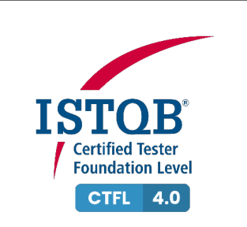
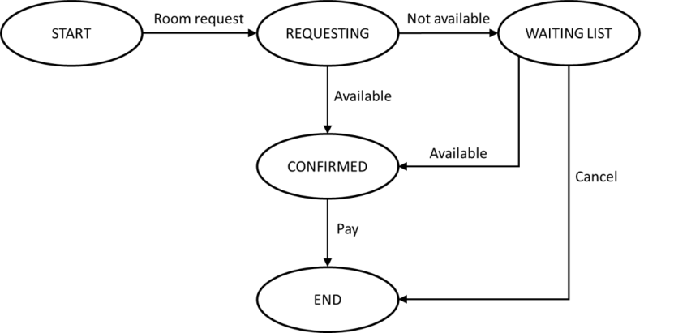
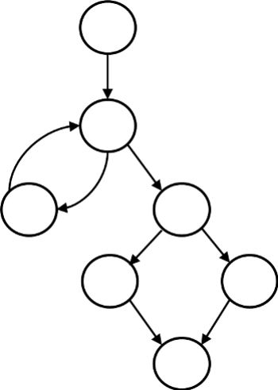
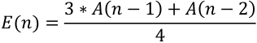
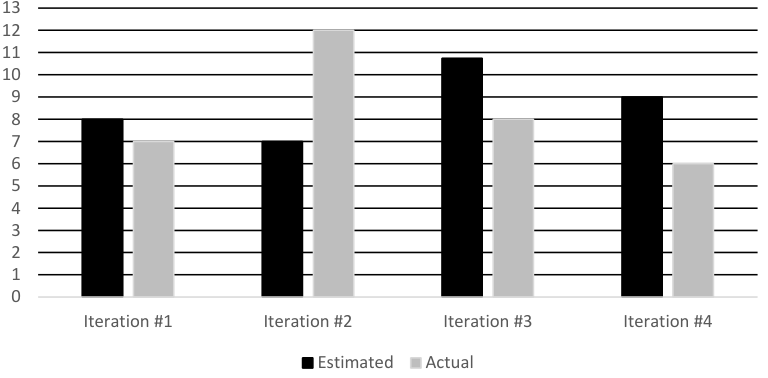
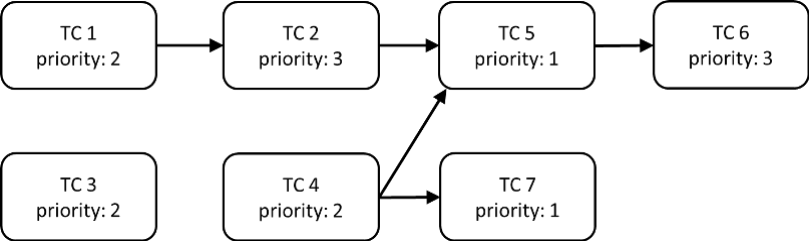

# ISTQB CTFL Sample Exam Set C - Questions

> Searchable Markdown conversion of the official ISTQB PDF, version 1.6, released March 25, 2025.
> The source PDF remains authoritative. Page anchors below correspond to physical PDF pages.

Source PDF: `resources/official/ISTQB-CTFL-Sample-C-Questions-v1.6.pdf`

<a id="pdf-page-1"></a>
<!-- Source PDF page 1 -->

### Sample Exam – Questions Sample Exam set C Version 1.6

### ISTQB® Certified Tester Syllabus Foundation Level Compatible with Syllabus version 4.0

International Software Testing Qualifications Board



<a id="pdf-page-2"></a>
<!-- Source PDF page 2 -->

### Copyright Notice

Copyright Notice © International Software Testing Qualifications Board (hereinafter called ISTQB®).

ISTQB® is a registered trademark of the International Software Testing Qualifications Board.

All rights reserved.

The authors hereby transfer the copyright to the ISTQB®. The authors (as current copyright holders) and ISTQB® (as the future copyright holder) have agreed to the following conditions of use:

Extracts, for non-commercial use, from this document may be copied if the source is acknowledged.

Any Accredited Training Provider may use this sample exam in their training course if the authors and the ISTQB® are acknowledged as the source and copyright owners of the sample exam and provided that any advertisement of such a training course is done only after official Accreditation of the training materials has been received from an ISTQB®-recognized Member Board.

Any individual or group of individuals may use this sample exam in articles and books, if the authors and the ISTQB® are acknowledged as the source and copyright owners of the sample exam.

Any other use of this sample exam is prohibited without first obtaining the approval in writing of the ISTQB®.

Any ISTQB®-recognized Member Board may translate this sample exam provided they reproduce the abovementioned Copyright Notice in the translated version of the sample exam.

### Document Responsibility

The ISTQB® Examination Working Group is responsible for this document.

This document is maintained by a core team from ISTQB® consisting of the Syllabus Working Group and Exam Working Group.

### Acknowledgements

This document was produced by a core team from ISTQB® : Stuart Reid and Adam Roman

The core team thanks the Exam Working Group review team, the Syllabus Working Group and Member Boards for their suggestions and input.

<a id="pdf-page-3"></a>
<!-- Source PDF page 3 -->

### Revision History

<u>Sample Exam – Questions Layout Template used: Version 2.11 Date: October 16, 2023</u>

|**Version**|**Date**|**Remarks**|
|---|---|---|
|1.6|Marts 25, 2025|Correction of usage of Glossary terms|
|1.5|June 11, 2024|Correction of Question: #20|
|1.4|May 29, 2024|Bump to match Answer version|
|1.3|March 14, 2024|Correction of Question: #20|
|1.2|December 20, 2023|No chances, just saved to PDF with transparent background on<br>pictures|
|1.1|November 6, 2023|Minor correction of question #4|
|1.0|October 16, 2023|First version|

<a id="pdf-page-4"></a>
<!-- Source PDF page 4 -->

## Table of Contents

```text
Copyright Notice ............................................................................................................................. 2
Document Responsibility ................................................................................................................. 2
Acknowledgements ......................................................................................................................... 2
Revision History .............................................................................................................................. 3
Table of Contents............................................................................................................................ 4
Introduction ..................................................................................................................................... 5
  Purpose of this document ............................................................................................................ 5
  Instructions .................................................................................................................................. 5
Questions ....................................................................................................................................... 6
    Question #1 (1 Point) ................................................................................................................................. 6
    Question #2 (1 Point) ................................................................................................................................. 6
    Question #3 (1 Point) ................................................................................................................................. 6
    Question #4 (1 Point) ................................................................................................................................. 6
    Question #5 (1 Point) ................................................................................................................................. 7
    Question #6 (1 Point) ................................................................................................................................. 7
    Question #7 (1 Point) ................................................................................................................................. 7
    Question #8 (1 Point) ................................................................................................................................. 8
    Question #9 (1 Point) ................................................................................................................................. 8
    Question #10 (1 Point) ............................................................................................................................... 8
    Question #11 (1 Point) ............................................................................................................................... 9
    Question #12 (1 Point) ............................................................................................................................... 9
    Question #13 (1 Point) ............................................................................................................................... 9
    Question #14 (1 Point) ............................................................................................................................... 9
    Question #15 (1 Point) ............................................................................................................................. 10
    Question #16 (1 Point) ............................................................................................................................. 10
    Question #17 (1 Point) ............................................................................................................................. 11
    Question #18 (1 Point) ............................................................................................................................. 11
    Question #19 (1 Point) ............................................................................................................................. 11
    Question #20 (1 Point) ............................................................................................................................. 12
    Question #21 (1 Point) ............................................................................................................................. 12
    Question #22 (1 Point) ............................................................................................................................. 13
    Question #23 (1 Point) ............................................................................................................................. 14
    Question #24 (1 Point) ............................................................................................................................. 15
    Question #25 (1 Point) ............................................................................................................................. 15
    Question #26 (1 Point) ............................................................................................................................. 16
    Question #27 (1 Point) ............................................................................................................................. 16
    Question #28 (1 Point) ............................................................................................................................. 16
    Question #29 (1 Point) ............................................................................................................................. 17
    Question #30 (1 Point) ............................................................................................................................. 17
    Question #31 (1 Point) ............................................................................................................................. 18
    Question #32 (1 Point) ............................................................................................................................. 19
    Question #33 (1 Point) ............................................................................................................................. 19
    Question #34 (1 Point) ............................................................................................................................. 19
    Question #35 (1 Point) ............................................................................................................................. 20
    Question #36 (1 Point) ............................................................................................................................. 20
    Question #37 (1 Point) ............................................................................................................................. 20
    Question #38 (1 Point) ............................................................................................................................. 21
    Question #39 (1 Point) ............................................................................................................................. 21
    Question #40 (1 Point) ............................................................................................................................. 21
```

<a id="pdf-page-5"></a>
<!-- Source PDF page 5 -->

### Introduction

### Purpose of this document

The example questions and answers and associated justifications in this sample exam have been created by a team of subject matter experts and experienced question writers with the aim of:

- Assisting ISTQB® Member Boards and Exam Boards in their question writing activities

- Providing training providers and exam candidates with examples of exam questions

These questions cannot be used as-is in any official examination.

**Note** , that real exams may include a wide variety of questions, and this sample exam **_is not_** intended to include examples of all possible question types, styles or lengths, also this sample exam may both be more difficult or less difficult than any official exam.

### Instructions

In this document you may find:

- Questions<sup>1</sup> , including for each question:

   - Any scenario needed by the question stem

   - Point value

   - Response (answer) option set

- Additional questions, including for each question [does not apply to all sample exams]: `-` Any scenario needed by the question stem

   - Point value

   - Response (answer) option set

- _Answers, including justification are contained in a separate document_

> 1 In this sample exam the questions are sorted by the LO they target; this cannot be expected of a live exam.

<a id="pdf-page-6"></a>
<!-- Source PDF page 6 -->

### <u>Questions</u>

## Question #1 (1 Point)

Which of the following is a typical test objective?

- a) Validating that documented requirements are met

- b) Causing failures and identifying defects

- c) Initiating errors and identifying root causes

- d) Verifying the test object meets user expectations

Select ONE option.

## Question #2 (1 Point)

Which of the following statements BEST describes the difference between testing and debugging?

- a) Testing causes failures while debugging fixes failures

- b) Testing is a negative activity while debugging is a positive activity

- c) Testing determines that defects exist while debugging removes defects

- d) Testing finds the cause of defects while debugging fixes the cause of defects

Select ONE option.

## Question #3 (1 Point)

The ‘absence-of-defects fallacy’ is one of the principles of testing. Which of the following is an example of addressing this principle in practice?

- a) Explaining that it is not possible for testing to show the absence of defects

- b) Supporting the end users to perform acceptance testing

- c) Ensuring that no implementation defects remain in the delivered system

- d) Modifying tests that cause no failures to ensure few defects remain

Select ONE option.

## Question #4 (1 Point)

Which of the following test activities are MOST likely to involve the application of boundary value analysis and equivalence partitioning?

- a) Test implementation

- b) Test design

- c) Test execution

- d) Test monitoring

- e) Test analysis

Select TWO options.

<a id="pdf-page-7"></a>
<!-- Source PDF page 7 -->

## Question #5 (1 Point)

Given the following testware:

1. Coverage items

2. Change requests

3. Test execution schedule

4. Prioritized test conditions

And the following test activities

- A. Test analysis

- B. Test design

- C. Test implementation

- D. Test completion

Which of the following BEST shows the testware produced by the activities?

- a) 1B, 2D, 3C, 4A

- b) 1B, 2D, 3A, 4C

- c) 1D, 2C, 3A, 4B

- d) 1D, 2C, 3B, 4A

Select ONE option.

## Question #6 (1 Point)

Which of the following statements about the different testing roles is MOST likely to be CORRECT?

- a) In Agile software development, the test management role is the primary responsibility of the team, while the testing role is primarily the responsibility of a single individual from outside the team

- b) The testing role is primarily responsible for test monitoring and test control, while the test management role is primarily responsible for test planning and test completion

- c) In Agile software development, test management activities that span multiple teams are handled by a test manager outside the team, while some test management tasks are handled by the team itself

- d) The test management role is primarily responsible for test analysis and test design, while the testing role is primarily responsible for test implementation and test execution

Select ONE option.

## Question #7 (1 Point)

Which of the following is an advantage of the whole-team approach?

- a) Teams with no testers

- b) Improved team dynamics

- c) Specialist team members

- d) Larger team sizes

Select ONE option.

<a id="pdf-page-8"></a>
<!-- Source PDF page 8 -->

## Question #8 (1 Point)

Which of the following statements about the independence of testing is CORRECT?

- a) Independent testers will find defects due to their different technical perspective from developers, but their independence may lead to an adversarial relationship with the developers

- b) Developers’ familiarity with their own code means they only find a few defects in it, however their shared software background with testers means these defects would also be found by the testers

- c) Independent testing requires testers who are outside the developer’s team and ideally from outside the organization, however these testers find it difficult to understand the application domain

- d) Testers from outside the developer’s team are more independent than testers from within the team, but the testers from within the team are more likely to be blamed for delays in product release

Select ONE option.

## Question #9 (1 Point)

Which of the following is a good testing practice that applies to all software development lifecycles?

- a) For each test level, there is a corresponding development level

- b) For each test objective, there is a corresponding development objective

- c) For every test activity, there is a corresponding user activity

- d) For every development activity, there is a corresponding test activity

Select ONE option.

## Question #10 (1 Point)

Which of the following is an example of a test-first approach to development?

- a) Component Test-Driven Development

- b) Integration Test-Driven Development

- c) System Test-Driven Development

- d) Acceptance Test-Driven Development

Select ONE option.

<a id="pdf-page-9"></a>
<!-- Source PDF page 9 -->

## Question #11 (1 Point)

Which of the following provides the BEST description of shift-left?

- a) When agreed by the developers, manual activities on the left-hand side of the test process are automated to support the principle of ‘early testing saves time and money’

- b) Where cost-effective, test activities are moved earlier in the software development lifecycle (SDLC) to reduce the total cost of quality by reducing the number of defects found later in the SDLC

- c) When they have spare time available, testers are required to automate tests for regression testing, starting with component tests and component integration tests

- d) When available, testers are trained to perform tasks early in the SDLC to allow more test activities to be automated later in the SDLC

Select ONE option.

## Question #12 (1 Point)

Which of the following is LEAST likely to occur as a result of a retrospective?

- a) The quality of future test objects improves by identifying improvements in development practices

- b) Test efficiency improves by speeding up the configuration of test environments through automation

- c) End users’ understanding of the development and test processes is improved

- d) Automated test scripts are enhanced through feedback from developers

Select ONE option.

## Question #13 (1 Point)

Which of the following test levels is MOST likely being performed if the testing is focused on validation and is not being performed by testers?

- a) Component testing

- b) Component integration testing

- c) System integration testing

- d) Acceptance testing

Select ONE option.

## Question #14 (1 Point)

The navigation system software has been updated due to it suggesting routes that break traffic laws, such as driving the wrong way down one-way streets. Which of the following BEST describes the testing that will be performed?

- a) Only confirmation testing

- b) Confirmation testing then regression testing

- c) Only regression testing

- d) Regression testing then confirmation testing

Select ONE option.

<a id="pdf-page-10"></a>
<!-- Source PDF page 10 -->

## Question #15 (1 Point)

Given the following example defects:

- i. Two different parts of the design specification disagree due to the complexity of the design

- ii. A response time is too long and so makes users lose patience

- iii. A path in the code cannot be reached during execution

- iv. A variable is declared but never subsequently used in the program

- v. The amount of memory needed by the program to generate a report is too high

Which of the following BEST identifies example defects that could be found by static testing (rather than dynamic testing)?

- a) ii, v

- b) iii, v

- c) i, ii, iv

- d) i, iii, iv

Select ONE option.

## Question #16 (1 Point)

Which of the following is a benefit of early and frequent stakeholder feedback?

- a) Changes to requirements are understood and implemented earlier

- b) It ensures business stakeholders understand user requirements

- c) It allows product owners to change their requirements as often as they want

- d) End users are told which requirements will not be implemented prior to release

Select ONE option.

<a id="pdf-page-11"></a>
<!-- Source PDF page 11 -->

## Question #17 (1 Point)

Given the following review types:

1. Technical review

2. Informal review

3. Inspection

4. Walkthrough

And the following descriptions:

- A. Includes objectives such as gaining consensus, generating new ideas, and motivating authors to improve

- B. Includes objectives such as educating reviewers, gaining consensus, generating new ideas and detecting potential defects

- C. The main objective is detecting potential defects and it requires metrics collection to support process improvement

- D. The main objective is detecting potential defects and it generates no formal documented output

Which of the following BEST matches the review types and the descriptions?

- a) 1A, 2B, 3C, 4D

- b) 1A, 2D, 3C, 4B

- c) 1B, 2C, 3D, 4A

- d) 1C, 2D, 3A, 4B

Select ONE option.

## Question #18 (1 Point)

Which of the following is a factor that contributes to a successful review?

- a) Ensure management participate as reviewers

- b) Split large work products into smaller parts

- c) Set reviewer evaluation as an objective

- d) Plan to cover one document per review

Select ONE option.

## Question #19 (1 Point)

What is the MAIN difference between black-box test techniques and experience-based test techniques?

- a) The test object

- b) The test level at which the test technique is used

- c) The test basis

- d) The software development lifecycle (SDLC) in which the test technique can be used

Select ONE option.

<a id="pdf-page-12"></a>
<!-- Source PDF page 12 -->

## Question #20 (1 Point)

You are testing a PIN validator, which accepts valid PINs and rejects invalid PINs. A PIN is a sequence of digits. A PIN is valid if it consists of four digits, which are not all the same digit. You have identified the following valid equivalence partitions:

Variable: PIN code length • The partition “length correct” - four-digit PINs • The partition “length incorrect” - PINs with length other than 4

- Variable: Number of different digits • The partition “number of different digits correct” - PINs with at least two different digits • The partition “number of different digits incorrect” - PINs with all digits being the same

Which of the following is the BEST set of input test data to cover the identified equivalence partitions?

- a) 12, 1111, 1234, 12345
- b) 1, 123, 1111, 1234
- c) 11, 12, 1111, 12345
- d) 123, 1222, 12345

Select ONE option.

## Question #21 (1 Point)

A developer was asked to implement the following business rule:

INPUT: value (integer number)

IF (value ≤ 100 OR value ≥ 200) THEN write “value incorrect” ELSE write “value OK”

You design the test cases using 2-value boundary value analysis.

Which of the following sets of test inputs achieves the greatest coverage?

- a) 100,  150,  200,  201
- b) 99, 100,  200,  201
- c) 98, 99, 100,  101
- d) 101,  150,  199,  200

Select ONE option.

<a id="pdf-page-13"></a>
<!-- Source PDF page 13 -->

## Question #22 (1 Point)

You are working on a project to develop a system to analyze driving test results. You have been asked to design test cases based on the following decision table.

||R1|R2|R3|
|---|---|---|---|
|C1: First attempt at the exam?|-|-|F|
|C2: Theoretical exam passed?|T|F|-|
|C3: Practical exam passed?|T|-|F|
|Issue a driving license?|X|||
|Request additional driving lessons?|||X|
|Request to take the exam again?||X||

What test data will show that there are contradictory rules in the decision table?

- a) C1 = T,  C2 = T,  C3 = F
- b) C1 = T,  C2 = F,  C3 = T
- c) C1 = T,  C2 = T,  C3 = T and C1 = F, C2 = T, C3 = T
- d) C1 = F,  C2 = F,  C3 = F

Select ONE option.

<a id="pdf-page-14"></a>
<!-- Source PDF page 14 -->

## Question #23 (1 Point)

You are designing test cases based on the following state transition diagram:



What is the MINIMUM number of test cases required to achieve 100% valid transitions coverage?

- a) 3
- b) 2
- c) 5
- d) 6

Select ONE option.

<a id="pdf-page-15"></a>
<!-- Source PDF page 15 -->

## Question #24 (1 Point)

You want to apply branch testing to the code represented by the following control flow graph.



How many coverage items do you need to test?

- a) 2
- b) 4
- c) 8
- d) 7

Select ONE option.

## Question #25 (1 Point)

How can white-box testing be useful in support of black-box testing?

- a) White-box coverage measures can help testers evaluate black-box tests in terms of the code coverage achieved by these black-box tests

- b) White-box coverage analysis can help testers identify unreachable fragments of the source code

- c) Branch testing subsumes black-box test techniques, so achieving full branch coverage guarantees achieving full coverage of any black-box technique

- d) White-box test techniques can provide coverage items for black-box techniques

Select ONE option.

<a id="pdf-page-16"></a>
<!-- Source PDF page 16 -->

## Question #26 (1 Point)

Consider the following list:

- Correct input not accepted

- Incorrect input accepted

- Wrong output format

- Division by zero

What test technique is MOST PROBABLY used by the tester who uses this list when performing testing?

- a) Exploratory testing

- b) Fault attack

- c) Checklist-based testing

- d) Boundary value analysis

Select ONE option.

## Question #27 (1 Point)

Which of the following BEST describes how using checklist-based testing can result in increased coverage?

- a) Checklist items can be defined at a sufficiently low level of detail, so the tester can implement and execute detailed test cases based on these items

- b) Checklists can be automated, so each time an automated test execution covers the checklist items, it results in additional coverage

- c) Each checklist item should be tested separately and independently, so the elements cover different areas of the software

- d) Two testers designing and executing tests based on the same high-level checklist items will typically perform the testing in slightly different ways

Select ONE option.

## Question #28 (1 Point)

Which of the following provides the BEST example of a scenario-oriented acceptance criterion?

- a) The application must allow users to delete their account and all associated data upon request

- b) When a customer adds an item to their cart and proceeds to checkout, they should be prompted to log in or create an account if they haven’t already done so

- c) IF (contain(product(23).Name, cart.products())) THEN return FALSE

- d) The website must comply with the ICT Accessibility 508 Standards and ensure that all content is accessible to users with disabilities

Select ONE option.

<a id="pdf-page-17"></a>
<!-- Source PDF page 17 -->

## Question #29 (1 Point)

You are using acceptance test-driven development and designing test cases based on the following user story:

As a Regular or Special user, I want to be able to use my electronic floor card, to access specific floors.

Acceptance Criteria:

AC1: Regular users have access to floors 1 to 3 AC2: Floor 4 is only accessible to Special users AC3: Special users have all the access rights of Regular users

Which test case is the MOST reasonable one to test AC3?

- a) Check that a Regular user can access floors 1 and 3

- b) Check that a Regular user cannot access floor 4

- c) Check that a Special user can access floor 5

- d) Check that a Special user can access floors 1, 2 and 3

Select ONE option.

## Question #30 (1 Point)

Which of the following is NOT a purpose of a test plan?

- a) To define test data and expected results for component tests and component integration tests

- b) To define as exit criteria from the component test level that “100% statement coverage and 100% branch coverage must be achieved”

- c) To describe what fields the test progress report shall contain and what should be the form of this report

- d) To explain why system integration testing will be excluded from testing, although the test strategy requires this test level

Select ONE option.

<a id="pdf-page-18"></a>
<!-- Source PDF page 18 -->

## Question #31 (1 Point)

At the beginning of each iteration, the team estimates the amount of work (in person-days) they will need to complete during the iteration. Let E(n) be the estimated amount of work for iteration n, and let A(n) be the actual amount of work done in iteration n. From the third iteration, the team uses the following estimation model based on extrapolation:



The graph shows the estimated and actual amount of work for the first four iterations.

### Estimated and actual effort (in person-days)



<!-- Start of picture text -->
13<br>12<br>11<br>10<br>9<br>8<br>7<br>6<br>5<br>4<br>3<br>2<br>1<br>0<br>Iteration #1 Iteration #2 Iteration #3 Iteration #4<br>Estimated Actual<br><!-- End of picture text -->

What is the estimated amount of work for iteration #5?

- a) 10.5 person-days
- b) 8.25 person-days
- c) 6.5 person-days
- d) 9.4 person-days

Select ONE option.

<a id="pdf-page-19"></a>
<!-- Source PDF page 19 -->

## Question #32 (1 Point)

You are preparing a test execution schedule for executing seven test cases TC 1 to TC 7.

The following figure includes the priorities of these test cases (1=highest priority, 3 = lowest priority).

The figure also shows the dependencies between test cases using arrows. For instance, the arrow from TC 4 to TC 5 means that TC 5 can only be executed if TC 4 was previously executed.



Which test case should be executed sixth?

- a) TC 3

- b) TC 5
- c) TC 6

- d) TC 2

Select ONE option.

## Question #33 (1 Point)

What does the test pyramid model show?

- a) That tests may have different priorities

- b) That tests may have different granularity

- c) That tests may require different coverage criteria

- d) That tests may depend on other tests

Select ONE option.

## Question #34 (1 Point)

What is the relationship between the testing quadrants, test levels and test types?

- a) Testing quadrants represent particular combinations of test levels and test types, defining their location in the software development lifecycle

- b) Testing quadrants describe the degree of granularity of individual test types performed at each test level

- c) Testing quadrants assign the test types that can be performed to the test levels

- d) Testing quadrants group test levels and test types by several criteria such as targeting specific stakeholders

Select ONE option.

<a id="pdf-page-20"></a>
<!-- Source PDF page 20 -->

## Question #35 (1 Point)

Which of the following is an example of how product risk analysis may influence the thoroughness and scope of testing?

- a) Continuous risk monitoring allows us to identify an emerging risk as soon as possible

- b) Risk identification allows us to implement risk mitigation activities and reduce the risk level

- c) The assessed risk level helps us to select the rigor of testing

- d) Risk analysis allows us to derive coverage items

Select ONE option.

## Question #36 (1 Point)

Which of the following activities in the test process makes the MOST use of test progress reports?

- a) Test design

- b) Test completion

- c) Test analysis

- d) Test planning

Select ONE option.

## Question #37 (1 Point)

Which of the following is NOT an example of how configuration management supports testing?

- a) All commits to the repository are uniquely identified and version controlled

- b) All changes in the test environment elements are tracked

- c) All requirement specifications are referenced unambiguously in test plans

- d) All identified defects have an assigned status

Select ONE option.

<a id="pdf-page-21"></a>
<!-- Source PDF page 21 -->

## Question #38 (1 Point)

Consider the following defect report for a web-based shopping application:

Application: WebShop v0.99 Defect: Login button not working Steps to Reproduce: Launch the website Click on the login button

Expected result: The user should be redirected to the login page. Actual result: The login button does not respond when clicked. Severity: High Priority: Urgent

What is the MOST important information that is missing from this defect report?

- a) Name of the tester and date

- b) Test environment elements and their version numbers

- c) Identification of the test object

- d) Impact on the interests of stakeholders

Select ONE option.

## Question #39 (1 Point)

Tools from which of the following categories help with the organization of test cases, detected defects and configuration management?

- a) Test execution and coverage tools

- b) Test design and implementation tools

- c) Defect management tools

- d) Test management tools

Select ONE option.

## Question #40 (1 Point)

Which of the following is MOST likely to be a benefit of test automation?

- a) The capability of generating test cases without access to the test basis

- b) The achievement of increased coverage through more objective assessment

- c) The increase in test execution times available with higher processing power

- d) The prevention of human errors through greater consistency and repeatability

Select ONE option.
