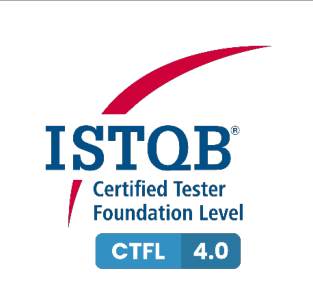

# ISTQB CTFL Sample Exam Set D - Answers

> Searchable Markdown conversion of the official ISTQB PDF, version 1.5, released May 2, 2025.
> The source PDF remains authoritative. Page anchors below correspond to physical PDF pages.

Source PDF: `resources/official/ISTQB-CTFL-Sample-D-Answers-v1.5.pdf`

<a id="pdf-page-1"></a>
<!-- Source PDF page 1 -->

### Sample Exam – Answers Sample Exam set D Version 1.5

### ISTQB® Certified Tester Syllabus Foundation Level

**Compatible with Syllabus version 4.0**

International Software Testing Qualifications Board



<a id="pdf-page-2"></a>
<!-- Source PDF page 2 -->

### Copyright Notice

Copyright Notice © International Software Testing Qualifications Board (hereinafter called ISTQB®).

ISTQB® is a registered trademark of the International Software Testing Qualifications Board.

All rights reserved.

The authors hereby transfer the copyright to the ISTQB®. The authors (as current copyright holders) and ISTQB® (as the future copyright holder) have agreed to the following conditions of use:

Extracts, for non-commercial use, from this document may be copied if the source is acknowledged.

Any Accredited Training Provider may use this sample exam in their training course if the authors and the ISTQB® are acknowledged as the source and copyright owners of the sample exam and provided that any advertisement of such a training course is done only after official Accreditation of the training materials has been received from an ISTQB®-recognized Member Board.

Any individual or group of individuals may use this sample exam in articles and books, if the authors and the ISTQB® are acknowledged as the source and copyright owners of the sample exam.

Any other use of this sample exam is prohibited without first obtaining the approval in writing of the ISTQB®.

Any ISTQB®-recognized Member Board may translate this sample exam provided they reproduce the abovementioned Copyright Notice in the translated version of the sample exam.

### Document Responsibility

The ISTQB® Examination Working Group is responsible for this document.

This document is maintained by a core team from ISTQB® consisting of the Syllabus Working Group and Exam Working Group.

### Acknowledgements

This document was produced by a core team from the ISTQB® : Stuart Reid and Adam Roman

The core team thanks the Exam Working Group review team, the Syllabus Working Group and Member Boards for their suggestions and input.

<a id="pdf-page-3"></a>
<!-- Source PDF page 3 -->

### Revision History

|Sample E|xam–Answers Layout T|emplate used:<br>Version 2.11<br>Date: October 16, 2023|
|---|---|---|
|**Version**|**Date**|**Remarks**|
|1.5|March 25, 2025|Correction of Glossary terms|
|1.4|May 27, 2024|Correction of Answer: #3, #19|
|1.3|March 20, 2024|Correction of Answer #16|
|1.2|December 4, 2023|Bump to follow Question document|
|1.1|November 6, 2023|Correction of Answer #8|
|1.0|October 16, 2023|First version|

<a id="pdf-page-4"></a>
<!-- Source PDF page 4 -->

## Table of Contents

```text
Copyright Notice ............................................................................................................................. 2
Document Responsibility ................................................................................................................. 2
Acknowledgements ......................................................................................................................... 2
Revision History .............................................................................................................................. 3
Table of Contents............................................................................................................................ 4
Introduction ..................................................................................................................................... 5
  Purpose of this document ............................................................................................................ 5
  Instructions .................................................................................................................................. 5
Answer Key ..................................................................................................................................... 6
Answers .......................................................................................................................................... 7
    1 ................................................................................................................................................................. 7
    2 ................................................................................................................................................................. 7
    3 ................................................................................................................................................................. 8
    4 ................................................................................................................................................................. 9
    5 ............................................................................................................................................................... 10
    6 ............................................................................................................................................................... 11
    7 ............................................................................................................................................................... 12
    8 ............................................................................................................................................................... 13
    9 ............................................................................................................................................................... 14
    10 ............................................................................................................................................................. 14
    11 ............................................................................................................................................................. 15
    12 ............................................................................................................................................................. 16
    13 ............................................................................................................................................................. 17
    14 ............................................................................................................................................................. 18
    15 ............................................................................................................................................................. 19
    16 ............................................................................................................................................................. 19
    17 ............................................................................................................................................................. 20
    18 ............................................................................................................................................................. 21
    19 ............................................................................................................................................................. 21
    20 ............................................................................................................................................................. 22
    21 ............................................................................................................................................................. 22
    22 ............................................................................................................................................................. 23
    23 ............................................................................................................................................................. 24
    24 ............................................................................................................................................................. 25
    25 ............................................................................................................................................................. 26
    26 ............................................................................................................................................................. 26
    27 ............................................................................................................................................................. 27
    28 ............................................................................................................................................................. 27
    29 ............................................................................................................................................................. 28
    30 ............................................................................................................................................................. 28
    31 ............................................................................................................................................................. 29
    32 ............................................................................................................................................................. 29
    33 ............................................................................................................................................................. 30
    34 ............................................................................................................................................................. 30
    35 ............................................................................................................................................................. 31
    36 ............................................................................................................................................................. 31
    37 ............................................................................................................................................................. 32
    38 ............................................................................................................................................................. 33
    39 ............................................................................................................................................................. 34
    40 ............................................................................................................................................................. 35
```

<a id="pdf-page-5"></a>
<!-- Source PDF page 5 -->

### Introduction

### Purpose of this document

The example questions and answers and associated justifications in this sample exam have been created by a team of subject matter experts and experienced question writers with the aim of:

- Assisting ISTQB® Member Boards and Exam Boards in their question writing activities

- Providing training providers and exam candidates with examples of exam questions

These questions cannot be used as-is in any official examination.

**Note** , that real exams may include a wide variety of questions, and this sample exam **_is not_** intended to include examples of all possible question types, styles or lengths, also this sample exam may both be more difficult or less difficult than any official exam.

### Instructions

In this document you may find:

- Answer Key table, including for each correct answer:

   - K-level, Learning Objective, and Point value

- Answer sets, including for all questions:

   - Correct answer

   - Justification for each response (answer) option

   - K-level, Learning Objective, and Point value

- Additional answer sets, including for all questions [does not apply to all sample exams]: `-` Correct answer

   - Justification for each response (answer) option

   - K-level, Learning Objective, and Point value

- _Questions are contained in a separate document_

<a id="pdf-page-6"></a>
<!-- Source PDF page 6 -->

### Answer Key

|**Question**<br>**Number (#)**|**Correct Answer**|**LO**|**K-Level**|**Points**|**Question**<br>**Number (#)**|**Correct Answer**|**LO**|**K-Level**|**Points**|
|---|---|---|---|---|---|---|---|---|---|
|1|d|FL-1.1.1|K1|1|21|c|FL-4.2.2|K3|1|
|2|c|FL-1.2.3|K2|1|22|a|FL-4.2.3|K3|1|
|3|a|FL-1.3.1|K2|1|23|b|FL-4.2.4|K3|1|
|4|b|FL-1.4.1|K2|1|24|c|FL-4.3.1|K2|1|
|5|a|FL-1.4.3|K2|1|25|a|FL-4.3.3|K2|1|
|6|d|FL-1.4.5|K2|1|26|c|FL-4.4.1|K2|1|
|7|a|FL-1.5.2|K1|1|27|d|FL-4.4.2|K2|1|
|8|b|FL-1.5.3|K2|1|28|d|FL-4.5.1|K2|1|
|9|a|FL-2.1.2|K1|1|29|a|FL-4.5.3|K3|1|
|10|a|FL-2.1.3|K1|1|30|b, d|FL-5.1.3|K2|1|
|11|d|FL-2.1.4|K2|1|31|a|FL-5.1.4|K3|1|
|12|b|FL-2.1.6|K2|1|32|b|FL-5.1.5|K3|1|
|13|a|FL-2.2.2|K2|1|33|c|FL-5.1.7|K2|1|
|14|b|FL-2.3.1|K2|1|34|b|FL-5.2.1|K1|1|
|15|c|FL-3.1.1|K1|1|35|b, e|FL-5.2.2|K2|1|
|16|c|FL-3.1.2|K2|1|36|c|FL-5.3.2|K2|1|
|17|b|FL-3.2.2|K2|1|37|d|FL-5.4.1|K2|1|
|18|b|FL-3.2.3|K1|1|38|a|FL-5.5.1|K3|1|
|19|b|FL-4.1.1|K2|1|39|b|FL-6.1.1|K2|1|
|20|b, e|FL-4.2.1|K3|1|40|c|FL-6.2.1|K1|1|

<a id="pdf-page-7"></a>
<!-- Source PDF page 7 -->

### Answers

|**Question**<br>**Number**<br>**(#)**|**Correct**<br>**Answer**|**Explanation / Rationale**|**Learning**<br>**Objective**<br>**(LO)**|**K-Level**|**Number**<br>**of**<br>**Points**|
|---|---|---|---|---|---|
|**1**|d|a) Is not correct. Finding and fixing defects in the test object is not a typical<br>test objective as although identifying defects is an objective of testing,<br>fixing defects is not a test activity<br>b) Is not correct. Maintaining effective communications with developers is<br>not a typical test objective although it is useful in achieving other<br>objectives of testing, such as providing stakeholders with information<br>that enables them to make informed decisions. It is not a primary reason<br>for performing testing<br>c) Is not correct. Validating that legal requirements have been met is not a<br>typical test objective because validation is concerned with checking<br>whether the system meets users’ and other stakeholders’ needs in its<br>operational environment. Checking that legal requirements have been<br>met is a form of verification<br>d) Is correct. Building confidence in the quality of the test object is<br>achieved by executing tests that passed|FL-1.1.1|K1|1|
|**2**|c|a) Is not correct. The miscalculation of bonuses is a failure by the system,<br>not a defect<br>b) Is not correct. The system not suitably supporting disabled users is a<br>failure which eventually results in a fine, but the fine itself is not a failure<br>(it appears to be the correct functioning of the regulatory system)<br>c) Is correct. The error is made by the programmer and this mistake is<br>caused by them working under severe time pressure, which is the root<br>cause of the subsequent defect<br>d) Is not correct. The poor design of the user interface, which does not<br>suitably address disabled users, is a design defect caused by the<br>designer error. Thus the design of the user interface includes a design<br>defect not a designer error|FL-1.2.3|K2|1|

<a id="pdf-page-8"></a>
<!-- Source PDF page 8 -->

|**Question**<br>**Number**<br>**(#)**|**Correct**<br>**Answer**|**Explanation / Rationale**|**Learning**<br>**Objective**<br>**(LO)**|**K-Level**|**Number**<br>**of**<br>**Points**|
|---|---|---|---|---|---|
|**3**|a|a)Is correct. The ‘tests wear out’principle is concerned with the idea that<br>repeating identical tests on unaltered code is unlikely to uncover novel<br>defects and therefore, modifying tests may be essential. By using test<br>conditions to generate new tests each time, the tests will not be identical<br>and the risk of the tests wearing out is reduced<br>b)Is not correct. The ‘absence-of-defects fallacy’principle is concerned<br>with ensuring that users’ needs are fulfilled even if lots of testing is done<br>and no defects are found (i.e., validation is also necessary). The use of<br>test conditions to generate test cases and execute tests does not<br>directly address this concern<br>c)Is not correct. The ‘early testing saves time and money’ principle is<br>concerned with fixing defects early on to prevent the occurrence of<br>subsequent defects in derived work products, thereby reducing costs<br>and the likelihood of failures. This is typically addressed by starting<br>testing (both static and dynamic) as early as possible, but this is not<br>addressed by using test conditions to generate test cases and execute<br>tests<br>d)Is not correct. The ‘Defects cluster together’ principle is concerned with<br>the distribution of defects in a system, which typically follows a Pareto<br>distribution. The use of test conditions to generate test cases and<br>execute tests does not address this concern, which is typically<br>addressed by risk-based testing|FL-1.3.1|K2|1|

<a id="pdf-page-9"></a>
<!-- Source PDF page 9 -->

|**Question**<br>**Number**<br>**(#)**|**Correct**<br>**Answer**|**Explanation / Rationale**|**Learning**<br>**Objective**<br>**(LO)**|**K-Level**|**Number**<br>**of**<br>**Points**|
|---|---|---|---|---|---|
|**4**|b|Considering each of the listed test activities and their tasks:<br>A. Test analysis - To identify the features that require testing, the<br>test basis is analyzed and defined as test conditions, which are<br>then prioritized along with related risks. During this test analysis,<br>defects in the test basis are typically uncovered, and the test<br>object's testability may also be assessed. (Task 4)<br>B. Test design - Involves using test conditions to create test cases<br>and other necessary testware, such as test data requirements<br>and test charters for exploratory testing. (Task 1)<br>C. Test implementation - Test procedures, such as manual and<br>automated test scripts, are created from test cases and may be<br>assembled into test suites. Test procedures are prioritized and<br>arranged in a test execution schedule. (Task 3)<br>D. Test completion - Occurs at project milestones, such as release,<br>end of iteration or end of test level. Testware is identified and<br>archived or handed to the appropriate teams for reuse, the test<br>environment is shut down, and the test activities are analyzed for<br>lessons learned and future improvements. (Task 2)<br>Thus:<br>a) Is not correct<br>b) Is correct. The CORRECT match is: 1B, 2D, 3C, 4A<br>c) Is not correct<br>d) Is not correct|FL-1.4.1|K2|1|

<a id="pdf-page-10"></a>
<!-- Source PDF page 10 -->

|**Question**<br>**Number**<br>**(#)**|**Correct**<br>**Answer**|**Explanation / Rationale**|**Learning**<br>**Objective**<br>**(LO)**|**K-Level**|**Number**<br>**of**<br>**Points**|
|---|---|---|---|---|---|
|**5**|a|Considering each of the listed testware, and the test activity that produces<br>it:<br>i.<br>The test completion report is an output of test completion<br>ii.<br>Data held in a database used for inputs and expected results is<br>the test data - output of test implementation<br>iii. The list of elements needed to build the test environment is the<br>test environment requirements - output of test design<br>iv. Documented sequences of test cases in execution order are the<br>test procedures - output of test implementation<br>v.<br>Test cases - output of test design<br>Test implementation produces the following outputs: test procedures (iv),<br>automated test scripts, test suites, test data (ii), test execution schedule,<br>and test environment elements such as stubs, drivers, simulators, and<br>service virtualizations.<br>Thus:<br>a) Is correct. Items ii and iv in the list are produced as a result of test<br>implementation<br>b) Is not correct<br>c) Is not correct<br>d) Is not correct|FL-1.4.3|K2|1|

<a id="pdf-page-11"></a>
<!-- Source PDF page 11 -->

|**Question**<br>**Number**<br>**(#)**|**Correct**<br>**Answer**|**Explanation / Rationale**|**Learning**<br>**Objective**<br>**(LO)**|**K-Level**|**Number**<br>**of**<br>**Points**|
|---|---|---|---|---|---|
|**6**|d|a) Is not correct. The testing role is primarily responsible for the technical<br>and engineering aspects of testing, such as test analysis, test design,<br>test implementation, and test execution. Evaluating the test basis for<br>defects and the test object for testability are tasks performed as part of<br>test analysis, so it is likely they are tasks performed by the testing role<br>b) Is not correct. The testing role is primarily responsible for the technical<br>and engineering aspects of testing, such as test analysis, test design,<br>test implementation, and test execution. Defining the test environment<br>requirements is a task performed as part of test design, so it is likely to<br>be a task performed by the testing role<br>c) Is not correct. The testing role is primarily responsible for the technical<br>and engineering aspects of testing, such as test analysis, test design,<br>test implementation, and test execution. Assessing the testability of a<br>test object is a task performed as part of test analysis, so it is likely to be<br>a task performed by the testing role<br>d) Is correct. The test management role primarily involves activities related<br>to test planning, test monitoring and test control, and test completion.<br>Thus, creating the test completion report, which is the prime output from<br>the test completion, is likely to be a task performed by the test<br>management role|FL-1.4.5|K2|1|

<a id="pdf-page-12"></a>
<!-- Source PDF page 12 -->

|**Question**<br>**Number**<br>**(#)**|**Correct**<br>**Answer**|**Explanation / Rationale**|**Learning**<br>**Objective**<br>**(LO)**|**K-Level**|**Number**<br>**of**<br>**Points**|
|---|---|---|---|---|---|
|**7**|a|a) Is correct. The whole team approach promotes robust communication<br>and collaboration between the team members<br>b) Is not correct. While the whole team approach prioritizes collective<br>accountability for quality, each individual team member is still equally<br>accountable for quality<br>c) Is not correct. The whole team approach is about how the team works<br>together, with the aim of higher quality deliverables, but it does not<br>necessarily result in faster deployment to end users<br>d) Is not correct. When using the whole team approach, testers work with<br>business representatives to create acceptance tests. There is no<br>suggestion that the approach will reduce collaboration with external<br>business users|FL-1.5.2|K1|1|

<a id="pdf-page-13"></a>
<!-- Source PDF page 13 -->

|**Question**<br>**Number**<br>**(#)**|**Correct**<br>**Answer**|**Explanation / Rationale**|**Learning**<br>**Objective**<br>**(LO)**|**K-Level**|**Number**<br>**of**<br>**Points**|
|---|---|---|---|---|---|
|**8**|b|Considering each of the listed benefits and drawbacks of the independence<br>of testing:<br>i.<br>Ideally, we want close collaboration between testers and<br>developers, which is not increased by isolation. Thus, this is a<br>disadvantage<br>ii.<br>Testers and developers have varied backgrounds, technical<br>viewpoints, and potential biases, allowing testers to usefully<br>challenge assumptions made by stakeholders during system<br>specification and implementation. Thus, this is an advantage<br>iii.<br>The main disadvantage of independence of testing is that testers<br>may become isolated from the development team, leading to<br>communication problems, a lack of collaboration, and potentially<br>an adversarial relationship, with testers being blamed for delays<br>and bottlenecks in the release process. Thus, this is a<br>disadvantage<br>iv.<br>One of the disadvantages of independence of testing is that<br>testers may become isolated from the development team, leading<br>to developers feeling less accountable for quality. Thus, this is a<br>disadvantage<br>v.<br>The primary benefit of independence of testing is that testers are<br>more likely to identify different types of failures and defects<br>compared to developers, due to their varied backgrounds,<br>technical viewpoints, and potential biases, including cognitive bias|FL-1.5.3|K2|1|
|||Thus:<br>a) Is not correct<br>b) Is correct. The list entries showing benefits are ii and v<br>c) Is not correct<br>d) Is not correct||||

<a id="pdf-page-14"></a>
<!-- Source PDF page 14 -->

|**Question**<br>**Number**<br>**(#)**|**Correct**<br>**Answer**|**Explanation / Rationale**|**Learning**<br>**Objective**<br>**(LO)**|**K-Level**|**Number**<br>**of**<br>**Points**|
|---|---|---|---|---|---|
|**9**|a|a) Is correct. Each test level has specific and distinct test objectives as a<br>different form of test object (e.g., single component and complete<br>system) is tested at each test level and overlapping test objectives<br>would lead to unnecessary duplication<br>b) Is not correct. Test analysis and test design for a given test level should<br>start during the corresponding development phase to facilitate early<br>testing (e.g., acceptance test analysis and test design should begin<br>during requirements analysis). Test implementation will generally start<br>later, and test execution will start during the test level<br>c) Is not correct. Test design for a given test level should start during the<br>corresponding development phase to facilitate early testing, however<br>test design (e.g., test case generation) needs to be based on an agreed<br>test basis, not an early draft, otherwise significant test effort may be<br>wasted on creating test cases for a design that later changes<br>d) Is not correct. Quality control applies to all development activities,<br>meaning that every software development activity has a corresponding<br>test activity. However, the same symmetry does not apply to dynamic<br>testing and static testing. There are some static testing activities (e.g.,<br>static analysis) for which there is no obvious corresponding dynamic<br>testing activity|FL-2.1.2|K1|1|
|**10**|a|a) Is correct. Behavior-Driven Development (BDD) is a well-known<br>example of a test-first approach to development<br>b) Is not correct. Test Level Driven Development is not a correct example<br>of a test-first approach to development<br>c) Is not correct. Function-Driven Development is not a correct example of<br>a test-first approach to development<br>d) Is not correct. Performance-Driven Development is not a correct<br>example of a test-first approach to development|FL-2.1.3|K1|1|

<a id="pdf-page-15"></a>
<!-- Source PDF page 15 -->

|**Question**<br>**Number**<br>**(#)**|**Correct**<br>**Answer**|**Explanation / Rationale**|**Learning**<br>**Objective**<br>**(LO)**|**K-Level**|**Number**<br>**of**<br>**Points**|
|---|---|---|---|---|---|
|**11**|d|a) Is not correct. DevOps generally increases the visibility of non-functional<br>quality characteristics, such as performance and reliability<br>b) Is not correct. Automated processes like continuous<br>integration/continuous delivery (CI/CD) used in DevOps facilitate stable<br>test environments<br>c) Is not correct. Automated processes like CI/CD used in DevOps<br>generally reduce the need for manual testing<br>d) Is correct. DevOps implementation can pose several risks and<br>challenges, including the need to define and set up the delivery pipeline,<br>introduce and maintain CI/CD tools, and establish and maintain test<br>automation|FL-2.1.4|K2|1|

<a id="pdf-page-16"></a>
<!-- Source PDF page 16 -->

|**Question**<br>**Number**<br>**(#)**|**Correct**<br>**Answer**|**Explanation / Rationale**|**Learning**<br>**Objective**<br>**(LO)**|**K-Level**|**Number**<br>**of**<br>**Points**|
|---|---|---|---|---|---|
|**12**|b|a) Is not correct. The benefits of retrospectives include team bonding and<br>learning from sharing issues, and better collaboration between<br>developers and testers through reviewing and improving working<br>practices. Calling out individuals who a team member may feel did not<br>fully contribute to achieving quality as required by the whole team<br>approach will not contribute to this team bonding and collaboration<br>b) Is correct. During the retrospective, the group discusses what aspects of<br>the project were successful and should be retained, as well as areas<br>that could be improved, and how to do so<br>c) Is not correct. The benefits of retrospectives are based on increased<br>effectiveness and efficiency through process improvements; they are<br>not an opportunity to let off steam and criticize management and<br>customers. Also, the test results are recorded, usually in the test<br>completion report, so anything said in the meeting could be read by<br>other stakeholders<br>d) Is not correct. Retrospectives are meetings that are typically held at the<br>end of an iteration where team members will focus on discussing<br>quality-related issues that have occurred in the current iteration. They<br>are not used for making plans or technical decisions for the next<br>iteration; this would be done in the iteration planning meeting at the start<br>of the next iteration|FL-2.1.6|K2|1|

<a id="pdf-page-17"></a>
<!-- Source PDF page 17 -->

|**Question**<br>**Number**<br>**(#)**|**Correct**<br>**Answer**|**Explanation / Rationale**|**Learning**<br>**Objective**<br>**(LO)**|**K-Level**|**Number**<br>**of**<br>**Points**|
|---|---|---|---|---|---|
|**13**|a|a) Is correct. Checking that the sort function puts the elements of the list or<br>array in ascending order is evaluating the functional correctness of the<br>sort function, which is part of functional testing<br>b) Is not correct. Assessing whether the sort function meets its non-<br>functional requirement to complete within one second is part of testing<br>its performance efficiency, which is part of non-functional testing<br>c) Is not correct. Evaluating the ease with which the sort function can be<br>modified from sorting ascending to sorting descending is testing its<br>modifiability, a form of non-functional maintainability testing, which is<br>part of non-functional testing<br>d) Is not correct. Assessing that the sort function still functions correctly<br>when moved from a 32-bit to a 64-bit architecture is testing its<br>adaptability, a form of portability testing, which is part of non-functional<br>testing|FL-2.2.2|K2|1|

<a id="pdf-page-18"></a>
<!-- Source PDF page 18 -->

|**Question**<br>**Number**<br>**(#)**|**Correct**<br>**Answer**|**Explanation / Rationale**|**Learning**<br>**Objective**<br>**(LO)**|**K-Level**|**Number**<br>**of**<br>**Points**|
|---|---|---|---|---|---|
|**14**|b|a) Is not correct. Assuming that testers could check the ease of changing<br>the currency exchange system then it would be done by maintainability<br>testing rather than maintenance testing, so this is not a trigger for<br>maintenance testing<br>b) Is correct. A system modification (such as a fix or enhancement) is an<br>example of a trigger for maintenance testing. The removal of the refund<br>option of the currency exchange system was a fix that would lead to<br>maintenance testing<br>c) Is not correct. If the agile team has started developing a user story that<br>adds a new customer loyalty feature to the currency exchange system,<br>then this will result in them testing the new feature, and then they would<br>perform regression testing. No maintenance testing is required in this<br>situation<br>d) Is not correct. Reconfiguration of the currency exchange system to<br>support both the local language and English currency transactions is not<br>a system modification, a change to the operational environment, or a<br>system retirement, which are the three triggers for maintenance testing|FL-2.3.1|K2|1|

<a id="pdf-page-19"></a>
<!-- Source PDF page 19 -->

|**Question**<br>**Number**<br>**(#)**|**Correct**<br>**Answer**|**Explanation / Rationale**|**Learning**<br>**Objective**<br>**(LO)**|**K-Level**|**Number**<br>**of**<br>**Points**|
|---|---|---|---|---|---|
|**15**|c|a) Is not correct. Most work products can be examined using some form of<br>static testing, and a contract must be interpretable by humans and so<br>could be reviewed, which is a form of static testing<br>b) Is not correct. Most work products can be examined using some form of<br>static testing, and a test plan must be interpretable by humans and so<br>could be reviewed, which is a form of static testing<br>c) Is correct. Most work products can be examined using some form of<br>static testing; however it is not suitable for work products that are too<br>complex for human interpretation and should not be analyzed by tools,<br>and encrypted code is too complex for humans and if it is properly<br>encrypted it will not be analyzable by most tools<br>d) Is not correct. Most work products can be examined using some form of<br>static testing, and a test charter must be interpretable by humans and<br>so could be reviewed, which is a form of static testing|FL-3.1.1|K1|1|
|**16**|c|Some defect types that can only be detected by static testing, such as<br>unreachable code, design patterns not implemented as desired and defects<br>in non-executable work products. Some defect types that can be found by<br>both static testing and dynamic testing, such as a programming defect that<br>can be observed by a reviewer in a code review and which causes an<br>observable failure during dynamic testing. And some defect types that can<br>only be detected by dynamic testing, such as performance issues or<br>memory issues that can only be observed when executing the code or<br>system.<br>Thus:<br>a) Is not correct<br>b) Is not correct<br>c) Is correct<br>d) Is not correct|FL-3.1.2|K2|1|

<a id="pdf-page-20"></a>
<!-- Source PDF page 20 -->

|**Question**<br>**Number**<br>**(#)**|**Correct**<br>**Answer**|**Explanation / Rationale**|**Learning**<br>**Objective**<br>**(LO)**|**K-Level**|**Number**<br>**of**<br>**Points**|
|---|---|---|---|---|---|
|**17**|b|The five listed descriptions and the corresponding review process activities<br>are:<br>1.This describes part of the ‘communication and analysis’ activity<br>2. This describes part of the‘fixing and reporting’ activity<br>3. This describes part of the ‘individual review’ activity<br>4. This describes part of the ‘planning’ activity<br>5. This describes part of the ‘review initiation’ activity<br>The generic review process from ISO/IEC 20246, which is outlined in the<br>syllabus, comprises the following activities in this logical order:<br>•<br>Planning (4)<br>•<br>Review initiation (5)<br>•<br>Individual review (3)<br>•<br>Communication and analysis (1)<br>•<br>Fixing and reporting (2)|FL-3.2.2|K2|1|
|||Thus:<br>a) Is not correct<br>b) Is correct. The correct sequence of activities is: 4–5–3–1–2<br>c) Is not correct<br>d) Is not correct||||

<a id="pdf-page-21"></a>
<!-- Source PDF page 21 -->

|**Question**<br>**Number**<br>**(#)**|**Correct**<br>**Answer**|**Explanation / Rationale**|**Learning**<br>**Objective**<br>**(LO)**|**K-Level**|**Number**<br>**of**<br>**Points**|
|---|---|---|---|---|---|
|**18**|b|a) Is not correct. The manager is responsible for deciding what needs to<br>be reviewed and allocating resources, such as staff and time, for the<br>review<br>b) Is correct. The moderator (or facilitator) is responsible for ensuring that<br>the review meetings run effectively, including managing time, mediating<br>discussions, and creating a safe environment where everyone can voice<br>their opinions freely<br>c) Is not correct. The chairperson is not a recognized role in reviews<br>d) Is not correct. The review leader is responsible for overseeing the<br>review process, such as selecting the review team members,<br>scheduling review meetings, and ensuring that the review is completed<br>successfully|FL-3.2.3|K1|1|
|**19**|b|a)Is not correct. The document does not refer to the test object’s internal<br>structure but specifies the desired behavior of the test object. Therefore,<br>white-box test techniques will not be helpful in designing test cases<br>b) Is correct. The document is a requirement that specifies the desired<br>behavior of the test object. Therefore, the most suitable test techniques<br>in this case are the black-box test techniques (e.g., Boundary Value<br>Analysis or Decision Table Testing)<br>c) Is not correct. Although experience-based test techniques can be used<br>to design test cases based on this document, black-box test techniques<br>will be more suitable. The document describes a precise business rule<br>and, in addition, wording like "exceeds $100" suggests the existence of<br>important equivalence partition boundaries that should be tested using<br>black-box test techniques like Boundary Value Analysis<br>d) Is not correct. Risk-based test techniques are not a recognized type of<br>test technique|FL-4.1.1|K2|1|

<a id="pdf-page-22"></a>
<!-- Source PDF page 22 -->

|**Question**<br>**Number**<br>**(#)**|**Correct**<br>**Answer**|**Explanation / Rationale**|**Learning**<br>**Objective**<br>**(LO)**|**K-Level**|**Number**<br>**of**<br>**Points**|
|---|---|---|---|---|---|
|**20**|b, e|There are two equivalence partitions that are not yet covered, which<br>correspond to“student discount” and “pensioner discount”.<br>a) Is not correct. CY–BY = 64, so these inputs correspond to the already<br>covered “no discount” partition<br>b) Is correct. CY–BY = 65, so these inputs correspond to a partition that<br>is not yet covered (“pensioner discount”)<br>c) Is not correct. CY–BY =–65, so these inputs correspond to the already<br>covered “error message” partition<br>d) Is not correct. CY–BY = 18, so these inputs correspond to the already<br>covered “no discount” partition<br>e) Is correct. CY–BY = 0, so these inputs correspond to a partition that is<br>not yet covered(“student discount”)|FL-4.2.1|K3|1|
|**21**|c|There are three equivalence partitions: {…, –2,–1}, {0, 1, 2}, {3, 4, …}.<br>For 2-value BVA all the boundary values for all the equivalence partitions<br>must be covered.<br>The boundary values are–1 (for the “temperature too low” partition), 0, 2<br>(for the “temperature OK” partition) and 3 (for the “temperature too high”<br>partition).<br>Thus:<br>a) Is not correct<br>b) Is not correct<br>c) Is correct. The correct option is:–1, 0, 2, 3<br>d) Is not correct|FL-4.2.2|K3|1|

<a id="pdf-page-23"></a>
<!-- Source PDF page 23 -->

|**Question**<br>**Number**<br>**(#)**|**Correct**<br>**Answer**|**Explanation / Rationale**|**Learning**<br>**Objective**<br>**(LO)**|**K-Level**|**Number**<br>**of**<br>**Points**|
|---|---|---|---|---|---|
|**22**|a|Test cases TC1, TC2, TC3 and TC4 cover, respectively, rules R2, R3, R7<br>and R6 in the decision table.<br>a)Is correct. The conditions “66-year-old”, “unregistered” and “no<br>experience” match rule R4, which is not covered by the existing test<br>cases, so after adding this test case, the decision table coverage will<br>increase<br>b)Is not correct. The conditions “55-year-old”, “unregistered” and “2 years<br>of experience” match rule R2, already covered by TC1. So adding this<br>test case will not increase the coverage<br>c)Is not correct. The conditions “19-year-old”, “registered” and “5 years of<br>experience” match rule R6, already covered by TC4. So adding this test<br>case will not increase the coverage<br>d) Is not correct. The existing test cases cover only 4 out of 7 columns of<br>the decision table. The coverage can be increased by adding test cases<br>that cover yet uncovered columns,that is,R1,R4 and R5|FL-4.2.3|K3|1|

<a id="pdf-page-24"></a>
<!-- Source PDF page 24 -->

|**Question**<br>**Number**<br>**(#)**|**Correct**<br>**Answer**|**Explanation / Rationale**|**Learning**<br>**Objective**<br>**(LO)**|**K-Level**|**Number**<br>**of**<br>**Points**|
|---|---|---|---|---|---|
|**23**|b|a) Is not correct. This sequence of five events covers 4 different valid<br>transitions (both “NotAvailable” events correspond to the same<br>transition between S1 and S3). This test case covers 4 out of 7 valid<br>transitions<br>b) Is correct. This sequence of five events covers 5 different transitions<br>(the first “Available” event corresponds to a transition between S1 and<br>S2, and the second “Available” event corresponds to a transition<br>between S3 and S2, so two different transitions are covered). This test<br>case covers 5 out of 7 valid transitions and achieves the highest valid<br>transitions coverage<br>c) Is not correct. This sequence of five events covers 3 different transitions<br>(both “Available” events correspond to the same transition from S1 to<br>S2; both “ChangeRoom” events correspond to the same transition from<br>S2 to S1). This test case covers 3 out of 7 valid transitions<br>d) Is not correct. This sequence of five events does not represent a<br>feasible test case, because after “Cancel” the system ends up in the<br>End state and no further valid transitions can be executed|FL-4.2.4|K3|1|

<a id="pdf-page-25"></a>
<!-- Source PDF page 25 -->

|**Question**<br>**Number**<br>**(#)**|**Correct**<br>**Answer**|**Explanation / Rationale**|**Learning**<br>**Objective**<br>**(LO)**|**K-Level**|**Number**<br>**of**<br>**Points**|
|---|---|---|---|---|---|
|**24**|c|a) Is not correct. A statement with a defect, when executed, does not have<br>to cause a failure. For example, a statement x := y / z will cause a failure<br>_only_when z equals 0<br>b) Is not correct. 100% statement coverage does not guarantee 100%<br>branch coverage. For example, a test case with x=0 for the code<br>1. IF (x=0) THEN<br>2.<br>A;<br>3. ENDIF<br>achieves 100% statement coverage but does not cover the branch from<br>1 to 3<br>c) Is correct. 100% statement coverage means that each executable<br>statement was executed at least once<br>d) Is not correct. The removed test case may provide coverage of some<br>statements that are not covered by either of the other two test cases, in<br>which case the remaining two test cases together will not achieve 100%<br>statement coverage|FL-4.3.1|K2|1|

<a id="pdf-page-26"></a>
<!-- Source PDF page 26 -->

|**Question**<br>**Number**<br>**(#)**|**Correct**<br>**Answer**|**Explanation / Rationale**|**Learning**<br>**Objective**<br>**(LO)**|**K-Level**|**Number**<br>**of**<br>**Points**|
|---|---|---|---|---|---|
|**25**|a|a) Is correct. A fundamental strength that all white-box test techniques<br>share is that the entire software implementation is taken into account<br>during testing, which facilitates defect detection even when the software<br>specification is vague, outdated or incomplete. This means white-box<br>testing can find defects such as an extra feature added to the code<br>(either accidentally or deliberately) that is not supposed to be there,<br>which black-box testing cannot detect<br>b) Is not correct. The fact that the coverage can be precisely defined is not<br>the right reason. The achieved level of coverage would have much more<br>impact than the possibility to measure the coverage<br>c) Is not correct. If the software does not implement one or more<br>requirements, white-box testing is unlikely to detect the resulting defects<br>of omission<br>d) Is not correct. While this is true, this is not the right answer, because<br>there is no connection between the capability to be used in both static<br>testing and dynamic testing and the claim that white-box testing<br>facilitates defect detection with poor specifications|FL-4.3.3|K2|1|
|**26**|c|Error guessing is about anticipating the errors, defects and failures based<br>on the tester’s knowledge.<br>a) Is not correct. This is an example of anticipating the developer’s error<br>b) Is not correct. This is an example of anticipating the defect<br>c) Is correct. This is an example of a potential root cause of a defect,<br>which is neither an error, defect nor failure, and difficult for the tester to<br>anticipate<br>d) Is not correct. This is an example of anticipating a failure, perhaps<br>based on experience of previous systems in this application domain|FL-4.4.1|K2|1|

<a id="pdf-page-27"></a>
<!-- Source PDF page 27 -->

|**Question**<br>**Number**<br>**(#)**|**Correct**<br>**Answer**|**Explanation / Rationale**|**Learning**<br>**Objective**<br>**(LO)**|**K-Level**|**Number**<br>**of**<br>**Points**|
|---|---|---|---|---|---|
|**27**|d|a) Is not correct. In exploratory testing, test cases are usually created<br>during the exploratory testing session, alongside test analysis, test<br>implementation and test execution<br>b) Is not correct. In exploratory testing, tests are simultaneously designed,<br>executed, and evaluated while the tester learns about the test object<br>c) Is not correct. Exploratory test results depend heavily on the tester’s<br>experience. So, even if the test results of exploratory testing can be<br>used as a predictor of risk and used to assess whether there will be<br>fewer or more defects, compared to the previous exploratory testing<br>session, they are not a good example of reliable defect prediction<br>models that can predict the number of remaining defects<br>d) Is correct. During exploratory testing, the testers can use any test<br>techniques that they find useful|FL-4.4.2|K2|1|
|**28**|d|a) Is not correct. Planning poker can estimate effort for a user story that is<br>already written. It does not help in understanding what should be<br>delivered<br>b) Is not correct. Reviews are not a collaborative user story writing practice<br>c) Is not correct. Iteration planning is a project-related practice, used to<br>plan the work, not to understand what needs to be delivered<br>d) Is correct. Conversation explains how the software will be used and<br>often allows the team to define meaningful acceptance criteria, thus<br>obtaining a shared vision of what should be delivered|FL-4.5.1|K2|1|

<a id="pdf-page-28"></a>
<!-- Source PDF page 28 -->

|**Question**<br>**Number**<br>**(#)**|**Correct**<br>**Answer**|**Explanation / Rationale**|**Learning**<br>**Objective**<br>**(LO)**|**K-Level**|**Number**<br>**of**<br>**Points**|
|---|---|---|---|---|---|
|**29**|a|a) Is correct. This test case is related to acceptance criteria 2 and 3,<br>because we check if we can set price range (acceptance criterion 2)<br>and if the results update dynamically after adjusting the price range filter<br>(acceptance criterion 3)<br>b) Is not correct. This test case is not related to any of the acceptance<br>criteria. It checks if the filter dynamically sets the default minimum and<br>maximum price range, and not that a customer can do it<br>c) Is not correct. This test case is not related to any of the acceptance<br>criteria. It checks the currency exchange feature, which is not discussed<br>in this user story<br>d) Is not correct. This test case is not related to any of the acceptance<br>criteria. It checks the application’s compatibility with different browsers,<br>which is not discussed in this user story|FL-4.5.3|K3|1|
|**30**|b, d|a) Is not correct. The approval of the budget is an example of an entry<br>criterion. It would make no sense to approve the budget for some<br>activity that has already been done<br>b) Is correct. Running out of budget can be viewed as a valid exit criterion<br>c) Is not correct. Availability of resources is an example of an entry<br>criterion for testing<br>d) Correct. Coverage is a measure of thoroughness, so it is a typical exit<br>criterion<br>e) Is not correct. This is an example of an entry criterion, checked before<br>the project starts|FL-5.1.3|K2|1|

<a id="pdf-page-29"></a>
<!-- Source PDF page 29 -->

|**Question**<br>**Number**<br>**(#)**|**Correct**<br>**Answer**|**Explanation / Rationale**|**Learning**<br>**Objective**<br>**(LO)**|**K-Level**|**Number**<br>**of**<br>**Points**|
|---|---|---|---|---|---|
|**31**|a|Using the three-point estimation technique, the final estimate (E) is<br>calculated as:<br>E = (a + 4*m + b) / 6,<br>where a is the most optimistic estimate, m is the most likely estimate, and b<br>is the most pessimistic estimate.<br>Thus:<br>a) Is correct. In this case, the estimate for executing a single test case is:<br>E = (1h + 4*3h + 8h) / 6 = 3.5 hours<br>So, the total time needed for the tester to execute 4 test cases is:<br>3.5h * 4 = 14 hours<br>b) Is not correct<br>c) Is not correct<br>d) Is not correct|FL-5.1.4|K3|1|
|**32**|b|TC1 achieves the highest coverage (4/7–Req1, Req3, Req4 and Req7), so<br>should be executed first.<br>Req2, Req5 and Req6 are still not covered.<br>The next test case that achieves the highest additional coverage of the<br>remaining requirements is TC3, covering 2 out of these 3 requirements<br>(Req5 and Req6). So, TC3 should be executed as the second one.<br>Now the only requirement still not covered is Req2, which is covered by<br>TC4. Therefore, TC4 should be executed as the third test case.<br>So, the last test case executed will be TC2.<br>Thus:<br>a) Is not correct<br>b) Is correct<br>c) Is not correct<br>d) Is not correct|FL-5.1.5|K3|1|

<a id="pdf-page-30"></a>
<!-- Source PDF page 30 -->

|**Question**<br>**Number**<br>**(#)**|**Correct**<br>**Answer**|**Explanation / Rationale**|**Learning**<br>**Objective**<br>**(LO)**|**K-Level**|**Number**<br>**of**<br>**Points**|
|---|---|---|---|---|---|
|**33**|c|a) Is not correct. Testing quadrants have nothing to do with describing the<br>relationships between test levels<br>b) Is not correct. Testing quadrants cannot help in assessing any type of<br>coverage<br>c) Is correct. Testing quadrants allow managers and other stakeholders to<br>understand the relationships between test types, the activities they<br>support (team support or product critique), and the viewpoint they are<br>focused on (business- or technology-facing)<br>d)Is not correct. Testing quadrants is not a psychological model|FL-5.1.7|K2|1|
|**34**|b|Risk assessment can use a quantitative or qualitative approach, or a mix of<br>them. In the quantitative approach the risk level is calculated as the<br>multiplication of risk likelihood and risk impact. So, Risk level = Risk<br>likelihood * Risk impact<br>Then, Risk impact = Risk level / Risk likelihood.<br>In our case, Risk impact = $1,000 / 50% = $1,000 / 0.5 = $2,000.<br>Thus:<br>a) Is not correct<br>b) Is correct<br>c) Is not correct<br>d) Is not correct|FL-5.2.1|K1|1|

<a id="pdf-page-31"></a>
<!-- Source PDF page 31 -->

|**Question**<br>**Number**<br>**(#)**|**Correct**<br>**Answer**|**Explanation / Rationale**|**Learning**<br>**Objective**<br>**(LO)**|**K-Level**|**Number**<br>**of**<br>**Points**|
|---|---|---|---|---|---|
|**35**|b, e|a) Is not correct. Scope creep is an example of a project risk related to<br>technical issues<br>b) Is correct. Poor architecture is an example of a product risk since it<br>refers to a product characteristic<br>c) Is not correct. Cost-cutting is an example of a project risk, related to<br>organizational issues<br>d) Is not correct. Poor tool support is an example of a project risk related to<br>technical issues<br>e) Is correct. Response time that is too long is an example of a product risk<br>since it refers to a product characteristic|FL-5.2.2|K2|1|
|**36**|c|a) Is not correct. Tracking test progress and identifying areas that require<br>further attention is an example of supporting the ongoing control of<br>testing. This is one of the purposes of test reports<br>b) Is not correct. Providing information on the tests executed, their test<br>results, and any defects found is an example of summarizing the test<br>activities performed at a given test level. This is one of the purposes of<br>test reports<br>c) Is correct. Providing information about defects is the purpose of a defect<br>report, not a test report<br>d) Is not correct. Providing information on testing planned for the next<br>period is one of the purposes of test reports|FL-5.3.2|K2|1|

<a id="pdf-page-32"></a>
<!-- Source PDF page 32 -->

|**Question**<br>**Number**<br>**(#)**|**Correct**<br>**Answer**|**Explanation / Rationale**|**Learning**<br>**Objective**<br>**(LO)**|**K-Level**|**Number**<br>**of**<br>**Points**|
|---|---|---|---|---|---|
|**37**|d|a) Is not correct. Risk management consists of risk analysis and risk<br>control. Neither of these activities supports the reassembly of the files<br>that made up the release, because these activities deal with risks, not<br>with configuration items<br>b) Is not correct. Test monitoring is concerned with gathering information<br>about testing. This information is used to assess test progress and to<br>measure whether the exit criteria or the test tasks associated with the<br>exit criteria are satisfied, such as meeting the targets for coverage of<br>product risks, requirements, or other acceptance criteria. Test control<br>uses the information from test monitoring to provide, in the form of<br>control directives, guidance and the necessary corrective actions to<br>achieve the most effective and efficient testing. None of these activities<br>deal with the management of configuration items<br>c) Is not correct. The whole team approach builds on the tester’s skill to<br>work effectively in a team context and to contribute positively to the<br>team goals. So, it focuses on team-related issues, not on configuration<br>items<br>d) Is correct. Configuration management provides a discipline for<br>identifying, controlling, and tracking work products. Configuration<br>management keeps a record of changed configuration items when a<br>new baseline is created. Using configuration management, it is possible<br>to revert to a previous baseline in order to reproduce previous test<br>results|FL-5.4.1|K2|1|

<a id="pdf-page-33"></a>
<!-- Source PDF page 33 -->

|**Question**<br>**Number**<br>**(#)**|**Correct**<br>**Answer**|**Explanation / Rationale**|**Learning**<br>**Objective**<br>**(LO)**|**K-Level**|**Number**<br>**of**<br>**Points**|
|---|---|---|---|---|---|
|**38**|a|a) Is correct. Adding this information allows the developer to use the same<br>input data, so it is more likely they will be able to reproduce the failure<br>quickly and so identify the defect faster<br>b) Is not correct. Adding the value of Priority will not help in reproducing<br>the defect itself<br>c) Is not correct. Although some of this information may be of value,<br>adding the memory dumps and database snapshots after each step will<br>be too much, because most of these artefacts will contain useless<br>information for the developer, and make the defect report less readable.<br>It will also require the developer to spend a lot of time analyzing this<br>information, which will lengthen the repair process<br>d) Is not correct. The question was about helping the developer to<br>reproduce the failure for a specific environment configuration|FL-5.5.1|K3|1|

<a id="pdf-page-34"></a>
<!-- Source PDF page 34 -->

|**Question**<br>**Number**<br>**(#)**|**Correct**<br>**Answer**|**Explanation / Rationale**|**Learning**<br>**Objective**<br>**(LO)**|**K-Level**|**Number**<br>**of**<br>**Points**|
|---|---|---|---|---|---|
|**39**|b|Considering each of the listed tool categories:<br>i.<br>Collaboration tools–facilitate communication. Communication<br>does not include the facilitation of test execution<br>ii. DevOps tools - support the DevOps delivery pipeline, workflow<br>tracking, automated build process(es) and CI/CD. The delivery<br>pipeline and CI/CD both include the facilitation of test execution,<br>such as component testing for CI<br>iii. Management tools–increase the test process efficiency by<br>facilitating management of the SDLC, requirements, tests, defects<br>and configuration. The management of these items does not<br>include the facilitation of test execution<br>iv. Non-functional testing tools–allow the tester to perform non-<br>functional testing that is difficult or impossible to perform<br>manually. Non-functional testing can include both static testing<br>and dynamic testing, including test execution<br>v. Test design and implementation tools–facilitate generation of<br>test cases, test data and test procedures. The generation of this<br>testware does not include the facilitation of test execution<br>Thus:<br>a) Is not correct<br>b) Is correct. Both DevOps tools (ii) and Non-functional testing tools (iv)<br>facilitate test execution<br>c) Is not correct<br>d) Is not correct|FL-6.1.1|K2|1|

<a id="pdf-page-35"></a>
<!-- Source PDF page 35 -->

|**Question**<br>**Number**<br>**(#)**|**Correct**<br>**Answer**|**Explanation / Rationale**|**Learning**<br>**Objective**<br>**(LO)**|**K-Level**|**Number**<br>**of**<br>**Points**|
|---|---|---|---|---|---|
|**40**|c|a) Is not correct. The detection of additional high-severity defects would be<br>a benefit of test automation, rather than a risk<br>b) Is not correct. The provision of measures that are too complicated for<br>humans to derive themselves is normally considered to be a benefit of<br>test automation<br>c) Is correct. If the test automation is incompatible with the development<br>platform, then it will not be able to integrate them, and, for instance,<br>pass test inputs to the test object and receive test results from the test<br>object<br>d) Is not correct. Substantially reduced test execution times would normally<br>be considered a benefit that is provided by test automation|FL-6.2.1|K1|1|
